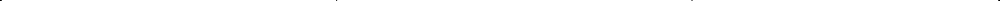
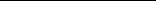
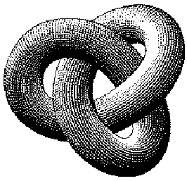

Theoretical Computer Science Cheat Sheet

Definitions Series f(n) = O(g(n)) iff ∃ positive c,n0 such that

n

n

n

n2(n + 1)2 4

n(n + 1) 2

n(n + 1)(2n + 1) 6

i2 =

i3 =

0 ≤ f(n) ≤ cg(n) ∀n ≥ n0.

i =

. In general:

,

,

i=1

i=1

i=1

f(n) = Ω(g(n)) iff ∃ positive c,n0 such that f(n) ≥ cg(n) ≥ 0 ∀n ≥ n0.

n

n

1 m + 1

(i + 1)m+1 − im+1 − (m + 1)im

(n + 1)m+1 − 1 −

im =

f(n) = Θ(g(n)) iff f(n) = O(g(n)) and f(n) = Ω(g(n)).

i=1

i=1

n−1

m

1 m + 1

m + 1 k

im =

Bknm+1 k. Geometric series:

f(n) = o(g(n)) iff limn→∞ f(n)/g(n) = 0.

i=1

k=0

an = a iff ∀ǫ > 0, ∃n0 such that |an − a| < ǫ, ∀n ≥ n0.

lim n→∞

n

∞

∞

cn+1 − 1 c − 1

1 1 − c

c 1 − c

ci

ci

ci

, |c| < 1,

, c = 1,

,

supS least b ∈ R such that b ≥ s, ∀s ∈ S.

i=0

i=0

i=1

∞

n

ncn+2 − (n + 1)cn+1 + c (c − 1)2

c (1 − c)2

ici =

ici =

inf S greatest b ∈ R such that b ≤

, |c < 1. Harmonic series:

, c = 1,

s, ∀s ∈ S. liminf n→∞

i=0

i=0

inf{ai | i ≥ n,i ∈ N}. limsup n→∞

an lim

n

n

n(n − 1) 4

1 i

n(n + 1) 2

n→∞

Hn −

Hn =

iHi =

,

.

sup{ai i ≥ n,i ∈ N}.

an lim

i=1

i=1

n→∞

n

n

1 m + 1

i m

n + 1 m + 1

n k Combinations: Size k sub-

Hn+1 −

Hi = (n + 1)Hn − n,

Hi =

.

sets of a size n set.

i=1

i=1

n

n k Stirling numbers (1st kind):

n k

n k

n n − k

n! (n − k)!k!

n k

= 2n, 3.

, 2.

=

,

=

1.

Arrangements of an n element set into k cycles.

k=0

n − 1 k − 1

n − 1 k

n − 1 k − 1

n k

n k

n k

, 5.

=

=

+

,

4.

n k Stirling numbers (2nd kind):

Partitions of an n element set into k non-empty sets.

n

n m

m k

n k

n k m − k

r k k

r + n + 1 n

=

, 7.

=

,

6.

k=0

n k 1st order Eulerian numbers: Permutations π1π2 ...πn on {1,2,...,n} with k ascents.

n

n

k m

n + 1 m + 1

r k

s n − k

r + s n

=

, 9.

=

,

8.

k=0

k=0

k − n − 1 k

n 1

n n

n k

= (−1)k

n k 2nd order Eulerian numbers.

, 11.

=

= 1,

10.

Cn Catalan Numbers: Binary trees with n + 1 vertices.

n − 1 k

n − 1 k − 1

n 2

n k

= 2n−1 − 1, 13.

= k

+

,

12.

n 1

n 2

n n

n k ≥

n k

= (n − 1)!, 15.

= (n − 1)!Hn−1, 16.

= 1, 17.

,

14.

n

n − 1 k

n − 1 k − 1

2n n

1 n + 1

n k

n n − 1

n n − 1

n 2

n k

= (n − 1)

,

+

, 19.

=

=

, 20.

= n!, 21. Cn =

18.

k=0

n − 1 k

n − 1 k − 1

n 0

n n − 1

n k

n n − 1 − k

n k

+ (n − k)

=

= 1, 23.

=

, 24.

= (k + 1)

,

22.

n 1

n 2

n + 1 2

0 k

1 if k = 0, 0 otherwise

= 2n − n − 1, 27.

= 3n − (n + 1)2n +

,

=

26.

25.

n

m

n

n k

x k n

n m

n + 1 k

n m

n k

k n − m

28. xn =

(m + 1 − k)n(−1)k, 30. m!

, 29.

=

=

,

k=0

k=0

k=0

n

n − k m

n m

n k

n 0

n n

(−1)n−k−mk!, 32.

=

= 1, 33.

= 0 for n = 0,

31.

k=0

n

(2n)n 2n

n − 1 k

n − 1 k − 1

n k

n k

+ (2n − 1 − k)

,

= (k + 1)

, 35.

=

34.

k=0

n

n

x + n − 1 − k 2n

x x − n

n k

n + 1 m + 1

n k

k m

k m

(m + 1)n−k,

=

, 37.

=

=

36.

k=0

k

k=0

Theoretical Computer Science Cheat Sheet

Identities Cont. Trees 38.

n

n

n

Every tree with n vertices has n − 1 edges.

k m

x x − n

n k

x + k 2n

1 k!

n + 1 m + 1

n k

k m

k m

nn−k = n!

, 39.

=

,

=

=

k=0

k=0

k

k=0

n m

n k

k + 1 m + 1

n m

n + 1 k + 1

k m

(−1)n−k, 41.

(−1)m−k,

=

=

40.

Kraft inequality: If the depths of the leaves of a binary tree are d1,...,dn:

k

k

m

m

n + k k

n + k k

m + n + 1 m

m + n + 1 m

k(n + k)

,

k

, 43.

=

=

42.

k=0

k=0

n m

n + 1 k + 1

k m

n m

n + 1 k + 1

k m

( 1)m−k, 45. (n m)!

( 1)m−k, for n ≥ m,

=

=

n

44.

2−d

≤ 1,

i

k

k

m − n m + k

m − n m + k

n n − m

- m + n
- n + k

m + k k

n n − m

- m + n
- n + k

m + k k

i=1

=

, 47.

=

,

46.

and equality holds only if every internal node has 2 sons.

k

k

n − k m

n − k m

n ℓ + m

ℓ + m ℓ

k ℓ

n k

n ℓ + m

ℓ + m ℓ

k ℓ

n k

=

, 49.

=

.

48.

k

k

Recurrences Master method:

Generating functions:

1 T(n) − 3T(n/2) = n 3 T(n/2) 3T(n/4) = n/2

T(n) = aT(n/b) + f(n), a ≥ 1,b > 1 If ∃ǫ > 0 such that f(n) = O(nlogb a ǫ) then

- 1. Multiply both sides of the equation by xi.
- 2. Sum both sides over all i for which the equation is valid.
- 3. Choose a generating function G(x). Usually G(x) = ∞i=0 xigi.

. . . 3log2 n 1 T(2) − 3T(1) = 2

T(n) = Θ(nlogb a). If f(n) = Θ(nlogb a) then

Let m = log2 n. Summing the left side we get T(n) − 3mT(1) = T(n) − 3m =

T(n) = Θ(nlogb a log2 n).

- 3. Rewrite the equation in terms of the generating function G(x).
- 4. Solve for G(x).
- 5. The coefficient of xi in G(x) is gi.

If ∃ǫ > 0 such that f(n) = Ω(nlogb a+ǫ), and ∃c < 1 such that af(n/b) ≤ cf(n) for large n, then

T(n) − nk where k = log2 3 ≈ 1.58496. Summing the right side we get

m−1

m−1

n

Example:

i .

- 2i
- 3i n

3 2

T(n) = Θ(f(n)).

gi+1 = 2gi + 1, g0 = 0. Multiply and sum:

i=0

i=0

Substitution (example): Consider the following recurrence

Let c = 32. Then we have n

gi+1xi =

2gixi +

xi.

m−1

i

Ti+1 = 22

· T2i, T1 = 2.

cm − 1 c − 1

ci n

i≥0

i≥0

i≥0

Note that Ti is always a power of two. Let ti = log2 Ti. Then we have

i=0

We choose G(x) = i≥0 xigi. Rewrite in terms of G(x):

= 2n(clog2 n − 1)

ti+1 = 2i + 2ti, t1 = 1.

= 2n(c(k−1) logc n 1)

G(x) − g0 x

xi.

= 2G(x) +

Let ui = ti/2i. Dividing both sides of the previous equation by 2i+1 we get

= 2nk − 2n,

i≥0

2i 2i+1

and so T(n) = 3nk − 2n. Full history recurrences can often be changed to limited history ones (example): Consider

Simplify:

ti+1 2i+1

ti 2i

. Substituting we find

=

+

G(x) x

1 1 x

. Solve for G(x):

= 2G(x) +

- i−1
- j=0

ui+1 = 12 + ui, u1 = 12, which is simply ui i/2. So we find that Ti has the closed form Ti = 2i2

Tj, T0 = 1.

Ti = 1 +

x (1 x)(1 2x)

G(x) =

. Expand this using partial fractions: G(x) = x

i 1

.

Note that

- i
- j=0

Summing factors (example): Consider the following recurrence

1 1 − x

2 1 − 2x −

Tj.

Ti+1 = 1 +

T(n) = 3T(n/2) + n, T(1) = 1.

xi

= x

Subtracting we find Ti+1 − Ti = 1 +

Rewrite so that all terms involving T are on the left side

2ixi −

2

- i−1
- j=0

- i
- j=0



Tj − 1 −

Tj

i≥0

i≥0

T(n) − 3T(n/2) = n.

(2i+1 − 1)xi+1.

=

= Ti. And so Ti+1 = 2Ti = 2i+1.

Now expand the recurrence, and choose a factor which makes the left side “telescope”

i≥0

So gi = 2i 1.

√5 2 ≈ −.61803

√5 2 ≈ 1.61803, ˆφ = 1−

π ≈ 3.14159, e ≈ 2.71828, γ ≈ 0.57721, φ = 1+

i 2i pi General Probability

- 1 2 2 Bernoulli Numbers (Bi = 0, odd i = 1): B0 = 1, B1 −12, B2 16, B4 130,

B6 = 142, B8 = − 130, B10 = 566. Change of base, quadratic formula:

logb x =

loga x loga b

, −b ±

√b2 − 4ac 2a

. Euler’s number e:

e = 1 + 12 + 16 + 124 + 1120 + ···

lim n→∞

1 +

x n

n

= ex.

1 + 1n n < e < 1 + 1n

n+1 .

1 + 1n n = e −

e 2n

+

11e 24n2 − O

1 n3

. Harmonic numbers:

1, 32, 116, 2512, 13760, 4920, 363140, 761280, 71292520,... lnn < Hn < lnn + 1, Hn = lnn + γ + O

1 n

. Factorial, Stirling’s approximation: 1, 2, 6, 24, 120, 720, 5040, 40320, 362880, ...

n! =

√

2πn

n e

n

1 + Θ

1 n

. Ackermann’s function and inverse:

a(i,j) =   

2j i = 1 a(i − 1,2) j = 1 a(i − 1,a(i,j − 1)) i,j ≥ 2

α(i) = min{j | a(j,j) ≥ i}.

Continuous distributions: If Pr[a < X < b] =

b

a

p(x)dx,

then p is the probability density function of X. If

Pr[X < a] = P(a), then P is the distribution function of X. If P and p both exist then

P(a) =

a

−∞

p(x)dx. Expectation: If X is discrete

E[g(X)] =

x

g(x)Pr[X x].

If X continuous then E[g(X)] =

∞

−∞

g(x)p(x)dx =

∞

−∞

g(x)dP(x). Variance, standard deviation:

VAR[X] = E[X2] − E[X]2, σ = VAR[X].

For events A and B: Pr[A ∨ B] = Pr[A] + Pr[B] − Pr[A ∧ B] Pr[A ∧ B] = Pr[A] · Pr[B],

iff A and B are independent. Pr[A|B] =

- Pr[A ∧ B]

- Pr[B

For random variables X and Y : E[X · Y ] = E[X] · E[Y ],

if X and Y are independent. E[X + Y ] = E[X] + E[Y ],

E[cX] = c E[X]. Bayes’ theorem:

Pr[Ai|B] =

Pr[B|Ai]Pr[Ai]

n j=1 Pr[Aj]Pr[B|Aj]

. Inclusion-exclusion:

Pr

n

i=1

Xi =

n

i=1

Pr[Xi] +

n

k=2

(−1)k+1

ii<···<ik

Pr

k

j=1

Xi

j

.

Moment inequalities: Pr |X| ≥ λE[X] ≤

1 λ

,

Pr X − E X] ≥ λ · σ ≤

1 λ2

. Geometric distribution:

Pr[X = k] = pqk 1, q = 1 − p,

E[X] =

∞

k=1

kpqk 1 =

1 p

.

- 2 4 3

- 3 8 5

- 4 16 7

- 5 32 11

- 6 64 13

- 7 128 17

- 8 256 19

- 9 512 23

- 10 1,024 29

- 11 2,048 31

- 12 4,096 37

- 13 8,192 41

- 14 16,384 43

- 15 32,768 47

- 16 65,536 53

- 17 131,072 59

- 18 262,144 61

- 19 524,288 67

- 20 1,048,576 71

- 21 2,097,152 73

- 22 4,194,304 79

- 23 8,388,608 83

- 24 16,777,216 89

- 25 33,554,432 97

- 26 67,108,864 101

- 27 134,217,728 103

- 28 268,435,456 107 Binomial distribution:

Pr[X = k] =

n k

pkqn k, q = 1 − p,

E[X] =

n

k=1

k

n k

pkqn k = np. Poisson distribution: Pr[X = k] =

e−λλk k!

, E[X] = λ. Normal (Gaussian) distribution:

p(x) =

1 √2πσ

e (x µ)

2/2σ2, E[X] = µ.

The “coupon collector”: We are given a random coupon each day, and there are n different types of coupons. The distribution of coupons is uniform. The expected number of days to pass before we to collect all n types is

nHn.

- 29 536,870,912 109

- 30 1,073,741,824 113

- 31 2,147,483,648 127

- 32 4,294,967,296 131 Pascal’s Triangle

1

- 1 1

- 1 2 1

- 1 3 3 1

- 1 4 6 4 1

- 1 5 10 10 5 1

- 1 6 15 20 15 6 1

- 1 7 21 35 35 21 7 1

- 1 8 28 56 70 56 28 8 1

- 1 9 36 84 126 126 84 36 9 1

1 10 45 120 210 252 210 120 45 10 1

Trigonometry Matrices More Trig.

C

Multiplication: C = A · B, ci,j =

n

<table>
  <tr>
    <th> </th>
    <th>θ  (0,1)  (cos</th>
  </tr>
  <tr>
    <td>,0)</td>
    <td>(0,-1)  (</td>
  </tr>
</table>

ai,kbk,j. Determinants: det A = 0 iff A is non-singular.

a

b

h A

b

θ,sinθ)

k=1

C

A

c

B

detA · B = detA · detB, detA =

Law of cosines: c2 = a2+b2−2ab cosC. Area:

c

a

n

sign(π)ai,π(i). 2 × 2 and 3 × 3 determinant:

B

π

i=1

Pythagorean theorem:

C2 = A2 + B2. Definitions:

A = 12hc,

a b c d

= ad bc,

= 12ab sinC,

sina = A/C, cosa = B/C, csca = C/A, seca = C/B,

c2 sinAsinB 2 sinC

a b c d e f g h i

=

. Heron’s formula:

b c e f − h

a c d f

a b d e

= g

+ i

sina cosa

- A

- B

cosa sina

B A

tana =

. Area, radius of inscribed circle:

=

, cota =

=

aei + bfg + cdh

A = √s · sa · sb · sc, s = 12(a + b + c),

=

− ceg − fha − ibd. Permanents:

AB A + B + C

- 1

- 2 AB,

.

n

- sa = s − a,
- sb = s − b,
- sc = s − c. More identities:

ai,π(i).

permA =

Identities: sinx =

π

i=1

1 sec x

1 csc x

, tanx =

, cosx =

Hyperbolic Functions

1 cotx

Definitions: sinhx =

, sin2 x + cos2 x = 1, 1 + tan2 x = sec2 x, 1 + cot2 x = csc2 x,

ex − e−x 2

ex + e−x 2

1 − cosx 2

sin x2 =

, tanhx =

, coshx =

,

ex − e−x ex + e x

1 sinhx

, cschx =

, sechx =

sinx = cos π2 − x , sinx = sin(π − x), cosx = − cos(π − x), tanx = cot π2 − x , cotx = cot(π x), csc x = cot x2 cotx, sin(x ± y) = sinxcosy ± cosxsiny,

- cos x2 =

1 + cosx 2

,

tan x2 =

1 − cosx 1 + cosx

,

=

1 − cosx sinx

,

=

sinx 1 + cosx

,

- cot x2 =

1 coshx

1 tanhx

, cothx =

.

Identities: cosh2 x − sinh2 x = 1, tanh2 x + sech2 x = 1, coth2 x − csch2 x = 1, sinh(−x) = − sinhx, cosh(−x) = coshx, tanh(−x) = − tanhx, sinh(x + y) = sinhxcoshy + coshxsinhy, cosh(x + y) = coshxcoshy + sinhxsinhy, sinh2x = 2 sinhxcoshx, cosh2x = cosh2 x + sinh2 x, coshx + sinhx = ex, coshx − sinhx = e−x, (coshx + sinhx)n = coshnx + sinhnx, n ∈ Z,

- cos(x ± y) = cosxcos y ∓ sinxsiny,

tan(x ± y) =

tanx ± tany 1 ∓ tanxtany

,

- cot(x ± y) =

1 + cosx 1 − cosx

,

1 + cosx sinx

cotxcoty ∓ 1 cotx ± coty

=

,

, sin2x = 2 sinxcosx, sin2x =

sinx 1 − cosx

2 tanx 1 + tan2 x

,

=

,

eix − e−ix 2i

cos2x = cos2 x sin2 x, cos2x = 2 cos2 x − 1, cos2x = 1 − 2 sin2 x, cos2x =

sinx =

,

1 − tan2 x 1 + tan2 x

eix + e ix 2

,

,

cosx =

cot2 x − 1 2 cotx

eix − e−ix eix + e ix

2 tanx 1 − tan2 x

,

tan2x =

, cot2x =

tanx = −i

,

- 2 sinh2 x2 = coshx − 1, 2 cosh2 x2 = coshx + 1. θ sinθ cosθ tanθ

0 0 1 0

π 6

- 1

- 2

√3 2

√3 3

π 4

√2 2

√2

2 1 π

- 3

e2ix − 1 e2ix + 1

sin(x + y)sin(x − y) = sin2 x − sin2 y, cos(x + y)cos(x y) = cos2 x sin2 y. Euler’s equation:

= i

,

... in mathematics you don’t understand things, you just get used to them.

sinhix i

,

sinx =

cosx = coshix, tanx =

eix = cosx + i sinx, eiπ = −1.

tanhix i

√3

√3 2

– J. von Neumannv2.02c1994 by Steve Seiden

.

- 1

- 2

sseiden@acm.org http://www.csc.lsu.edu/~seiden

π 2 1 0 ∞

Theoretical Computer Science Cheat Sheet

Number Theory Graph Theory The Chinese remainder theorem: There exists a number C such that:

Notation: E(G) Edge set V (G) Vertex set c(G) Number of components G[S] Induced subgraph deg(v) Degree of v ∆(G) Maximum degree δ(G) Minimum degree χ(G) Chromatic number χE(G) Edge chromatic number Gc Complement graph Kn Complete graph Kn

Definitions: Loop An edge connecting a vertex to itself.

C ≡ r1 mod m1

Directed Each edge has a direction. Simple Graph with no loops or multi-edges.

. . .

C ≡ rn mod mn if mi and mj are relatively prime for i = j. Euler’s function: φ(x) is the number of positive integers less than x relatively prime to x. If ni=1 pe

Walk A sequence v0e1v1 ...eℓvℓ. Trail A walk with distinct edges. Path A trail with distinct

vertices.

Connected A graph where there exists a path between any two vertices.

i is the prime factorization of x then

i

1,n2 Complete bipartite graph r(k,ℓ) Ramsey number

n

pe

i−1

i (pi − 1).

φ(x) =

Component A maximal connected

i=1

subgraph. Tree A connected acyclic graph. Free tree A tree with no root. DAG Directed acyclic graph. Eulerian Graph with a trail visiting

Geometry Projective coordinates: triples (x,y,z), not all x, y and z zero.

Euler’s theorem: If a and b are relatively prime then

1 ≡ aφ(b) mod b. Fermat’s theorem:

(x,y,z) = (cx,cy,cz) ∀c = 0. Cartesian Projective (x,y) (x,y,1) y = mx + b (m,−1,b) x = c (1,0,−c)

each edge exactly once. Hamiltonian Graph with a cycle visiting each vertex exactly once.

1 ≡ ap−1 mod p.

The Euclidean algorithm: if a > b are integers then

Cut A set of edges whose removal increases the number of components.

gcd(a,b) = gcd(a mod b,b). If ni=1 pe

Distance formula, Lp and L∞ metric:

i is the prime factorization of x then

i

Cut-set A minimal cut. Cut edge A size 1 cut. k-Connected A graph connected with

(x1 − x0)2 + (y1 − y0)2,

n

pe

i+1

i − 1 pi 1

|x1 − x0 p + |y1 − y0|p 1/p, lim p→∞

.

d =

S(x) =

i=1

the removal of any k − 1 vertices.

x1 − x0|p + |y1 − y0 p 1/p.

d|x

Perfect Numbers: x is an even perfect number iff x = 2n−1(2n−1) and 2n−1 is prime. Wilson’s theorem: n is a prime iff

Area of triangle (x0,y0), (x1,y1) and (x2,y2):

k-Tough ∀S ⊆ V,S = ∅ we have k · c(G − S) ≤ |S|. k-Regular A graph where all vertices have degree k. k-Factor A k-regular spanning subgraph. Matching A set of edges, no two of which are adjacent. Clique A set of vertices, all of which are adjacent. Ind. set A set of vertices, none of which are adjacent. Vertex cover A set of vertices which cover all edges. Planar graph A graph which can be embeded in the plane. Plane graph An embedding of a planar graph.

x1 − x0 y1 − y0 x2 − x0 y2 − y0

(n 1)! ≡ −1 mod n. Mo¨bius inversion:

- 1

- 2 abs

. Angle formed by three points:

1 if i = 1. 0 if i is not square-free. (−1)r if i is the product of

 

µ(i) =

(x2,y2) ℓ2



r distinct primes. If

θ

F(d),

G(a) =

(x1,y1)

ℓ1 cosθ =

(0,0)

d a

(x1,y1) · (x2,y2) ℓ1ℓ2

.

then

a d

µ(d)G

F(a) =

.

Line through two points (x0,y0) and (x1,y1):

d|a

x y 1 x0 y0 1 x1 y1 1

Prime numbers: pn = n lnn + n lnlnn − n + n

lnlnn lnn

= 0.

n lnn

Area of circle, volume of sphere: A = πr2, V = 43πr3.

,

+ O

deg(v) = 2m. If G is planar then n m + f = 2, so

v∈V

n lnn

2!n (ln n)3

n (ln n)2

π(n) =

+

If I have seen farther than others, it is because I have stood on the shoulders of giants.

f ≤ 2n − 4, m ≤ 3n − 6. Any planar graph has a vertex with degree ≤ 5.

n (lnn)4

.

+ O

– Issac Newton

Theoretical Computer Science Cheat Sheet

π Calculus Wallis’ identity:

Derivatives: 1.

2 · 2 · 4 · 4 · 6 · 6 ··· 1 · 3 · 3 · 5 · 5 · 7 ···

π = 2 ·

du dx

d(u + v) dx

du dx

dv dx

d(uv) dx

dv dx

du dx

d(cu) dx

= c

, 2.

=

+

, 3.

= u

+ v

,

Brouncker’s continued fraction expansion:

v dudx − u dvdx v2

d(ecu) dx

d(un) dx

du dx

d(u/v) dx

du dx

12 2 + 32

= nun−1

= cecu

, 6.

, 5.

=

,

4.

π 4 = 1 +

2+ 52

2+ 72 2+···

- 7.

d(cu) dx

= (lnc)cu

du dx

, 8.

d(ln u) dx

=

1 u

du dx

,

- 9.

d(sinu) dx

= cosu

du dx

, 10.

d(cosu) dx

= − sinu

du dx

,

- 11.

d(tanu) dx

= sec2 u

du dx

, 12.

d(cotu) dx

= csc2 u

du dx

,

- 13.

d(sec u) dx

= tanu secu

du dx

, 14.

d(csc u) dx

= − cotu cscu

du dx

,

15.

d(arcsinu) dx

=

1 √1 − u2

du dx

, 16.

d(arccosu) dx

= −1 √1 − u2

du dx

,

17.

d(arctanu) dx

=

1 1 + u2

du dx

, 18.

d(arccotu) dx

= −1 1 + u2

du dx

,

19.

d(arcsecu) dx

=

1 u√1 − u2

du dx

, 20.

d(arccscu) dx

= −1 u√1 u2

du dx

,

21.

d(sinhu) dx

= coshu

du dx

, 22.

d(coshu) dx

= sinhu

du dx

,

23.

d(tanhu) dx

= sech2 u

du dx

, 24.

d(cothu) dx

= − csch2 u

du dx

,

25.

d(sechu) dx

= − sechu tanhu

du dx

, 26.

d(cschu) dx

= − cschu cothu

du dx

,

27.

d(arcsinhu) dx

=

1 √1 + u2

du dx

, 28.

d(arccoshu) dx

=

1 √u2 − 1

du dx

,

29.

d(arctanhu) dx

=

1 1 − u2

du dx

, 30.

d(arccothu) dx

=

1 u2 − 1

du dx

,

31.

d(arcsechu) dx

= −1 u√1 − u2

du dx

, 32.

d(arccschu) dx

= −1 u|

√1 + u2

du dx

. Integrals:

1. cu dx = c u dx, 2. (u + v)dx = u dx + v dx,

3. xn dx =

1 n + 1

xn+1, n = 1, 4.

1 x

dx = lnx, 5. ex dx = ex,

6.

dx 1 + x2

= arctanx, 7. u

dv dx

dx = uv − v

du dx

dx,

8. sinxdx = − cosx, 9. cosxdx = sinx,

10. tanxdx = − ln|cosx|, 11. cotxdx = ln cosx|,

12. secxdx = ln|secx + tanx|, 13. cscxdx = ln|cscx + cotx|,

- 14. arcsin xadx = arcsin xa + a2 x2, a > 0,

Gregrory’s series: π 4 = 1 13 + 15

1 7 + 19 − ···

Newton’s series:

1 · 3 2 · 4 · 5 · 25

- 1

- 2

1 2 · 3 · 23

π 6 =

+ ··· Sharp’s series:

+

+

1 √3

1 31 · 3

1 32 · 5 −

1 33 · 7

π 6 =

1−

+··· Euler’s series:

+

π2

6 = 112 + 122 + 132 + 142 + 152 + ··· π2

8 = 112 + 132 + 152 + 172 + 192 + ···

π2 12 = 112 − 122 + 132 − 142 + 152 − ···

Partial Fractions Let N(x) and D(x) be polynomial functions of x. We can break down N(x)/D(x) using partial fraction expansion. First, if the degree of N is greater than or equal to the degree of D, divide N by D, obtaining

N′(x) D(x)

N(x) D(x)

= Q(x) +

,

where the degree of N′ is less than that of D. Second, factor D(x). Use the following rules: For a non-repeated factor:

N′(x) D(x)

A x − a

N(x) (x − a)D(x)

, where

=

+

N(x) D(x) x=a

A =

.

For a repeated factor:

m−1

N′(x) D(x)

N(x) (x − a)mD(x)

Ak (x − a)m−k +

=

,

k=0

where

dk dxk

N(x) D(x) x a

1 k!

.

Ak

The reasonable man adapts himself to the world; the unreasonable persists in trying to adapt the world to himself. Therefore all progress depends on the unreasonable. – George Bernard Shaw

Theoretical Computer Science Cheat Sheet

Calculus Cont. 15. arccos xadx = arccos xa − a2 − x2, a > 0, 16. arctan xadx = xarctan xa − a2 ln(a2 + x2), a > 0,

17. sin2(ax)dx = 12a ax sin(ax)cos(ax) , 18. cos2(ax)dx = 12a ax + sin(ax)cos(ax) ,

19. sec2 xdx = tanx, 20. csc2 xdx = − cotx,

sinn−1 xcosx n

cosn−1 xsinx n

n − 1 n

n − 1 n

21. sinn xdx = −

sinn−2 xdx, 22. cosn xdx =

cosn 2 xdx,

+

+

tann 1 x n − 1 − tann−2 xdx, n = 1, 24. cotn xdx = −

cotn 1 x n − 1 − cotn−2 xdx, n = 1,

23. tann xdx =

- 25. secn xdx =

tanxsecn 1 x n − 1

+

n − 2 n − 1

secn−2 xdx, n = 1,

- 26. cscn xdx = −

cotxcscn−1 x n − 1

n − 2 n − 1

cscn−2 xdx, n = 1, 27. sinhxdx = coshx, 28. coshxdx = sinhx,

+

29. tanhxdx = ln|coshx|, 30. cothxdx = ln|sinhx|, 31. sechxdx = arctansinhx, 32. cschxdx = ln tanh x2 ,

33. sinh2 xdx = 14 sinh(2x) − 12x, 34. cosh2 xdx = 14 sinh(2x) + 12x, 35. sech2 xdx = tanhx,

36. arcsinh xadx = xarcsinh xa − x2 + a2, a > 0, 37. arctanh xadx = xarctanh xa + a2 ln|a2 − x2|,

- 38. arccosh xadx = 

 

xarccosh

x a − x2 + a2, if arccosh xa > 0 and a > 0,

xarccosh

x a

+ x2 + a2, if arccosh xa < 0 and a > 0,

- 39.

dx √a2 x2

= ln x + a2 + x2 , a > 0,

- 40.

dx a2 + x2

2

= 1a arctan xa, a > 0, 41. a2 − x2 dx = x2 a2 − x2 + a

2 arcsin xa, a > 0,

- 42. (a2 − x2)3/2dx = x8(5a2 − 2x2) a2 − x2 + 3a

4

8 arcsin xa, a > 0,

- 43.

dx (a2 − x2)3/2

dx √a2 − x2

- 1

- 2a

dx a2 − x2

a + x a − x

x a2√a2 − x2

= arcsin xa, a > 0, 44.

,

, 45.

=

ln

=

dx √x2 − a2

2

46. a2 ± x2 dx = x2 a2 ± x2 ± a

2 ln x + a2 ± x2 , 47.

= ln x + x2 − a2 , a > 0,

√

2(3bx − 2a)(a + bx)3/2 15b2

1 a

x a + bx

dx ax2 + bx

a bxdx

,

ln

, 49. x

48.

√a + bx x

√a + bx −

√a √a + bx + √a

√

x √a + bx

1 x√a + bx

1 √2

dx, 51.

dx =

a + bx + a

, a > 0,

ln

dx = 2

50.

√a2 − x2 x

a + √a2 − x2 x

, 53. x a2 − x2 dx = −13(a2 − x2)3/2,

dx = a2 − x2 − a ln

52.

a + √a2 − x2 x

dx √a2 − x2

4

54. x2 a2 − x2 dx = x8(2x2 − a2) a2 − x2 + a

= −1a ln

8 arcsin xa, a > 0, 55.

,

x2 dx √a2 − x2

xdx √a2 − x2

2

= −x2 a2 − x2 + a

2 arcsin xa, a > 0,

= − a2 − x2, 57.

56.

√x2 − a2 x

√a2 + x2 x

a + √a2 + x2 x

dx x2 a2 a arccos a|x|, a > 0,

dx a2 + x2 a ln

, 59.

58.

dx x√x2 + a2

x a + √a2 + x2

60. x x2 ± a2 dx = 13(x2 ± a2)3/2, 61.

= 1a ln

,

Calculus Cont. Finite Calculus 62.

√x2 ± a2 a2x

Difference, shift operators: ∆f(x) = f(x + 1) − f(x), Ef(x) = f(x + 1).

dx x√x2 − a2

dx x2√x2 ± a2

= 1a arccos ax , a > 0, 63.

= ∓

,

√x2 ± a2 x4

(x2 + a2)3/2 3a2x3

xdx √x2 ± a2

= x2 ± a2, 65.

dx = ∓

,

64.

Fundamental Theorem: f(x) = ∆F(x) ⇔ f(x)δx = F(x) + C.

b

b−1

- 66.

dx ax2 bx + c

=

 



- 1

√b2 − 4ac

ln

2ax + b −

√b2 − 4ac 2ax + b + √b2 − 4ac

, if b2 > 4ac,

- 2

√4ac − b2

arctan

2ax + b √4ac − b2

, if b2 < 4ac,

- 67.

dx √ax2 + bx + c

=

 



1 √a

ln 2ax + b + 2√a ax2 + bx + c , if a > 0, 1

√

−a

arcsin −2ax − b √b2 − 4ac

, if a < 0,

- 68. ax2 + bx + c dx =

2ax + b 4a

ax2 + bx + c +

4ax − b2 8a

dx √ax2 + bx + c

,

- 69.

xdx √ax2 + bx c

=

√ax2 + bx + c a

b 2a

dx √ax2 + bx + c

,

- 70.

dx x√ax2 + bx + c

=

 



−1 √c

ln

2√c√ax2 + bx + c + bx + 2c x

, if c > 0, 1 √ c

arcsin

bx + 2c |x|

√b2 − 4ac

, if c < 0,

- 71. x3 x2 + a2 dx = (13x2 − 215a2)(x2 + a2)3/2,

- 72. xn sin(ax)dx = −1axn cos(ax) + na xn−1 cos(ax)dx,

- 73. xn cos(ax)dx = 1axn sin(ax) − na xn−1 sin(ax)dx,

- 74. xneax dx =

xneax a − na xn 1eax dx,

- 75. xn ln(ax)dx = xn+1

ln(ax) n + 1 −

1 (n + 1)2

,

- 76. xn(lnax)m dx =

f(i).

f(x)δx =

a

i=a

Differences: ∆(cu) = c∆u, ∆(u + v) = ∆u + ∆v,

∆(uv) = u∆v + E v∆u, ∆(xn) = nxn−1,

∆(Hx) = x−1, ∆(2x) = 2x, ∆(cx) = (c − 1)cx, ∆ xm = xm 1 . Sums:

cu δx = c u δx, (u + v)δx = u δx + v δx,

u∆v δx = uv − Ev∆u δx, xn δx x

n+1

m+1 , x−1 δx Hx, cx δx = c

x

c−1 , xm δx = xm+1 .

Falling Factorial Powers: xn = x(x − 1)···(x − n + 1), n > 0, x0 = 1, xn =

1 (x + 1)···(x + n|)

, n < 0,

xn+m = xm(x − m)n. Rising Factorial Powers:

xn = x(x + 1)···(x + n − 1), n > 0, x0 = 1, xn =

1 (x − 1)···(x − |n|)

, n < 0,

xn+1 n + 1

- m

- n + 1

(lnax)m −

xn(ln ax)m−1 dx.

xn+m = xm(x + m)n. Conversion: xn = ( 1)n( x)n = (x n + 1)n

x1 = x1 = x1 x2 = x2 + x1 = x2 − x1 x3 = x3 + 3x2 + x1 = x3 − 3x2 + x1 x4 x4 + 6x3 + 7x2 x1 x4 − 6x3 + 7x2 − x1 x5 x5 + 15x4 + 25x3 + 10x2 + x1 x5 15x4 + 25x3 10x2 + x1

= 1/(x + 1) n, xn = (−1)n(−x)n = (x + n 1)n

= 1/(x − 1)−n, xn =

n

n

n k

n k

(−1)n kxk,

xk =

x1 = x1 x1 = x1 x2 = x2 + x1 x2 = x2 − x1 x3 = x3 + 3x2 + 2x1 x3 = x3 − 3x2 + 2x1 x4 = x4 + 6x3 + 11x2 + 6x1 x4 = x4 − 6x3 + 11x2 − 6x1 x5 = x5 + 10x4 + 35x3 + 50x2 + 24x1 x5 = x5 − 10x4 + 35x3 − 50x2 + 24x1

k=1

k=1

n

n k

(−1)n−kxk,

xn =

k=1

n

n k

xn =

xk.

k=1

Theoretical Computer Science Cheat Sheet Series Taylor’s series:

Ordinary power series: A(x) =

∞

(x − a)i i!

(x − a)2 2

∞

f(i)(a). Expansions:

f′′(a) + ··· =

f(x) = f(a) + (x − a)f′(a) +

aixi.

i=0

i=0

Exponential power series: A(x) =

∞

1 1 − x

xi, 1 1 − cx

= 1 + x + x2 + x3 + x4 + ···

∞

xi i!

ai

. Dirichlet power series:

i=0

∞

i=0

cixi, 1 1 − xn

= 1 + cx + c2x2 + c3x3 + ··· =

i=0

∞

∞

ai ix

A(x) =

. Binomial theorem:

xni, x (1 − x)2

= 1 + xn + x2n + x3n + ··· =

i=1

i=0

∞

ixi,

= x + 2x2 + 3x3 + 4x4 + ··· =

n

n k

(x + y)n =

xn−kyk. Difference of like powers:

i=0

n

∞

k!zk (1 z)k+1

n k

k=0

inxi,

= x + 2nx2 + 3nx3 + 4nx4 + ··· =

i=0

k=0

n−1

∞

xi i!

xn 1 kyk. For ordinary power series: αA(x) + βB(x) =

xn − yn = (x − y)

ex = 1 + x + 12x2 + 16x3 + ··· =

,

k=0

i=0

∞

xi i

(−1)i+1

ln(1 + x) = x − 12x2 + 13x3 − 14x4 − ··· =

,

∞

(αai + βbi)xi,

i=1

∞

xi i

1 1 x

i=0

= x + 12x2 + 13x3 + 14x4 + ··· =

ln

,

∞

xkA(x) =

ai kxi,

i=1

∞

x2i+1 (2i + 1)!

(−1)i

sinx = x − 13!x3 + 15!x5 − 17!x7 + ··· =

i=k

,

∞

A(x) − k−1i=0 aixi xk

i=0

ai+kxi,

∞

=

x2i (2i)!

( 1)i

cosx = 1 12!x2 + 14!x4 16!x6 + ···

,

i=0

∞

i=0

ciaixi,

∞

A(cx) =

x2i+1 (2i + 1)

(−1)i

tan−1 x = x − 13x3 + 15x5 − 17x7 + ··· =

,

i=0

∞

i=0

∞

(i + 1)ai+1xi,

A′(x) =

n i

(1 + x)n = 1 + nx + n(n−1)2x2 + ··· =

xi, 1 (1 − x)n+1

i=0

i=0

∞

∞

i + n i

iaixi,

xA′(x) =

= 1 + (n + 1)x + n+22 x2 + ··· =

xi, x ex − 1

i=1

i=0

∞

∞

Bixi i!

ai−1 i

xi,

= 1 − 12x + 112x2 − 1720x4 + ··· =

A(x)dx =

,

i=1

i=0

∞

√1 − 4x) = 1 + x + 2x2 + 5x3 + ··· =

∞

1 i + 1

- 1

- 2x

2i i

A(x) + A(−x) 2

xi, 1 √1 − 4x

(1 −

a2ix2i,

i=0

i=0

∞

2i i

∞

A(x) − A(−x) 2

xi, 1 √1 − 4x

= 1 + 2x + 6x2 + 20x3 + ··· =

a2i+1x2i+1.

=

i=0

√1 − 4x 2x

i=0

n

∞

1 −

2i + n i

= 1 + (2 + n)x + 4+n2 x2 + ··· =

xi, 1 1 − x

Summation: If bi ij=0 ai then B(x) =

i=0

1 1 − x

∞

A(x). Convolution:

1 1 − x

Hixi,

= x + 32x2 + 116x3 + 2512x4 ··· =

ln

i=1

∞

2

Hi−1xi i

ajbi−j

 

1 1 − x

- 1

- 2

∞

- i
- j=0

= 12x2 + 34x3 + 1124x4 + ··· =

ln

, x 1 − x − x2

xi.

A(x)B(x) =

i=2

i=0

∞

Fixi, Fnx 1 − (Fn−1 + Fn+1)x − (−1)nx2

= x + x2 + 2x3 + 3x4 ··· =

God made the natural numbers; all the rest is the work of man.

i=0

∞

Fnixi.

= Fnx + F2nx2 + F3nx3 + ··· =

– Leopold Kronecker

i=0

Series Escher’s Knot Expansions: 1 (1 − x)n+1

∞

∞

−n

i n

n + i i

1 x

1 1 − x

xi,

xi,

(Hn+i − Hn)

=

ln

=

i=0

i=0

∞

∞

n!xi i!

n i

i n

xn =

xi, (ex − 1)n =

,

i=0

i=0

∞

∞

n

(−4)iB2ix2i (2i)!

n!xi i!

1 1 − x

i n

ln

=

, xcotx =

,

i=0

i=0

∞

∞

22i(22i − 1)B2ix2i−1 (2i)!

1 ix

( 1)i−1

tanx =

, 1 ζ(x)

, ζ(x) =

i=1

i=1

∞

∞

ζ(x − 1) ζ(x)

µ(i) ix

φ(i) ix

,

,

=

=

i=1

i=1

1 1 − p x

Stieltjes Integrationζ(x) =

,

p

If G is continuous in the interval [a,b] and F is nondecreasing then

∞

d(i) xi

b

ζ2(x) =

where d(n) = d|n 1,

G(x)dF(x) exists. If a ≤ b ≤ c then

i=1

a

∞

S(i) xi

ζ(x)ζ(x − 1) =

where S(n) = d|n d,

c

b

c

i=1

G(x)dF(x). If the integrals involved exist

G(x)dF(x) +

G(x)dF(x) =

22n−1|B2n| (2n)!

b

a

a

π2n, n ∈ N, x sinx

ζ(2n) =

b

∞

(4i − 2)B2ix2i (2i)!

(−1)i−1

=

,

- a

G(x) + H(x) dF(x) =

b

a

G(x)dF(x) +

b

a

H(x)dF(x),

- b

i=0

√1 − 4x 2x

n

∞

n(2i + n − 1)! i!(n + i)!

1 −

xi,

=

- a

G(x)d F(x) + H(x) =

b

a

G(x)dF(x) +

b

a

G(x)dH(x),

- b

a

- c · G(x)dF(x) =

b

b

i=0

G(x)d c · F(x) = c

G(x)dF(x),

∞

2i/2 sin iπ4 i!

a

a

xi,

ex sinx =

b

b

i=1

G(x)dF(x) = G(b)F(b) − G(a)F(a) −

F(x)dG(x).

√1 − x x

a

a

∞

1 −

(4i)! 16i√2(2i)!(2i + 1)!

If the integrals involved exist, and F possesses a derivative F′ at every point in [a,b] then

xi,

=

i=0

∞

2

b

b

4ii!2 (i + 1)(2i + 1)!

arcsinx x

G(x)F′(x)dx.

x2i.

G(x)dF(x) =

=

a

a

i=0

Fibonacci Numbers If we have equations:

Cramer’s Rule

00 47 18 76 29 93 85 34 61 52 86 11 57 28 70 39 94 45 02 63 95 80 22 67 38 71 49 56 13 04 59 96 81 33 07 48 72 60 24 15 73 69 90 82 44 17 58 01 35 26 68 74 09 91 83 55 27 12 46 30 37 08 75 19 92 84 66 23 50 41 14 25 36 40 51 62 03 77 88 99 21 32 43 54 65 06 10 89 97 78 42 53 64 05 16 20 31 98 79 87

1,1,2,3,5,8,13,21,34,55,89,... Definitions: Fi = Fi−1+Fi−2, F0 = F1 = 1,

- a1,1x1 + a1,2x2 + ··· + a1,nxn = b1
- a2,1x1 + a2,2x2 + ··· + a2,nxn = b2

. . . an,1x1 an,2x2 + ··· + an,nxn bn

F−i = (−1)i−1Fi, Fi = 1√5 φi ˆφi ,

Let A = (ai,j) and B be the column matrix (bi). Then there is a unique solution iff detA = 0. Let Ai be A with column i replaced by B. Then

Cassini’s identity: for i > 0:

Fi+1Fi 1 − F2i = (−1)i. Additive rule:

detAi detA

The Fibonacci number system: Every integer n has a unique representation

xi =

.

Fn+k = FkFn+1 + Fk−1Fn, F2n = FnFn+1 + Fn−1Fn. Calculation by matrices:

Improvement makes strait roads, but the crooked roads without Improvement, are roads of Genius.

+ ··· + Fk

,

+ Fk

n = Fk

m

2

1

n

where ki ≥ ki+1 + 2 for all i, 1 ≤ i < m and km ≥ 2.

Fn−2 Fn−1 Fn−1 Fn

- 0 1
- 1 1

.

– William Blake (The Marriage of Heaven and Hell)

