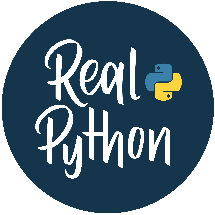

## Data Types

## Strings

### Numbers & Math Arithmetic Operators

# Real Python Pocket Reference

Python is dynamically typed

It’s recommended to use double-quotes for strings

Use None to represent missing or optional values

Use "\n" to create a line break in a string

10 + 3 # 13 10 3 # 7 10 * 3 # 30 10 / 3 # 3.3333333333333335 10 // 3 # 3 10 % 3 # 1 2 ** 3 # 8

Use type() to check object type

To write a backslash in a normal string, write "\\"

Visit realpython.com to turbocharge your Python learning with in-depth tutorials,

Check for a specific type with isinstance() issubclass() checks if a class is a subclass

### Creating Strings

single = 'Hello' double = "World" multi = """Multiple

### Type Investigation

type(42) # <class 'int'> type(3.14) # <class 'float'> type("Hello") # <class 'str'> type(True) # <class 'bool'> type(None) # <class 'NoneType'>

line string"""

real-world examples, and expert guidance.

### Useful Functions

### String Operations

abs(-5) # 5 round(3.7) # 4 round(3.14159, 2) # 3.14 min(3, 1, 2) # 1 max(3, 1, 2) # 3 sum([1, 2, 3]) # 6

greeting = "me" + "ow!" # "meow!" repeat = "Meow!" * 3 # "Meow!Meow!Meow!" length = len("Python") # 6

isinstance(3.14, float) # True issubclass(int, object) # True - everything inherits from object

## Getting Started

### Type Conversion

### String Methods

Follow these guides to kickstart your Python journey:

### Learn More on realpython.com/search:

int("42") # 42 float("3.14") # 3.14 str(42) # "42" bool(1) # True list("abc") # ["a", "b", "c"]

"a".upper() # "A" "A".lower() # "a" " a ".strip() # "a" "abc".replace("bc", "ha") # "aha" "a b".split() # ["a", "b"] "-".join(["a", "b"]) # "a-b"

realpython.com/what-can-i-do-with-python

math ∙ operators ∙ built in functions

realpython.com/installing-python

realpython.com/python-first-steps

## Conditionals

### Start the Interactive Shell

### Learn More on realpython.com/search:

Python uses indentation for code blocks

$ python

Use 4 spaces per indentation level If-Elif-Else

### String Indexing & Slicing

data types ∙ type checking ∙ isinstance ∙ issubclass

text = "Python" text[0] # "P" (first) text[-1] # "n" (last) text[1:4] # "yth" (slice) text[:3] # "Pyt" (from start) text[3:] # "hon" (to end) text[::2] # "Pto" (every 2nd) text[::-1] # "nohtyP" (reverse)

### Quit the Interactive Shell

## Variables & Assignment

>>> exit()

if age < 13:

category = "child" elif age < 20:

Variables are created when first assigned

### Run a Script

Use descriptive variable names

category = "teenager" else:

Follow snake_case convention Basic Assignment

$ python my_script.py

category = "adult"

### Run a Script in Interactive Mode

### String Formatting

### Comparison Operators

name = "Leo" # String age = 7 # Integer height = 5.6 # Float is_cat = True # Boolean flaws = None # None type

$ python -i my_script.py

# f-strings name = "Aubrey" age = 2 f"Hello, {name}!" # "Hello, Aubrey!" f"{name} is {age} years old" # "Aubrey is 2 years old" f"Debug: {age=}" # "Debug: age=2"

x == y # Equal to x != y # Not equal to x < y # Less than x <= y # Less than or equal x > y # Greater than x >= y # Greater than or equal

### Learn More on realpython.com/search:

interpreter ∙ run a script ∙ command line

### Parallel & Chained Assignments

# Format method template = "Hello, {name}! You're {age}." template.format(name="Aubrey", age=2) # "Hello, Aubrey! You're 2."

## Comments

x, y = 10, 20 # Assign multiple values a = b = c = 0 # Give same value to multiple variables

### Logical Operators

Always add a space after the #

if age >= 18 and has_car: print("Roadtrip!")

Use comments to explain “why” of your code Write Comments

### Raw Strings

### Augmented Assignments

# Normal string with an escaped tab "This is:\tCool." # "This is: Cool."

counter += 1 numbers += [4, 5] permissions |= write

if is_weekend or is_holiday:

print("No work today.") if not is_raining:

# This is a comment # print("This code will not run.") print("This will run.") # Comments are ignored by Python

# Raw string with escape sequences r"This is:\tCool." # "This is:\tCool."

print("You can go outside.")

### Learn More on realpython.com/search:

variables ∙ assignment operator ∙ walrus operator

### Learn More on realpython.com/search:

### Learn More on realpython.com/search:

### Learn More on realpython.com/search:

comment ∙ documentation

strings ∙ string methods ∙ slice notation ∙ raw strings

conditional statements ∙ operators ∙ truthy falsy

### Calling Functions

### Class Attributes & Methods

### Raising Exceptions

Loops range(5) generates 0 through 4

greet() # "Hello!" greet_person("Bartosz") # "Hello, Bartosz" add(5, 3) # 8 add(7) # 17

class Cat: species = "Felis catus" # Class attribute

def validate_age(age): if age < 0:

Use enumerate() to get index and value break exits the loop, continue skips to next

raise ValueError("Age cannot be negative") return age

def __init__(self, name):

self.name = name # Instance attribute def meow(self):

Be careful with while to not create an infinite loop

### Return Values

### Learn More on realpython.com/search:

### For Loops

exceptions ∙ errors ∙ debugging

return f"{self.name} says Meow!"

def get_min_max(numbers): return min(numbers), max(numbers)

# Loop through range for i in range(5): # 0, 1, 2, 3, 4

@classmethod def create_kitten(cls, name):

## Collections

minimum, maximum = get_min_max([1, 5, 3])

print(i)

return cls(f"Baby {name}")

A collection is any container data structure that stores multiple items

# Loop through collection fruits = ["apple", "banana"] for fruit in fruits: print(fruit)

### Useful Built-in Functions

If an object is a collection, then you can loop through it

### Inheritance

Strings are collections, too

callable() # Checks if an object can be called as a function dir() # Lists attributes and methods globals() # Get a dictionary of the current global symbol table hash() # Get the hash value id() # Get the unique identifier locals() # Get a dictionary of the current local symbol table repr() # Get a string representation for debugging

class Animal: def __init__(self, name): self.name = name

Use len() to get the size of a collection

You can check if an item is in a collection with the in keyword

# With enumerate for index for i, fruit in enumerate(fruits):

Some collections may look similar, but each data structure solves specific needs

def speak(self): pass

print(f"{i}: {fruit}")

### Lists

### While Loops

class Dog(Animal): def speak(self): return f"{self.name} barks!"

### Lambda Functions

# Creating lists

while True: user_input = input("Enter 'quit' to exit: ") if user_input == "quit":

square = lambda x: x**2 result = square(5) # 25

empty = [] nums = [5] mixed = [1, "two", 3.0, True]

break print(f"You entered: {user_input}")

### Learn More on realpython.com/search:

# With map and filter numbers = [1, 2, 3, 4] squared = list(map(lambda x: x**2, numbers)) evens = list(filter(lambda x: x % 2 == 0, numbers))

object oriented programming ∙ classes

# List methods nums.append("x") # Add to end nums.insert(0, "y") # Insert at index 0 nums.extend(["z", 5]) # Extend with iterable nums.remove("x") # Remove first "x" last = nums.pop() # Pop returns last element

### Loop Control

## Exceptions

for i in range(10): if i == 3:

### Learn More on realpython.com/search:

When Python runs and encounters an error, it creates an exception

continue # Skip this iteration if i == 7:

define functions ∙ return multiple values ∙ lambda

Use specific exception types when possible else runs if no exception occurred finally always runs, even after errors

# List indexing and checks fruits = ["banana", "apple", "orange"] fruits[0] # "banana" fruits[-1] # "orange" "apple" in fruits # True len(fruits) # 3

break # Exit loop print(i)

## Classes

### Learn More on realpython.com/search:

Classes are blueprints for objects

### Try-Except

You can create multiple instances of one class

for loop ∙ while loop ∙ enumerate ∙ control flow

try:

You commonly use classes to encapsulate data

number = int(input("Enter a number: ")) result = 10 / number

### Tuples

Inside a class, you provide methods for interacting with the data

## Functions

except ValueError:

.__init__() is the constructor method self refers to the instance

# Creating tuples point = (3, 4) single = (1,) # Note the comma! empty = ()

print("That's not a valid number!") except ZeroDivisionError:

Define functions with def

print("Cannot divide by zero!") else:

Always use () to call a function

### Defining Classes

Add return to send values back

print(f"Result: {result}") finally:

Create anonymous functions with the lambda keyword Defining Functions

class Dog:

# Basic tuple unpacking point = (3, 4) x, y = point

def __init__(self, name, age): self.name = name self.age = age

print("Calculation attempted")

- x # 3

- y # 4

def greet(): return "Hello!"

### Common Exceptions

def bark(self): return f"{self.name} says Woof!"

# Extended unpacking first, *rest = (1, 2, 3, 4) first # 1 rest # [2, 3, 4]

ValueError # Invalid value TypeError # Wrong type IndexError # List index out of range KeyError # Dict key not found FileNotFoundError # File doesn't exist

def greet_person(name): return f"Hello, {name}!"

# Create instance my_dog = Dog("Frieda", 3) print(my_dog.bark()) # Frieda says Woof!

def add(x, y=10): # Default parameter return x + y

### Sets

### Pythonic Constructs

### File I/O File Operations

## Virtual Environments

# Creating Sets

# Swap variables a, b = b, a

Virtual Environments are often called “venv”

- a = {1, 2, 3}

- b = set([3, 4, 4, 5])

Use venvs to isolate project packages from the system-wide Python packages Create Virtual Environment $ python -m venv .venv

# Read an entire file with open("file.txt", mode="r", encoding="utf-8") as file:

# Flatten a list of lists matrix = [[1, 2, 3], [4, 5, 6], [7, 8, 9]] flat = [item for sublist in matrix for item in sublist]

# Set Operations a | b # {1, 2, 3, 4, 5} a & b # {3} a - b # {1, 2} a ^ b # {1, 2, 4, 5}

content = file.read()

# Read a file line by line with open("file.txt", mode="r", encoding="utf-8") as file:

# Remove duplicates unique_unordered = list(set(my_list))

### Activate Virtual Environment (Windows)

for line in file: print(line.strip())

# Remove duplicates, preserve order unique = list(dict.fromkeys(my_list))

PS> .venv\Scripts\activate

### Dictionaries

# Write a file with open("output.txt", mode="w", encoding="utf-8") as file:

# Creating Dictionaries empty = {} pet = {"name": "Leo", "age": 42}

### Activate Virtual Environment (Linux & macOS)

# Count occurrences from collections import Counter

file.write("Hello, World!\n")

$ source .venv/bin/activate

# Append to a File with open("log.txt", mode="a", encoding="utf-8") as file:

# Dictionary Operations pet["sound"] = "Purr!" # Add key and value pet["age"] = 7 # Update value age = pet.get("age", 0) # Get with default del pet["sound"] # Delete key pet.pop("age") # Remove and return

counts = Counter(my_list)

### Deactivate Virtual Environment

file.write("New log entry\n")

### Learn More on realpython.com/search:

(.venv) $ deactivate

### Learn More on realpython.com/search:

counter ∙ tricks

### Learn More on realpython.com/search:

files ∙ context manager ∙ pathlib

# Dictionary Methods pet = {"name": "Frieda", "sound": "Bark!"} pet.keys() # dict_keys(['name', 'sound']) pet.values() # dict_values(['Frieda', 'Bark!']) pet.items() # dict_items([('name', 'Frieda'), ('sound', 'Bark!')])

virtual environment ∙ venv

## Imports & Modules

## Do you want to go deeper on any topic in the Python curriculum?

## Packages

At Real Python you can immerse yourself in any topic. Level up your skills effectively with curated resources like:

Prefer explicit imports over import *

### Learn More on realpython.com/search:

The official third-party package repository is the Python Package Index (PyPI) Install Packages

Use aliases for long module names

list ∙ tuple ∙ set ∙ dictionary ∙ indexing ∙ unpacking

Group imports: standard library, third-party libraries, user-defined modules

Learning paths

Video courses

## Comprehensions

### Import Styles

$ python -m pip install requests

Written tutorials

# Import entire module import math result = math.sqrt(16)

Interactive quizzes Podcast interviews Reference articles

You can think of comprehensions as condensed for loops

### Save Requirements & Install from File

Comprehensions are faster than equivalent loops List Comprehensions

$ python -m pip freeze > requirements.txt $ python -m pip install -r requirements.txt

# Import specific function from math import sqrt result = sqrt(16)

Continue your learning journey and become a Python expert at realpython.com/start-here

# Basic squares = [x**2 for x in range(10)]

### Related Tutorials

Installing Python Packages

# Import with alias import numpy as np array = np.array([1, 2, 3])

# With condition evens = [x for x in range(20) if x % 2 == 0]

Requirements Files in Python Projects

# Nested matrix = [[i*j for j in range(3)] for i in range(3)]

## Miscellaneous

# Import all (not recommended) from math import *

### Truthy Falsy

### Other Comprehensions

### Package Imports

-42 0 3.14 0.0 "John" "" [1, 2, 3] [] ("apple", "banana") () {"key": None} {}

# Dictionary comprehension word_lengths = {word: len(word) for word in ["hello", "world"]}

# Import from package import package.module from package import module from package.subpackage import module

# Set comprehension unique_lengths = {len(word) for word in ["who", "what", "why"]}

# Import specific items from package.module import function, Class from package.module import name as alias

# Generator expression sum_squares = sum(x**2 for x in range(1000))

### Learn More on realpython.com/search:

### Learn More on realpython.com/search:

comprehensions ∙ data structures ∙ generators

None

import ∙ modules ∙ packages

