####### Lists

#### Python For Data Science Cheat Sheet Python Basics Learn More Python for Data Science Interactively at www.datacamp.com

############ Also see NumPy Arrays

<table>
  <tr>
    <th>>>> a = 'is' >>> b = 'nice' >>> my_list = ['my', 'list', a, b] >>> my_list2 = [[4,5,6,7], [3,4,5,6]] </th>
  </tr>
</table>

########### Selecting List Elements

############## Index starts at 0

Variables and Data Types

<table>
  <tr>
    <th>Subset >>> my_list[1] >>> my_list[-3]  Slice >>> my_list[1:3] >>> my_list[1:] >>> my_list[:3] >>> my_list[:]  Subset Lists of Lists >>> my_list2[1][0] >>> my_list2[1][:2]</th>
    <th>Select item at index 1 Select 3rd last item  Select items at index 1 and 2 Select items after index 0 Select items before index 3 Copy my_list  my_list[list][itemOfList]</th>
  </tr>
</table>

Variable Assignment

<table>
  <tr>
    <th>>>> x=5 >>> x  5</th>
  </tr>
</table>

########### Calculations With Variables

<table>
  <tr>
    <th>>>> x+2  7  >>> x-2  3  >>> x*2  10  >>> x**2  25  >>> x%2  1  >>> x/float(2)  2.5 </th>
    <th>Sum of two variables Subtraction of two variables Multiplication of two variables Exponentiation of a variable Remainder of a variable Division of a variable</th>
  </tr>
</table>

List Operations

<table>
  <tr>
    <th>>>> my_list + my_list ['my', 'list', 'is', 'nice', 'my', 'list', 'is', 'nice'] >>> my_list * 2 ['my', 'list', 'is', 'nice', 'my', 'list', 'is', 'nice'] >>> my_list2 > 4 True</th>
  </tr>
</table>

Types and Type Conversion

List Methods

<table>
  <tr>
    <th>str() int() float() bool()</th>
    <th>'5', '3.45', 'True' 5, 3, 1 5.0, 1.0 True, True, True</th>
    <th>Variables to strings Variables to integers Variables to floats Variables to booleans</th>
  </tr>
</table>

<table>
  <tr>
    <th>>>> my_list.index(a) >>> my_list.count(a) >>> my_list.append('!') >>> my_list.remove('!') >>> del(my_list[0:1]) >>> my_list.reverse() >>> my_list.extend('!') >>> my_list.pop(-1) >>> my_list.insert(0,'!') >>> my_list.sort()</th>
    <th>Get the index of an item Count an item Append an item at a time Remove an item Remove an item Reverse the list  Append an item Remove an item Insert an item  Sort the list</th>
  </tr>
</table>

########## Asking For Help

<table>
  <tr>
    <th>>>> help(str)</th>
  </tr>
</table>

Strings

<table>
  <tr>
    <th>>>> my_string = 'thisStringIsAwesome' >>> my_string 'thisStringIsAwesome'</th>
  </tr>
</table>

String Operations

Index starts at 0

<table>
  <tr>
    <th>>>> my_string[3] >>> my_string[4:9]</th>
  </tr>
</table>

String Operations

String Methods

<table>
  <tr>
    <th>>>> my_string * 2  'thisStringIsAwesomethisStringIsAwesome' >>> my_string + 'Innit' 'thisStringIsAwesomeInnit' >>> 'm' in my_string  True</th>
  </tr>
</table>

<table>
  <tr>
    <th>>>> my_string.upper() >>> my_string.lower() >>> my_string.count('w') >>> my_string.replace('e', 'i') >>> my_string.strip()</th>
    <th>String to uppercase String to lowercase Count String elements  Replace String elements Strip whitespaces</th>
  </tr>
</table>

<table>
  <tr>
    <th>Import libraries >>> import numpy >>> import numpy as np  Selective import  >>> from math import pi  Libraries        Scientific computing  Data analysis  2D plotting  Machine learning  </th>
  </tr>
</table>

########## Install Python

Free IDE that is included with Anaconda

Create and share documents with live code, visualizations, text, ...

Leading open data science platform powered by Python

####### Numpy Arrays

Also see Lists

<table>
  <tr>
    <th>>>> my_list = [1, 2, 3, 4] >>> my_array = np.array(my_list) >>> my_2darray = np.array([[1,2,3],[4,5,6]])</th>
  </tr>
</table>

Selecting Numpy Array Elements Index starts at 0

<table>
  <tr>
    <th>Subset  >>> my_array[1]  2 Slice  >>> my_array[0:2]  array([1, 2])  Subset 2D Numpy arrays >>> my_2darray[:,0]  array([1, 4])  </th>
    <th>Select item at index 1  Select items at index 0 and 1  my_2darray[rows, columns]</th>
  </tr>
</table>

Numpy Array Operations

<table>
  <tr>
    <th>>>> my_array > 3  array([False, False, False, True], dtype=bool) >>> my_array * 2  array([2, 4, 6, 8])  >>> my_array + np.array([5, 6, 7, 8])  array([6, 8, 10, 12])</th>
  </tr>
</table>

Numpy Array Functions

<table>
  <tr>
    <th>>>> my_array.shape >>> np.append(other_array) >>> np.insert(my_array, 1, 5) >>> np.delete(my_array,[1]) >>> np.mean(my_array) >>> np.median(my_array) >>> my_array.corrcoef() >>> np.std(my_array)</th>
    <th>Get the dimensions of the array Append items to an array Insert items in an array Delete items in an array Mean of the array Median of the array Correlation coefficient Standard deviation</th>
  </tr>
</table>

Working with Different Programming Languages

##### WidgetsPython For Data ScienceCheat Sheet

Kernels provide computation and communication with front-end interfaces like the notebooks. There are three main kernels:

Notebook widgets provide the ability to visualize and control changes in your data, often as a control like a slider, textbox, etc.

######## Jupyter Notebook

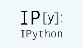

Learn More Python for Data Science Interactively at www.DataCamp.com

You can use them to build interactive GUIs for your notebooks or to synchronize stateful and stateless information between Python and JavaScript.

IRkernel IJulia

Installing Jupyter Notebook will automatically install the IPython kernel.

Saving/Loading Notebooks

Interrupt kernel

Restart kernel

<table>
  <tr>
    <th>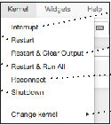  </th>
  </tr>
</table>

Download serialized state of all widget models in use

Create new notebook

Interrupt kernel & clear all output

Save notebook with interactive widgets

Restart kernel & run all cells

<table>
  <tr>
    <th>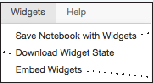</th>
  </tr>
</table>

<table>
  <tr>
    <th>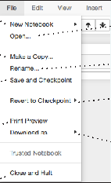  </th>
  </tr>
</table>

Open an existing notebookMake a copy of the current notebook

Connect back to a remote notebook

Restart kernel & run all cells

Embed current widgets

Rename notebook

Run other installed kernels

Revert notebook to a previous checkpoint

Save current notebook and record checkpoint

Command Mode:

<table>
  <tr>
    <th>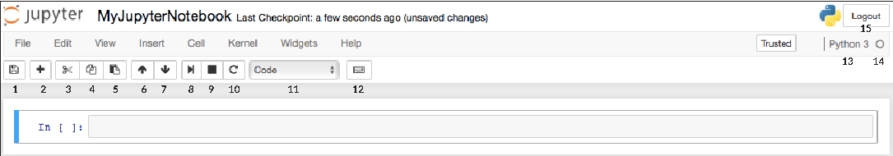  1 2 3 4 5 6 7 8 9 10 11 12  13 14  15</th>
  </tr>
</table>

Download notebook as

Preview of the printed notebook

- - IPython notebook
- - Python
- - HTML
- - Markdown
- - reST
- - LaTeX
- - PDF

Close notebook & stop running any scripts

Writing Code And Text

Code and text are encapsulated by 3 basic cell types: markdown cells, code cells, and raw NBConvert cells.

Edit Mode:

- 9. Interrupt kernel
- 10. Restart kernel
- 11. Display characteristics
- 12. Open command palette
- 13. Current kernel
- 14. Kernel status
- 15. Log out from notebook server

- 1. Save and checkpoint
- 2. Insert cell below
- 3. Cut cell
- 4. Copy cell(s)
- 5. Paste cell(s) below
- 6. Move cell up
- 7. Move cell down
- 8. Run current cell

Edit Cells

<table>
  <tr>
    <th>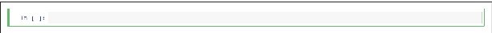</th>
  </tr>
</table>

Cut currently selected cells to clipboard

Copy cells from clipboard to current cursor position

Executing Cells Run selected cell(s) Run current cells down

Paste cells from clipboard above current cell

Paste cells from clipboard below

<table>
  <tr>
    <th>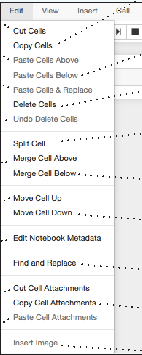  </th>
  </tr>
</table>

and create a new one below

current cellPaste cells from clipboard on top of current cel

Asking For Help

<table>
  <tr>
    <th>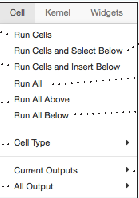  </th>
  </tr>
</table>

Run current cells down and create a new one above Run all cells

Delete current cells

Walk through a UI tour

Split up a cell from current cursor position

Revert “Delete Cells” invocation

List of built-in keyboard shortcutsEdit the built-in keyboard shortcuts

<table>
  <tr>
    <th>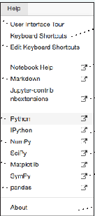</th>
  </tr>
</table>

Run all cells below the current cell

Run all cells above the current cell

Merge current cell with the one above

Merge current cell with the one below

Change the cell type of current cell

Notebook help topics

toggle, toggle scrolling and clear

Description of markdown available in notebook

Move current cell up Move current cell

current outputstoggle, toggle scrolling and clear all output

Information on unofficial Jupyter Notebook extensions

down

Adjust metadata underlying the current notebook

Find and replace in selected cells

Python help topics

IPython help topics NumPy help topics

View Cells

Remove cell attachments

Copy attachments of current cell

SciPy help topics

Toggle display of Jupyter logo and filename

Toggle display of toolbar

Matplotlib help topics

Paste attachments of current cell

Insert image in selected cells

SymPy help topics

<table>
  <tr>
    <th>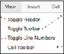</th>
  </tr>
</table>

Toggle display of cell action icons:

Pandas help topics

About Jupyter Notebook

Insert Cells

- - None
- - Edit metadata
- - Raw cell format
- - Slideshow
- - Attachments
- - Tags

<table>
  <tr>
    <th>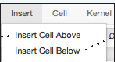</th>
  </tr>
</table>

Toggle line numbers in cells

Add new cell below the current one

Add new cell above the current one

DataCamp

####### Inspecting Your Array

Subsetting, Slicing, Indexing

#### Python For Data Science Cheat Sheet NumPy Basics Learn Python for Data Science Interactively at www.DataCamp.com

Also see Lists

<table>
  <tr>
    <th>>>> a.shape >>> len(a) >>> b.ndim >>> e.size >>> b.dtype >>> b.dtype.name >>> b.astype(int) </th>
    <th>Array dimensions Length of array Number of array dimensions Number of array elements Data type of array elements Name of data type Convert an array to a different type</th>
  </tr>
</table>

<table>
  <tr>
    <th>Subsetting  >>> a[2] 3 >>> b[1,2] 6.0   Slicing  >>> a[0:2] array([1, 2]) >>> b[0:2,1] array([ 2., 5.])   >>> b[:1] array([[1.5, 2., 3.]]) >>> c[1,...] array([[[ 3., 2., 1.],   [ 4., 5., 6.]]])  >>> a[ : :-1] array([3, 2, 1])  Boolean Indexing  >>> a[a<2] array([1])  Fancy Indexing  >>> b[[1, 0, 1, 0],[0, 1, 2, 0]] array([ 4. , 2. , 6. , 1.5])   >>> b[[1, 0, 1, 0]][:,[0,1,2,0]]   array([[ 4. ,5. , 6. , 4. ], [ 1.5, 2. , 3. , 1.5], [ 4. , 5. , 6. , 4. ], [ 1.5, 2. , 3. , 1.5]])  <table>
  <tr>
    <th>1</th>
    <th>2</th>
    <th>3</th>
  </tr>
</table>
  <table>
  <tr>
    <th>1.5</th>
    <th>2</th>
    <th>3</th>
  </tr>
  <tr>
    <td>4</td>
    <td>5</td>
    <td>6</td>
  </tr>
</table>
  <table>
  <tr>
    <th>1</th>
    <th>2</th>
    <th>3</th>
  </tr>
</table>
  <table>
  <tr>
    <th>1.5</th>
    <th>2</th>
    <th>3</th>
  </tr>
  <tr>
    <td>4</td>
    <td>5</td>
    <td>6</td>
  </tr>
</table>
  <table>
  <tr>
    <th>1.5</th>
    <th>2</th>
    <th>3</th>
  </tr>
  <tr>
    <td>4</td>
    <td>5</td>
    <td>6</td>
  </tr>
</table>
  <table>
  <tr>
    <th>1</th>
    <th>2</th>
    <th>3</th>
  </tr>
</table>
</th>
    <th>Select the element at the 2nd index Select the element at row 0 column 2  (equivalent to b[1][2]) Select items at index 0 and 1 Select items at rows 0 and 1 in column 1  Select all items at row 0 (equivalent to b[0:1, :]) Same as [1,:,:]  Reversed array a  Select elements from a less than 2  Select elements (1,0),(0,1),(1,2) and (0,0) Select a subset of the matrix’s rows and columns  </th>
  </tr>
</table>

NumPy

<table>
  <tr>
    <th>2  The NumPy library is the core library for scientific computing in Python. It provides a high-performance multidimensional array object, and tools for working with these arrays.  >>> import numpy as np  Use the following import convention:    <table>
  <tr>
    <th>1</th>
    <th>2</th>
    <th>3</th>
  </tr>
</table>
  1D array 2D array 3D array  <table>
  <tr>
    <th>1.5</th>
    <th>2</th>
    <th>3</th>
  </tr>
  <tr>
    <td>4</td>
    <td>5</td>
    <td>6</td>
  </tr>
</table>
  NumPy Arrays  axis 0 axis 1   axis 0  axis 1  axis 2 </th>
  </tr>
</table>

Asking For Help

<table>
  <tr>
    <th>>>> np.info(np.ndarray.dtype)</th>
  </tr>
</table>

Array Mathematics

Arithmetic Operations

<table>
  <tr>
    <th>>>> g = a - b  array([[-0.5, 0. , 0. ],  [-3. , -3. , -3. ]]) >>> np.subtract(a,b) >>> b + a  array([[ 2.5, 4. , 6. ],  [ 5. , 7. , 9. ]]) >>> np.add(b,a) >>> a / b  array([[ 0.66666667, 1. , 1. ],  [ 0.25 , 0.4 , 0.5 ]]) >>> np.divide(a,b) >>> a * b  array([[ 1.5, 4. , 9. ],  [ 4. , 10. , 18. ]]) >>> np.multiply(a,b) >>> np.exp(b) >>> np.sqrt(b) >>> np.sin(a) >>> np.cos(b) >>> np.log(a) >>> e.dot(f)  array([[ 7., 7.], [ 7., 7.]])</th>
    <th>Subtraction  Subtraction Addition  Addition Division  Division Multiplication  Multiplication Exponentiation Square root Print sines of an array Element-wise cosine Element-wise natural logarithm Dot product</th>
  </tr>
</table>

Creating Arrays

<table>
  <tr>
    <th>>>> a = np.array([1,2,3]) >>> b = np.array([(1.5,2,3), (4,5,6)], dtype = float) >>> c = np.array([[(1.5,2,3), (4,5,6)], [(3,2,1), (4,5,6)]], dtype = float) </th>
  </tr>
</table>

Array Manipulation

<table>
  <tr>
    <th>Transposing Array >>> i = np.transpose(b) >>> i.T  Changing Array Shape >>> b.ravel()  >>> g.reshape(3,-2) Adding/Removing Elements >>> h.resize((2,6)) >>> np.append(h,g) >>> np.insert(a, 1, 5) >>> np.delete(a,[1])   Combining Arrays  >>> np.concatenate((a,d),axis=0)  array([ 1, 2, 3, 10, 15, 20]) >>> np.vstack((a,b))  array([[ 1. , 2. , 3. ], [ 1.5, 2. , 3. ], [ 4. , 5. , 6. ]])  >>> np.r_[e,f] >>> np.hstack((e,f))  array([[ 7., 7., 1., 0.],  [ 7., 7., 0., 1.]]) >>> np.column_stack((a,d))  array([[ 1, 10],  [ 2, 15], [ 3, 20]])   >>> np.c_[a,d]  Splitting Arrays >>> np.hsplit(a,3)  [array([1]),array([2]),array([3])]  >>> np.vsplit(c,2) [array([[[ 1.5, 2. , 1. ],  [ 4. , 5. , 6. ]]]), array([[[ 3., 2., 3.],  [ 4., 5., 6.]]])]  </th>
    <th>Permute array dimensions Permute array dimensions  Flatten the array Reshape, but don’t change data  Return a new array with shape (2,6) Append items to an array Insert items in an array Delete items from an array  Concatenate arrays Stack arrays vertically (row-wise)  Stack arrays vertically (row-wise) Stack arrays horizontally (column-wise)  Create stacked column-wise arrays  Create stacked column-wise arrays  Split the array horizontally at the 3rd index Split the array vertically at the 2nd index</th>
  </tr>
</table>

Initial Placeholders

<table>
  <tr>
    <th>>>> np.zeros((3,4)) >>> np.ones((2,3,4),dtype=np.int16)  >>> d = np.arange(10,25,5) >>> np.linspace(0,2,9) >>> e = np.full((2,2),7) >>> f = np.eye(2) >>> np.random.random((2,2)) >>> np.empty((3,2)) </th>
    <th>Create an array of zeros Create an array of ones Create an array of evenly spaced values (step value) Create an array of evenly spaced values (number of samples) Create a constant array Create a 2X2 identity matrix Create an array with random values Create an empty array</th>
  </tr>
</table>

Comparison

<table>
  <tr>
    <th>>>> a == b  array([[False, True, True],  [False, False, False]], dtype=bool) >>> a < 2  array([True, False, False], dtype=bool) >>> np.array_equal(a, b)</th>
    <th>Element-wise comparison  Element-wise comparison Array-wise comparison</th>
  </tr>
</table>

####### I/O

Aggregate Functions

Saving & Loading On Disk

<table>
  <tr>
    <th>>>> a.sum()  >>> a.min() >>> b.max(axis=0)   >>> b.cumsum(axis=1)   >>> a.mean() >>> b.median() >>> a.corrcoef() >>> np.std(b) </th>
    <th>Array-wise sum Array-wise minimum value Maximum value of an array row Cumulative sum of the elements Mean Median Correlation coefficient Standard deviation</th>
  </tr>
</table>

<table>
  <tr>
    <th>>>> np.save('my_array', a) >>> np.savez('array.npz', a, b) >>> np.load('my_array.npy')</th>
  </tr>
</table>

Saving & Loading Text Files

<table>
  <tr>
    <th>>>> np.loadtxt("myfile.txt") >>> np.genfromtxt("my_file.csv", delimiter=',') >>> np.savetxt("myarray.txt", a, delimiter=" ")</th>
  </tr>
</table>

Copying Arrays

Data Types

<table>
  <tr>
    <th>>>> h = a.view() >>> np.copy(a) >>> h = a.copy()</th>
    <th>Create a view of the array with the same data Create a copy of the array Create a deep copy of the array</th>
  </tr>
</table>

<table>
  <tr>
    <th>>>> np.int64 >>> np.float32 >>> np.complex >>> np.bool >>> np.object >>> np.string_ >>> np.unicode_</th>
    <th>Signed 64-bit integer types Standard double-precision floating point Complex numbers represented by 128 floats Boolean type storing TRUE and FALSE values Python object type Fixed-length string type Fixed-length unicode type</th>
  </tr>
</table>

Sorting Arrays

<table>
  <tr>
    <th>>>> a.sort() >>> c.sort(axis=0)</th>
    <th>Sort an array Sort the elements of an array's axis</th>
  </tr>
</table>

####### Linear Algebra

Also see NumPy

You’ll use the linalg and sparse modules. Note that scipy.linalgcontains and expands on numpy.linalg.

###### SciPy - Linear Algebra

Matrix Functions

<table>
  <tr>
    <th>>>> from scipy import linalg, sparse</th>
  </tr>
</table>

Learn More Python for Data Science Interactively at www.datacamp.com

Creating Matrices

<table>
  <tr>
    <th>Addition >>> np.add(A,D) Subtraction >>> np.subtract(A,D) Division >>> np.divide(A,D) Multiplication >>> np.multiply(D,A) >>> np.dot(A,D) >>> np.vdot(A,D)  >>> np.inner(A,D) >>> np.outer(A,D) >>> np.tensordot(A,D) >>> np.kron(A,D)  Exponential Functions >>> linalg.expm(A) >>> linalg.expm2(A) >>> linalg.expm3(D)  Logarithm Function >>> linalg.logm(A)  Trigonometric Tunctions  >>> linalg.sinm(D) >>> linalg.cosm(D) >>> linalg.tanm(A)  Hyperbolic Trigonometric Functions  >>> linalg.sinhm(D) >>> linalg.coshm(D) >>> linalg.tanhm(A)  Matrix Sign Function >>> np.sigm(A)  Matrix Square Root >>> linalg.sqrtm(A)  Arbitrary Functions  >>> linalg.funm(A, lambda x: x*x)</th>
    <th>Addition Subtraction Division Multiplication Dot product Vector dot product Inner product Outer product Tensor dot product Kronecker product  Matrix exponential Matrix exponential (Taylor Series) Matrix exponential(eigenvalue decomposition)  Matrix logarithm Matrix sine Matrix cosine Matrix tangent Hypberbolic matrix sine Hyperbolic matrix cosine Hyperbolic matrix tangent Matrix sign function Matrix square root Evaluate matrix function</th>
  </tr>
</table>

<table>
  <tr>
    <th>>>> A = np.matrix(np.random.random((2,2))) >>> B = np.asmatrix(b) >>> C = np.mat(np.random.random((10,5))) >>> D = np.mat([[3,4], [5,6]]) </th>
  </tr>
</table>

####### SciPy

The SciPy library is one of the core packages for scientific computing that provides mathematical algorithms and convenience functions built on the NumPy extension of Python.

Basic Matrix Routines

<table>
  <tr>
    <th>Inverse  >>> A.I Inverse >>> linalg.inv(A) Inverse >>> A.T Tranpose matrix  >>> A.H Conjugate transposition >>> np.trace(A) Trace  Norm >>> linalg.norm(A) Frobenius norm >>> linalg.norm(A,1) L1 norm (max column sum) >>> linalg.norm(A,np.inf) L inf norm (max row sum)  Rank  >>> np.linalg.matrix_rank(C) Matrix rank  Determinant  >>> linalg.det(A) Determinant  Solving linear problems  >>> linalg.solve(A,b) Solver for dense matrices >>> E = np.mat(a).T Solver for dense matrices >>> linalg.lstsq(D,E) Least-squares solution to linear matrix  equation Generalized inverse  >>> linalg.pinv(C) Compute the pseudo-inverse of a matrix (least-squares solver) >>> linalg.pinv2(C) Compute the pseudo-inverse of a matrix (SVD)</th>
  </tr>
</table>

Interacting With NumPy Also seeNumPy

<table>
  <tr>
    <th>>>> import numpy as np  >>> a = np.array([1,2,3]) >>> b = np.array([(1+5j,2j,3j), (4j,5j,6j)]) >>> c = np.array([[(1.5,2,3), (4,5,6)], [(3,2,1), (4,5,6)]]) </th>
  </tr>
</table>

Index Tricks

<table>
  <tr>
    <th>>>> np.mgrid[0:5,0:5] >>> np.ogrid[0:2,0:2] >>> np.r_[[3,[0]*5,-1:1:10j] >>> np.c_[b,c]</th>
    <th>Create a dense meshgrid Create an open meshgrid Stack arrays vertically (row-wise) Create stacked column-wise arrays</th>
  </tr>
</table>

Shape Manipulation

<table>
  <tr>
    <th>>>> np.transpose(b) >>> b.flatten()  >>> np.hstack((b,c)) >>> np.vstack((a,b)) >>> np.hsplit(c,2) >>> np.vpslit(d,2)</th>
    <th>Permute array dimensions Flatten the array Stack arrays horizontally (column-wise) Stack arrays vertically (row-wise) Split the array horizontally at the 2nd index Split the array vertically at the 2nd index</th>
  </tr>
</table>

Polynomials

<table>
  <tr>
    <th>>>> from numpy import poly1d >>> p = poly1d([3,4,5])</th>
    <th>Create a polynomial object</th>
  </tr>
</table>

Creating Sparse Matrices

Vectorizing Functions

<table>
  <tr>
    <th>>>> F = np.eye(3, k=1) >>> G = np.mat(np.identity(2)) >>> C[C > 0.5] = 0 >>> H = sparse.csr_matrix(C) >>> I = sparse.csc_matrix(D) >>> J = sparse.dok_matrix(A) >>> E.todense() >>> sparse.isspmatrix_csc(A) </th>
    <th>Create a 2X2 identity matrix Create a 2x2 identity matrix  Compressed Sparse Row matrix Compressed Sparse Column matrix Dictionary Of Keys matrix Sparse matrix to full matrix Identify sparse matrix</th>
  </tr>
</table>

<table>
  <tr>
    <th>>>> def myfunc(a):  if a < 0:  return a*2 else:  return a/2  >>> np.vectorize(myfunc)</th>
    <th>Vectorize functions</th>
  </tr>
</table>

Decompositions

<table>
  <tr>
    <th>Eigenvalues and Eigenvectors >>> la, v = linalg.eig(A) >>> l1, l2 = la  >>> v[:,0] >>> v[:,1] >>> linalg.eigvals(A)   Singular Value Decomposition >>> U,s,Vh = linalg.svd(B) >>> M,N = B.shape >>> Sig = linalg.diagsvd(s,M,N)  LU Decomposition  >>> P,L,U = linalg.lu(C)</th>
    <th>Solve ordinary or generalized eigenvalue problem for square matrix Unpack eigenvalues First eigenvector Second eigenvector Unpack eigenvalues  Singular Value Decomposition (SVD) Construct sigma matrix in SVD LU Decomposition</th>
  </tr>
</table>

Type Handling

<table>
  <tr>
    <th>>>> np.real(c) >>> np.imag(c) >>> np.real_if_close(c,tol=1000) >>> np.cast['f'](np.pi)</th>
    <th>Return the real part of the array elements Return the imaginary part of the array elements Return a real array if complex parts close to 0 Cast object to a data type</th>
  </tr>
</table>

Sparse Matrix Routines

<table>
  <tr>
    <th>Inverse  >>> sparse.linalg.inv(I)  Norm >>> sparse.linalg.norm(I) Solving linear problems >>> sparse.linalg.spsolve(H,I)</th>
    <th>Inverse  Norm  Solver for sparse matrices</th>
  </tr>
</table>

Other Useful Functions

<table>
  <tr>
    <th>>>> np.angle(b,deg=True) >>> g = np.linspace(0,np.pi,num=5)  >>> g [3:] += np.pi >>> np.unwrap(g) >>> np.logspace(0,10,3) >>> np.select([c<4],[c*2])  >>> misc.factorial(a) >>> misc.comb(10,3,exact=True) >>> misc.central_diff_weights(3) >>> misc.derivative(myfunc,1.0)</th>
    <th>Return the angle of the complex argument Create an array of evenly spaced values (number of samples)  Unwrap Create an array of evenly spaced values (log scale) Return values from a list of arrays depending on conditions Factorial Combine N things taken at k time Weights for Np-point central derivative Find the n-th derivative of a function at a point</th>
  </tr>
</table>

Sparse Matrix Decompositions

Sparse Matrix Functions

<table>
  <tr>
    <th>>>> la, v = sparse.linalg.eigs(F,1) >>> sparse.linalg.svds(H, 2)</th>
    <th>Eigenvalues and eigenvectors SVD</th>
  </tr>
</table>

<table>
  <tr>
    <th>>>> sparse.linalg.expm(I)</th>
    <th>Sparse matrix exponential</th>
  </tr>
</table>

Asking For Help

######### DataCamp

<table>
  <tr>
    <th>>>> help(scipy.linalg.diagsvd) >>> np.info(np.matrix)</th>
  </tr>
</table>

Learn Python for Data ScienceInteractively

Dropping

#### Python For Data Science Cheat Sheet Pandas Basics Learn Python for Data Science Interactively at www.DataCamp.com

<table>
  <tr>
    <th>>>> help(pd.Series.loc)  Asking For Help</th>
  </tr>
</table>

<table>
  <tr>
    <th>>>> s.drop(['a', 'c']) >>> df.drop('Country', axis=1)</th>
    <th>Drop values from rows (axis=0) Drop values from columns(axis=1)</th>
  </tr>
</table>

Selection

Also see NumPy Arrays

Getting

Sort & Rank

<table>
  <tr>
    <th>>>> s['b']  -5  >>> df[1:]  Country Capital Population  1 India New Delhi 1303171035 2 Brazil Brasília 207847528 </th>
    <th>Get one element  Get subset of a DataFrame</th>
  </tr>
</table>

<table>
  <tr>
    <th>>>> df.sort_index() >>> df.sort_values(by='Country') >>> df.rank()</th>
    <th>Sort by labels along an axis Sort by the values along an axis Assign ranks to entries</th>
  </tr>
</table>

####### Pandas

The Pandas library is built on NumPy and provides easy-to-use data structures and data analysis tools for the Python programming language.

Retrieving Series/DataFrame Information

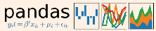

Selecting, Boolean Indexing & Setting Basic Information

Use the following import convention: Pandas Data Structures

<table>
  <tr>
    <th>By Position  >>> df.iloc([0],[0])  'Belgium'  >>> df.iat([0],[0]) 'Belgium' By Label  >>> df.loc([0], ['Country'])  'Belgium'  >>> df.at([0], ['Country'])  'Belgium'  By Label/Position >>> df.ix[2]  Country Brazil Capital Brasília Population 207847528  >>> df.ix[:,'Capital']  0 Brussels 1 New Delhi 2 Brasília   >>> df.ix[1,'Capital']  'New Delhi'  Boolean Indexing >>> s[~(s > 1)] >>> s[(s < -1) | (s > 2)] >>> df[df['Population']>1200000000]  Setting  >>> s['a'] = 6</th>
    <th>Select single value by row & column  Select single value by row & column labels  Select single row of subset of rows  Select a single column of subset of columns  Select rows and columns  Series s where value is not >1 s where value is <-1 or >2 Use filter to adjust DataFrame  Set index a of Series s to 6</th>
  </tr>
</table>

<table>
  <tr>
    <th>>>> df.shape >>> df.index >>> df.columns >>> df.info() >>> df.count()</th>
    <th>(rows,columns) Describe index Describe DataFrame columns Info on DataFrame Number of non-NA values</th>
  </tr>
</table>

>>> import pandas as pd

Series

Summary

<table>
  <tr>
    <th>a</th>
    <th>3</th>
  </tr>
  <tr>
    <td>b</td>
    <td>-5</td>
  </tr>
  <tr>
    <td>c</td>
    <td>7</td>
  </tr>
  <tr>
    <td>d</td>
    <td>4</td>
  </tr>
</table>

A one-dimensional labeled array capable of holding any data type

<table>
  <tr>
    <th>>>> df.sum() >>> df.cumsum() >>> df.min()/df.max() >>> df.idxmin()/df.idxmax() >>> df.describe() >>> df.mean() >>> df.median()</th>
    <th>Sum of values Cummulative sum of values Minimum/maximum values Minimum/Maximum index value Summary statistics Mean of values Median of values</th>
  </tr>
</table>

Index

>>> s = pd.Series([3, -5, 7, 4], index=['a', 'b', 'c', 'd'])

Applying Functions

DataFrame

<table>
  <tr>
    <th>>>> f = lambda x: x*2 >>> df.apply(f) >>> df.applymap(f)</th>
    <th>Apply function Apply function element-wise</th>
  </tr>
</table>

Columns

A two-dimensional labeled data structure with columns of potentially different types

<table>
  <tr>
    <th>Country</th>
    <th>Capital</th>
    <th>Population</th>
  </tr>
</table>

<table>
  <tr>
    <th>Belgium</th>
    <th>Brussels</th>
    <th>11190846</th>
  </tr>
  <tr>
    <td>India</td>
    <td>New Delhi</td>
    <td>1303171035</td>
  </tr>
  <tr>
    <td>Brazil</td>
    <td>Brasília</td>
    <td>207847528</td>
  </tr>
</table>

<table>
  <tr>
    <th>0</th>
  </tr>
  <tr>
    <td>1</td>
  </tr>
  <tr>
    <td>2</td>
  </tr>
</table>

Data Alignment

Index

Internal Data Alignment

NA values are introduced in the indices that don’t overlap:

<table>
  <tr>
    <th>>>> s3 = pd.Series([7, -2, 3], index=['a', 'c', 'd']) >>> s + s3  a 10.0 b NaN c 5.0 d 7.0 </th>
  </tr>
</table>

>>> data = {'Country': ['Belgium', 'India', 'Brazil'], 'Capital': ['Brussels', 'New Delhi', 'Brasília'], 'Population': [11190846, 1303171035, 207847528]}

>>> df = pd.DataFrame(data, columns=['Country', 'Capital', 'Population'])

Arithmetic Operations with Fill Methods

####### I/O

You can also do the internal data alignment yourself with the help of the fill methods:

########### Read and Write to CSV

Read and Write to SQL Query or Database Table

<table>
  <tr>
    <th>>>> pd.read_csv('file.csv', header=None, nrows=5) >>> df.to_csv('myDataFrame.csv')</th>
  </tr>
</table>

<table>
  <tr>
    <th>>>> from sqlalchemy import create_engine >>> engine = create_engine('sqlite:///:memory:') >>> pd.read_sql("SELECT * FROM my_table;", engine) >>> pd.read_sql_table('my_table', engine) >>> pd.read_sql_query("SELECT * FROM my_table;", engine)</th>
  </tr>
</table>

<table>
  <tr>
    <th>>>> s.add(s3, fill_value=0)  a 10.0 b -5.0 c 5.0 d 7.0   >>> s.sub(s3, fill_value=2) >>> s.div(s3, fill_value=4) >>> s.mul(s3, fill_value=3)</th>
  </tr>
</table>

Read and Write to Excel

<table>
  <tr>
    <th>>>> pd.read_excel('file.xlsx') >>> pd.to_excel('dir/myDataFrame.xlsx', sheet_name='Sheet1')  Read multiple sheets from the same file >>> xlsx = pd.ExcelFile('file.xls') >>> df = pd.read_excel(xlsx, 'Sheet1')</th>
  </tr>
</table>

read_sql()is a convenience wrapper around read_sql_table() and read_sql_query()

DataCamp

<table>
  <tr>
    <th>>>> pd.to_sql('myDf', engine)</th>
  </tr>
</table>

Create Your Model

Evaluate Your Model’s Performance

Classification Metrics

Supervised Learning Estimators

###### Scikit-Learn

<table>
  <tr>
    <th>Accuracy Score >>> knn.score(X_test, y_test) >>> from sklearn.metrics import accuracy_score >>> accuracy_score(y_test, y_pred)  Classification Report >>> from sklearn.metrics import classification_report >>> print(classification_report(y_test, y_pred))  Confusion Matrix >>> from sklearn.metrics import confusion_matrix >>> print(confusion_matrix(y_test, y_pred))</th>
    <th>Estimator score method Metric scoring functions  Precision, recall, f1-score and support</th>
  </tr>
</table>

<table>
  <tr>
    <th>Linear Regression >>> from sklearn.linear_model import LinearRegression >>> lr = LinearRegression(normalize=True)  Support Vector Machines (SVM) >>> from sklearn.svm import SVC >>> svc = SVC(kernel='linear')  Naive Bayes >>> from sklearn.naive_bayes import GaussianNB >>> gnb = GaussianNB()  KNN >>> from sklearn import neighbors >>> knn = neighbors.KNeighborsClassifier(n_neighbors=5)</th>
  </tr>
</table>

Learn Python for data science Interactively at www.DataCamp.com

Scikit-learn

Scikit-learn is an open source Python library that implements a range of machine learning, preprocessing, cross-validation and visualization algorithms using a unified interface.

Regression Metrics

A Basic Example

<table>
  <tr>
    <th>Mean Absolute Error  >>> from sklearn.metrics import mean_absolute_error >>> y_true = [3, -0.5, 2] >>> mean_absolute_error(y_true, y_pred)  Mean Squared Error >>> from sklearn.metrics import mean_squared_error >>> mean_squared_error(y_test, y_pred)  R² Score >>> from sklearn.metrics import r2_score >>> r2_score(y_true, y_pred)</th>
  </tr>
</table>

<table>
  <tr>
    <th>>>> from sklearn import neighbors, datasets, preprocessing >>> from sklearn.model_selection import train_test_split >>> from sklearn.metrics import accuracy_score >>> iris = datasets.load_iris() >>> X, y = iris.data[:, :2], iris.target >>> X_train, X_test, y_train, y_test = train_test_split(X, y, random_state=33) >>> scaler = preprocessing.StandardScaler().fit(X_train) >>> X_train = scaler.transform(X_train) >>> X_test = scaler.transform(X_test) >>> knn = neighbors.KNeighborsClassifier(n_neighbors=5) >>> knn.fit(X_train, y_train) >>> y_pred = knn.predict(X_test) >>> accuracy_score(y_test, y_pred)</th>
  </tr>
</table>

Unsupervised Learning Estimators

<table>
  <tr>
    <th>Principal Component Analysis (PCA) >>> from sklearn.decomposition import PCA >>> pca = PCA(n_components=0.95)  K Means >>> from sklearn.cluster import KMeans >>> k_means = KMeans(n_clusters=3, random_state=0)</th>
  </tr>
</table>

Clustering Metrics

Model Fitting

<table>
  <tr>
    <th>Adjusted Rand Index  >>> from sklearn.metrics import adjusted_rand_score >>> adjusted_rand_score(y_true, y_pred)  Homogeneity >>> from sklearn.metrics import homogeneity_score >>> homogeneity_score(y_true, y_pred)  V-measure >>> from sklearn.metrics import v_measure_score >>> metrics.v_measure_score(y_true, y_pred)</th>
  </tr>
</table>

<table>
  <tr>
    <th>Supervised learning >>> lr.fit(X, y) >>> knn.fit(X_train, y_train) >>> svc.fit(X_train, y_train)  Unsupervised Learning >>> k_means.fit(X_train) >>> pca_model = pca.fit_transform(X_train)</th>
    <th>Fit the model to the data  Fit the model to the data Fit to data, then transform it</th>
  </tr>
</table>

Loading The Data Also seeNumPy&Pandas

Your data needs to be numeric and stored as NumPy arrays or SciPy sparse matrices. Other types that are convertible to numeric arrays, such as Pandas DataFrame, are also acceptable.

<table>
  <tr>
    <th>>>> import numpy as np >>> X = np.random.random((10,5)) >>> y = np.array(['M','M','F','F','M','F','M','M','F','F','F']) >>> X[X < 0.7] = 0</th>
  </tr>
</table>

Prediction

Cross-Validation

<table>
  <tr>
    <th>>>> from sklearn.cross_validation import cross_val_score >>> print(cross_val_score(knn, X_train, y_train, cv=4)) >>> print(cross_val_score(lr, X, y, cv=2))</th>
  </tr>
</table>

<table>
  <tr>
    <th>Supervised Estimators >>> y_pred = svc.predict(np.random.random((2,5))) >>> y_pred = lr.predict(X_test) >>> y_pred = knn.predict_proba(X_test)  Unsupervised Estimators  >>> y_pred = k_means.predict(X_test)</th>
    <th>Predict labels Predict labels Estimate probability of a label  Predict labels in clustering algos</th>
  </tr>
</table>

####### Training And Test Data

<table>
  <tr>
    <th>>>> from sklearn.model_selection import train_test_split >>> X_train, X_test, y_train, y_test = train_test_split(X,  y, random_state=0)</th>
  </tr>
</table>

Tune Your Model

Grid Search

<table>
  <tr>
    <th>>>> from sklearn.grid_search import GridSearchCV >>> params = {"n_neighbors": np.arange(1,3),  "metric": ["euclidean", "cityblock"]} >>> grid = GridSearchCV(estimator=knn,  param_grid=params) >>> grid.fit(X_train, y_train) >>> print(grid.best_score_) >>> print(grid.best_estimator_.n_neighbors)</th>
  </tr>
</table>

####### Preprocessing The Data Standardization

########### Encoding Categorical Features

<table>
  <tr>
    <th>>>> from sklearn.preprocessing import StandardScaler >>> scaler = StandardScaler().fit(X_train) >>> standardized_X = scaler.transform(X_train) >>> standardized_X_test = scaler.transform(X_test)</th>
  </tr>
</table>

<table>
  <tr>
    <th>>>> from sklearn.preprocessing import LabelEncoder >>> enc = LabelEncoder() >>> y = enc.fit_transform(y)</th>
  </tr>
</table>

Randomized Parameter Optimization

<table>
  <tr>
    <th>>>> from sklearn.grid_search import RandomizedSearchCV >>> params = {"n_neighbors": range(1,5),  "weights": ["uniform", "distance"]}  >>> rsearch = RandomizedSearchCV(estimator=knn, param_distributions=params, cv=4, n_iter=8, random_state=5)  >>> rsearch.fit(X_train, y_train) >>> print(rsearch.best_score_)</th>
  </tr>
</table>

########### Normalization

########### Imputing Missing Values

<table>
  <tr>
    <th>>>> from sklearn.preprocessing import Normalizer >>> scaler = Normalizer().fit(X_train) >>> normalized_X = scaler.transform(X_train) >>> normalized_X_test = scaler.transform(X_test)</th>
  </tr>
</table>

<table>
  <tr>
    <th>>>> from sklearn.preprocessing import Imputer >>> imp = Imputer(missing_values=0, strategy='mean', axis=0) >>> imp.fit_transform(X_train)</th>
  </tr>
</table>

########### Generating Polynomial Features

########### Binarization

<table>
  <tr>
    <th>>>> from sklearn.preprocessing import PolynomialFeatures >>> poly = PolynomialFeatures(5) >>> poly.fit_transform(X)</th>
  </tr>
</table>

<table>
  <tr>
    <th>>>> from sklearn.preprocessing import Binarizer >>> binarizer = Binarizer(threshold=0.0).fit(X) >>> binary_X = binarizer.transform(X)</th>
  </tr>
</table>

Plot Anatomy & Workflow

Plot Anatomy Workflow

###### Matplotlib

The basic steps to creating plots with matplotlib are:

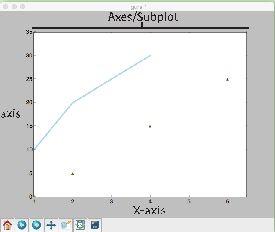

Axes/Subplot

1Prepare data 2Create plot 3Plot 4 Customize plot 5Save plot 6Show plot

Learn Python Interactively at www.DataCamp.com

<table>
  <tr>
    <th>>>> import matplotlib.pyplot as plt  >>> x = [1,2,3,4] >>> y = [10,20,25,30] >>> fig = plt.figure() >>> ax = fig.add_subplot(111) >>> ax.plot(x, y, color='lightblue', linewidth=3) >>> ax.scatter([2,4,6],   [5,15,25], color='darkgreen', marker='^')  >>> ax.set_xlim(1, 6.5) >>> plt.savefig('foo.png') >>> plt.show()  Step 3, 4  Step 2  Step 1  Step 3  Step 6</th>
  </tr>
</table>

####### Matplotlib

Y-axis

Figure

Matplotlib is a Python 2D plotting library which produces publication-quality figures in a variety of hardcopy formats and interactive environments across platforms.

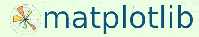

X-axis

## 1

Prepare The Data Also seeLists&NumPy

## 4

####### Customize Plot

- 1D Data

- 2D Data or Images

<table>
  <tr>
    <th>>>> import numpy as np  >>> x = np.linspace(0, 10, 100) >>> y = np.cos(x) >>> z = np.sin(x) </th>
  </tr>
</table>

Mathtext

Colors, Color Bars & Color Maps

<table>
  <tr>
    <th>>>> plt.plot(x, x, x, x**2, x, x**3) >>> ax.plot(x, y, alpha = 0.4) >>> ax.plot(x, y, c='k') >>> fig.colorbar(im, orientation='horizontal') >>> im = ax.imshow(img,  cmap='seismic')</th>
  </tr>
</table>

<table>
  <tr>
    <th>>>> plt.title(r'$sigma_i=15$', fontsize=20)</th>
  </tr>
</table>

Limits, Legends & Layouts

<table>
  <tr>
    <th>Limits & Autoscaling >>> ax.margins(x=0.0,y=0.1) >>> ax.axis('equal') >>> ax.set(xlim=[0,10.5],ylim=[-1.5,1.5]) >>> ax.set_xlim(0,10.5)  Legends  >>> ax.set(title='An Example Axes',  ylabel='Y-Axis', xlabel='X-Axis')  >>> ax.legend(loc='best')  Ticks  >>> ax.xaxis.set(ticks=range(1,5), ticklabels=[3,100,-12,"foo"])  >>> ax.tick_params(axis='y', direction='inout', length=10)  Subplot Spacing  >>> fig3.subplots_adjust(wspace=0.5, hspace=0.3, left=0.125, right=0.9, top=0.9, bottom=0.1)  >>> fig.tight_layout()  Axis Spines >>> ax1.spines['top'].set_visible(False) >>> ax1.spines['bottom'].set_position(('outward',10))</th>
    <th>Add padding to a plot Set the aspect ratio of the plot to 1 Set limits for x-and y-axis Set limits for x-axis  Set a title and x-and y-axis labels No overlapping plot elements Manually set x-ticks Make y-ticks longer and go in and out  Adjust the spacing between subplots  Fit subplot(s) in to the figure area Make the top axis line for a plot invisible Move the bottom axis line outward</th>
  </tr>
</table>

<table>
  <tr>
    <th>>>> data = 2 * np.random.random((10, 10)) >>> data2 = 3 * np.random.random((10, 10)) >>> Y, X = np.mgrid[-3:3:100j, -3:3:100j]  >>> U = -1 - X**2 + Y >>> V = 1 + X - Y**2 >>> from matplotlib.cbook import get_sample_data >>> img = np.load(get_sample_data('axes_grid/bivariate_normal.npy')) </th>
  </tr>
</table>

Markers

<table>
  <tr>
    <th>>>> fig, ax = plt.subplots() >>> ax.scatter(x,y,marker=".") >>> ax.plot(x,y,marker="o")</th>
  </tr>
</table>

Linestyles

Create Plot2

<table>
  <tr>
    <th>>>> plt.plot(x,y,linewidth=4.0) >>> plt.plot(x,y,ls='solid') >>> plt.plot(x,y,ls='--') >>> plt.plot(x,y,'--',x**2,y**2,'-.') >>> plt.setp(lines,color='r',linewidth=4.0)</th>
  </tr>
</table>

<table>
  <tr>
    <th>>>> import matplotlib.pyplot as plt</th>
  </tr>
</table>

Figure

<table>
  <tr>
    <th>>>> fig = plt.figure() >>> fig2 = plt.figure(figsize=plt.figaspect(2.0))</th>
  </tr>
</table>

Text & Annotations

<table>
  <tr>
    <th>>>> ax.text(1,  -2.1, 'Example Graph', style='italic')  >>> ax.annotate("Sine", xy=(8, 0), xycoords='data', xytext=(10.5, 0), textcoords='data', arrowprops=dict(arrowstyle="->",  connectionstyle="arc3"),)</th>
  </tr>
</table>

Axes

All plotting is done with respect to an Axes. In most cases, a subplot will fit your needs. A subplot is an axes on a grid system.

<table>
  <tr>
    <th>>>> fig.add_axes() >>> ax1 = fig.add_subplot(221) # row-col-num >>> ax3 = fig.add_subplot(212)  >>> fig3, axes = plt.subplots(nrows=2,ncols=2) >>> fig4, axes2 = plt.subplots(ncols=3) </th>
  </tr>
</table>

5

# Plotting Routines3

####### Save Plot

<table>
  <tr>
    <th>Save figures  >>> plt.savefig('foo.png')  Save transparent figures  >>> plt.savefig('foo.png', transparent=True)</th>
  </tr>
</table>

- 1D Data

<table>
  <tr>
    <th>>>> fig, ax = plt.subplots() >>> im = ax.imshow(img,  cmap='gist_earth', interpolation='nearest', vmin=-2, vmax=2)</th>
    <th>Colormapped or RGB arrays</th>
  </tr>
</table>

- 2D Data or Images

Vector Fields

<table>
  <tr>
    <th>>>> fig, ax = plt.subplots() >>> lines = ax.plot(x,y) >>> ax.scatter(x,y)  >>> axes[0,0].bar([1,2,3],[3,4,5]) >>> axes[1,0].barh([0.5,1,2.5],[0,1,2]) >>> axes[1,1].axhline(0.45) >>> axes[0,1].axvline(0.65) >>> ax.fill(x,y,color='blue') >>> ax.fill_between(x,y,color='yellow') </th>
    <th>Draw points with lines or markers connecting them Draw unconnected points, scaled or colored Plot vertical rectangles (constant width) Plot horiontal rectangles (constant height) Draw a horizontal line across axes Draw a vertical line across axes Draw filled polygons Fill between y-values and 0</th>
  </tr>
</table>

<table>
  <tr>
    <th>>>> axes[0,1].arrow(0,0,0.5,0.5) >>> axes[1,1].quiver(y,z) >>> axes[0,1].streamplot(X,Y,U,V) </th>
    <th>Add an arrow to the axes Plot a 2D field of arrows Plot a 2D field of arrows</th>
  </tr>
</table>

6

Data Distributions

####### Show Plot

<table>
  <tr>
    <th>>>> ax1.hist(y) >>> ax3.boxplot(y) >>> ax3.violinplot(z)</th>
    <th>Plot a histogram Make a box and whisker plot Make a violin plot</th>
  </tr>
</table>

<table>
  <tr>
    <th>>>> plt.show()</th>
  </tr>
</table>

####### Close & Clear

<table>
  <tr>
    <th>>>> plt.cla() >>> plt.clf() >>> plt.close()</th>
    <th>Clear an axis Clear the entire figure Close a window</th>
  </tr>
</table>

<table>
  <tr>
    <th>>>> axes2[0].pcolor(data2) Pseudocolor plot of 2D array >>> axes2[0].pcolormesh(data) Pseudocolor plot of 2D array >>> CS = plt.contour(Y,X,U) Plot contours >>> axes2[2].contourf(data1) Plot filled contours >>> axes2[2]= ax.clabel(CS) Label a contour plot</th>
  </tr>
</table>

############ DataCamp

Learn Python for Data ScienceInteractively

Matplotlib 2.0.0 - Updated on: 02/2017

####### Plotting With Seaborn

Axis Grids

###### Seaborn

<table>
  <tr>
    <th>>>> g = sns.FacetGrid(titanic, col="survived", row="sex")  >>> g = g.map(plt.hist,"age") >>> sns.factorplot(x="pclass",  y="survived", hue="sex", data=titanic)  >>> sns.lmplot(x="sepal_width", y="sepal_length", hue="species", data=iris)</th>
    <th>Subplot grid for plotting conditional relationships  Draw a categorical plot onto a Facetgrid  Plot data and regression model fits across a FacetGrid</th>
  </tr>
</table>

<table>
  <tr>
    <th>>>> h = sns.PairGrid(iris)  >>> h = h.map(plt.scatter) >>> sns.pairplot(iris) >>> i = sns.JointGrid(x="x", y="y", data=data)   >>> i = i.plot(sns.regplot, sns.distplot)   >>> sns.jointplot("sepal_length", "sepal_width", data=iris, kind='kde')</th>
    <th>Subplot grid for plotting pairwise relationships Plot pairwise bivariate distributions Grid for bivariate plot with marginal univariate plots  Plot bivariate distribution</th>
  </tr>
</table>

Learn Data Science Interactively at www.DataCamp.com

Statistical Data Visualization With Seaborn

The Python visualization library Seaborn is based on matplotlib and provides a high-level interface for drawing attractive statistical graphics.

Regression PlotsCategorical Plots

Make use of the following aliases to import the libraries:

<table>
  <tr>
    <th>>>> sns.regplot(x="sepal_width", y="sepal_length", data=iris, ax=ax)</th>
    <th>Plot data and a linear regression model fit</th>
  </tr>
</table>

<table>
  <tr>
    <th>Scatterplot  >>> sns.stripplot(x="species", y="petal_length", data=iris)  >>> sns.swarmplot(x="species", y="petal_length", data=iris)  Bar Chart  >>> sns.barplot(x="sex", y="survived", hue="class", data=titanic)  Count Plot  >>> sns.countplot(x="deck", data=titanic, palette="Greens_d")  Point Plot  >>> sns.pointplot(x="class", y="survived", hue="sex", data=titanic, palette={"male":"g",  "female":"m"}, markers=["^","o"], linestyles=["-","--"])  Boxplot  >>> sns.boxplot(x="alive", y="age", hue="adult_male", data=titanic)  >>> sns.boxplot(data=iris,orient="h")  Violinplot  >>> sns.violinplot(x="age", y="sex", hue="survived", data=titanic)</th>
    <th>Scatterplot with one categorical variable  Categorical scatterplot with non-overlapping points  Show point estimates and confidence intervals with scatterplot glyphs  Show count of observations  Show point estimates and confidence intervals as rectangular bars  Boxplot  Boxplot with wide-form data  Violin plot</th>
  </tr>
</table>

<table>
  <tr>
    <th>>>> import matplotlib.pyplot as plt >>> import seaborn as sns</th>
  </tr>
</table>

The basic steps to creating plots with Seaborn are:

Distribution Plots

- 1. Prepare some data
- 2. Control figure aesthetics
- 3. Plot with Seaborn
- 4. Further customize your plot

<table>
  <tr>
    <th>>>> plot = sns.distplot(data.y,  kde=False, color="b")</th>
    <th>Plot univariate distribution</th>
  </tr>
</table>

Matrix Plots

<table>
  <tr>
    <th>>>> sns.heatmap(uniform_data,vmin=0,vmax=1)</th>
    <th>Heatmap</th>
  </tr>
</table>

<table>
  <tr>
    <th>>>> import matplotlib.pyplot as plt >>> import seaborn as sns >>> tips = sns.load_dataset("tips") >>> sns.set_style("whitegrid") >>> g = sns.lmplot(x="tip",  y="total_bill", data=tips, aspect=2)  >>> g = (g.set_axis_labels("Tip","Total bill(USD)"). set(xlim=(0,10),ylim=(0,100))) >>> plt.title("title") >>> plt.show(g)  Step 4  Step 2  Step 1  Step 5  Step 3  </th>
  </tr>
</table>

Further Customizations4

Also see Matplotlib

Axisgrid Objects

<table>
  <tr>
    <th>>>> g.despine(left=True) >>> g.set_ylabels("Survived") >>> g.set_xticklabels(rotation=45)  >>> g.set_axis_labels("Survived", "Sex") >>> h.set(xlim=(0,5), ylim=(0,5), xticks=[0,2.5,5], yticks=[0,2.5,5]) </th>
    <th>Remove left spine Set the labels of the y-axis Set the tick labels for x Set the axis labels  Set the limit and ticks of the x-and y-axis</th>
  </tr>
</table>

- 1

<table>
  <tr>
    <th>>>> titanic = sns.load_dataset("titanic") >>> iris = sns.load_dataset("iris")</th>
  </tr>
</table>

Seaborn also offers built-in data sets:

- 2

Data

Also see Lists, NumPy&Pandas

Plot

<table>
  <tr>
    <th>>>> import pandas as pd >>> import numpy as np >>> uniform_data = np.random.rand(10, 12) >>> data = pd.DataFrame({'x':np.arange(1,101),  'y':np.random.normal(0,4,100)})</th>
  </tr>
</table>

<table>
  <tr>
    <th>>>> plt.title("A Title") >>> plt.ylabel("Survived") >>> plt.xlabel("Sex") >>> plt.ylim(0,100) >>> plt.xlim(0,10) >>> plt.setp(ax,yticks=[0,5]) >>> plt.tight_layout()</th>
    <th>Add plot title Adjust the label of the y-axis Adjust the label of the x-axis Adjust the limits of the y-axis Adjust the limits of the x-axis Adjust a plot property Adjust subplot params</th>
  </tr>
</table>

5

Show or Save Plot

Also see Matplotlib

Figure Aesthetics

Also see Matplotlib

<table>
  <tr>
    <th>>>> plt.show() >>> plt.savefig("foo.png") >>> plt.savefig("foo.png",  transparent=True)</th>
    <th>Show the plot Save the plot as a figure Save transparent figure</th>
  </tr>
</table>

Context Functions

<table>
  <tr>
    <th>>>> f, ax = plt.subplots(figsize=(5,6))</th>
    <th>Create a figure and one subplot</th>
  </tr>
</table>

<table>
  <tr>
    <th>>>> sns.set_context("talk") >>> sns.set_context("notebook",  font_scale=1.5, rc={"lines.linewidth":2.5})</th>
    <th>Set context to "talk" Set context to "notebook", Scale font elements and override param mapping</th>
  </tr>
</table>

Seaborn styles

Close & Clear

Also see Matplotlib

<table>
  <tr>
    <th>>>> sns.set() >>> sns.set_style("whitegrid") >>> sns.set_style("ticks",  {"xtick.major.size":8,  "ytick.major.size":8}) >>> sns.axes_style("whitegrid")</th>
    <th>(Re)set the seaborn default Set the matplotlib parameters Set the matplotlib parameters  Return a dict of params or use with with to temporarily set the style</th>
  </tr>
</table>

<table>
  <tr>
    <th>>>> plt.cla() >>> plt.clf() >>> plt.close()</th>
    <th>Clear an axis Clear an entire figure Close a window</th>
  </tr>
</table>

Color Palette

<table>
  <tr>
    <th>>>> sns.set_palette("husl",3) Define the color palette >>> sns.color_palette("husl") Use with with to temporarily set palette >>> flatui = ["#9b59b6","#3498db","#95a5a6","#e74c3c","#34495e","#2ecc71"] >>> sns.set_palette(flatui) Set your own color palette</th>
  </tr>
</table>

####### Renderers & Visual Customizations Glyphs

Grid Layout

###### Bokeh

<table>
  <tr>
    <th>Scatter Markers  >>> p1.circle(np.array([1,2,3]), np.array([3,2,1]), fill_color='white') >>> p2.square(np.array([1.5,3.5,5.5]), [1,4,3], color='blue', size=1)   Line Glyphs  >>> p1.line([1,2,3,4], [3,4,5,6], line_width=2) >>> p2.multi_line(pd.DataFrame([[1,2,3],[5,6,7]]), pd.DataFrame([[3,4,5],[3,2,1]]), color="blue")   <table>
  <tr>
    <th rowspan="7"> </th>
    <th rowspan="5"> </th>
    <th rowspan="7"> </th>
    <th> </th>
    <th rowspan="7"> </th>
    <th rowspan="3"> </th>
    <th rowspan="7"> </th>
    <th rowspan="7"> </th>
  </tr>
  <tr>
    <td> </td>
  </tr>
  <tr>
    <td rowspan="5"> </td>
  </tr>
  <tr>
    <td> </td>
  </tr>
  <tr>
    <td rowspan="3"> </td>
  </tr>
  <tr>
    <td> </td>
  </tr>
  <tr>
    <td> </td>
  </tr>
</table>
  <table>
  <tr>
    <th> </th>
    <th> </th>
    <th> </th>
    <th> </th>
    <th> </th>
    <th> </th>
    <th> </th>
    <th> </th>
  </tr>
</table>
  <table>
  <tr>
    <th> </th>
    <th> </th>
    <th> </th>
    <th> </th>
    <th> </th>
    <th> </th>
    <th> </th>
    <th> </th>
  </tr>
</table>
  <table>
  <tr>
    <th> </th>
    <th> </th>
    <th> </th>
    <th> </th>
    <th> </th>
    <th> </th>
    <th> </th>
    <th> </th>
  </tr>
</table>
  </th>
  </tr>
</table>

<table>
  <tr>
    <th>>>> from bokeh.layouts import gridplot  >>> row1 = [p1,p2] >>> row2 = [p3] >>> layout = gridplot([[p1,p2],[p3]]) </th>
  </tr>
</table>

Learn Bokeh Interactively at www.DataCamp.com, taught by Bryan Van de Ven, core contributor

########### Tabbed Layout

####### Plotting With Bokeh

<table>
  <tr>
    <th>>>> from bokeh.models.widgets import Panel, Tabs  >>> tab1 = Panel(child=p1, title="tab1") >>> tab2 = Panel(child=p2, title="tab2") >>> layout = Tabs(tabs=[tab1, tab2]) </th>
  </tr>
</table>

The Python interactive visualization library Bokeh enables high-performance visual presentation of large datasets in modern web browsers.

Customized Glyphs

Also seeData

Linked Plots

<table>
  <tr>
    <th>Selection and Non-Selection Glyphs >>> p = figure(tools='box_select') >>> p.circle('mpg', 'cyl', source=cds_df,  selection_color='red', nonselection_alpha=0.1)  Hover Glyphs >>> from bokeh.models import HoverTool >>> hover = HoverTool(tooltips=None, mode='vline') >>> p3.add_tools(hover)  <table>
  <tr>
    <th> </th>
    <th> </th>
    <th> </th>
    <th> </th>
  </tr>
</table>
  Colormapping >>> from bokeh.models import CategoricalColorMapper >>> color_mapper = CategoricalColorMapper(  <table>
  <tr>
    <th> </th>
    <th> </th>
    <th> </th>
    <th> </th>
    <th> </th>
    <th> </th>
    <th>US Asia Europe</th>
    <th> </th>
  </tr>
</table>
  factors=['US', 'Asia', 'Europe'], palette=['blue', 'red', 'green'])  >>> p3.circle('mpg', 'cyl', source=cds_df, color=dict(field='origin',  transform=color_mapper), legend='Origin')  <table>
  <tr>
    <th> </th>
    <th> </th>
    <th> </th>
    <th> </th>
    <th> </th>
    <th> </th>
    <th> </th>
    <th> </th>
  </tr>
</table>
    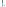        </th>
  </tr>
</table>

Bokeh’s mid-level general purpose bokeh.plotting interfaceis centered around two main components: data and glyphs.

<table>
  <tr>
    <th>Linked Axes  >>> p2.x_range = p1.x_range >>> p2.y_range = p1.y_range Linked Brushing   >>> p4 = figure(plot_width = 100, tools='box_select,lasso_select')  >>> p4.circle('mpg', 'cyl', source=cds_df)  >>> p5 = figure(plot_width = 200, tools='box_select,lasso_select')  >>> p5.circle('mpg', 'hp', source=cds_df) >>> layout = row(p4,p5)   </th>
  </tr>
</table>

<table>
  <tr>
    <th> </th>
    <th> </th>
    <th> </th>
    <th> </th>
    <th> </th>
    <th> </th>
    <th> </th>
    <th> </th>
  </tr>
</table>

<table>
  <tr>
    <th> </th>
    <th> </th>
    <th> </th>
  </tr>
  <tr>
    <td> </td>
    <td> </td>
    <td> </td>
  </tr>
  <tr>
    <td> </td>
    <td> </td>
    <td> </td>
  </tr>
  <tr>
    <td> </td>
    <td> </td>
    <td> </td>
  </tr>
  <tr>
    <td> </td>
    <td> </td>
    <td> </td>
  </tr>
</table>

+ =

data glyphs plot

The basic steps to creating plots with the bokeh.plotting interface are:

- 1. Prepare some data:

Python lists, NumPy arrays, Pandas DataFrames and other sequences of values

- 2. Create a new plot
- 3. Add renderers for your data, with visual customizations
- 4. Specify where to generate the output
- 5. Show or save the results

# Output & Export4

########### Notebook

<table>
  <tr>
    <th>>>> from bokeh.io import output_notebook, show >>> output_notebook()</th>
  </tr>
</table>

<table>
  <tr>
    <th>>>> from bokeh.plotting import figure >>> from bokeh.io import output_file, show  >>> x = [1, 2, 3, 4, 5] >>> y = [6, 7, 2, 4, 5] >>> p = figure(title="simple line example",   x_axis_label='x', y_axis_label='y')   >>> p.line(x, y, legend="Temp.", line_width=2) >>> output_file("lines.html") >>> show(p)  Step 4  Step 2  Step 1  Step 5  Step 3</th>
  </tr>
</table>

HTML

Legend Location

<table>
  <tr>
    <th>Standalone HTML >>> from bokeh.embed import file_html >>> from bokeh.resources import CDN >>> html = file_html(p, CDN, "my_plot")</th>
  </tr>
</table>

<table>
  <tr>
    <th>Inside Plot Area  >>> p.legend.location = 'bottom_left'  Outside Plot Area  >>> from bokeh.models import Legend  >>> r1 = p2.asterisk(np.array([1,2,3]), np.array([3,2,1]) >>> r2 = p2.line([1,2,3,4], [3,4,5,6]) >>> legend = Legend(items=[("One" ,[p1, r1]),("Two",[r2])],   location=(0, -30)) >>> p.add_layout(legend, 'right')</th>
  </tr>
</table>

<table>
  <tr>
    <th>>>> from bokeh.io import output_file, show >>> output_file('my_bar_chart.html', mode='cdn')</th>
  </tr>
</table>

<table>
  <tr>
    <th>Components >>> from bokeh.embed import components >>> script, div = components(p)</th>
  </tr>
</table>

1

Data Also seeLists,NumPy&Pandas Under the hood, your data is converted to Column Data Sources. You can also do this manually:

Legend Orientation

PNG

<table>
  <tr>
    <th>>>> p.legend.orientation = "horizontal" >>> p.legend.orientation = "vertical"</th>
  </tr>
</table>

<table>
  <tr>
    <th>>>> import numpy as np >>> import pandas as pd >>> df = pd.DataFrame(np.array([[33.9,4,65, 'US'],  [32.4,4,66, 'Asia'], [21.4,4,109, 'Europe']]),  columns=['mpg','cyl', 'hp', 'origin'], index=['Toyota', 'Fiat', 'Volvo'])</th>
  </tr>
</table>

<table>
  <tr>
    <th>>>> from bokeh.io import export_png >>> export_png(p, filename="plot.png")</th>
  </tr>
</table>

Legend Background & Border

########### SVG

<table>
  <tr>
    <th>>>> p.legend.border_line_color = "navy" >>> p.legend.background_fill_color = "white"</th>
  </tr>
</table>

<table>
  <tr>
    <th>>>> from bokeh.io import export_svgs >>> p.output_backend = "svg" >>> export_svgs(p, filename="plot.svg")</th>
  </tr>
</table>

Rows & Columns Layout

<table>
  <tr>
    <th>>>> from bokeh.models import ColumnDataSource >>> cds_df = ColumnDataSource(df)</th>
  </tr>
</table>

<table>
  <tr>
    <th>Rows >>> from bokeh.layouts import row >>> layout = row(p1,p2,p3)  Columns >>> from bokeh.layouts import columns >>> layout = column(p1,p2,p3)  Nesting Rows & Columns  >>>layout = row(column(p1,p2), p3)</th>
  </tr>
</table>

Show or Save Your Plots5

- 2

Plotting

<table>
  <tr>
    <th>>>> from bokeh.plotting import figure  >>> p1 = figure(plot_width=300, tools='pan,box_zoom') >>> p2 = figure(plot_width=300, plot_height=300, x_range=(0, 8), y_range=(0, 8)) >>> p3 = figure() </th>
  </tr>
</table>

<table>
  <tr>
    <th>>>> show(p1) >>> save(p1)</th>
    <th>>>> show(layout) >>> save(layout)</th>
  </tr>
</table>

