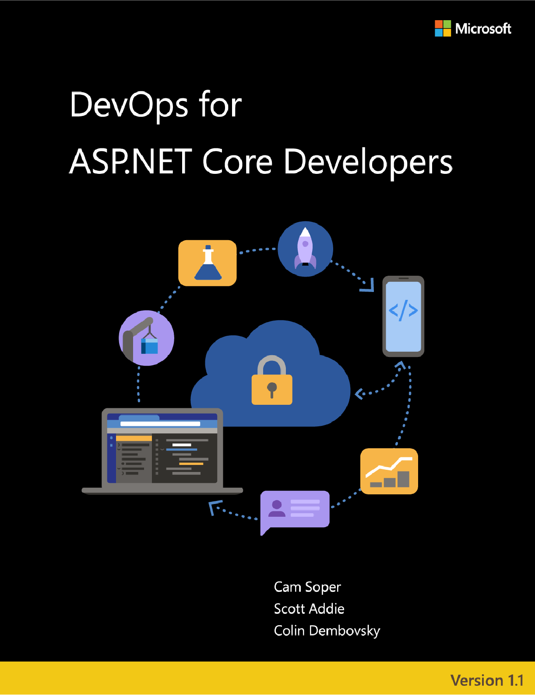

EDITION v1.1.0 Refer changelog for the book updates and community contributions. This guide is available as a downloadable PDF e-book. PUBLISHED BY Microsoft Developer Division, .NET, and Visual Studio product teams A division of Microsoft Corporation One Microsoft Way Redmond, Washington 98052-6399 Copyright © 2022 by Microsoft Corporation All rights reserved. No part of the contents of this book may be reproduced or transmitted in any form or by any means without the written permission of the publisher.

This book is provided “as-is” and expresses the author’s views and opinions. The views, opinions, and information expressed in this book, including URL and other Internet website references, may change without notice.

Some examples depicted herein are provided for illustration only and are fictitious. No real association or connection is intended or should be inferred.

Microsoft and the trademarks listed at https://www.microsoft.com on the “Trademarks” webpage are trademarks of the Microsoft group of companies.

Mac and macOS are trademarks of Apple Inc. The Docker whale logo is a registered trademark of Docker, Inc. Used by permission. All other marks and logos are property of their respective owners.

Credits Authors: Cam Soper Scott Addie Colin Dembovsky

# Welcome

Welcome to the Azure Development Lifecycle guide for .NET! This guide introduces the basic concepts of building a development lifecycle around Azure using .NET tools and processes. After finishing this guide, you’ll reap the benefits of a mature DevOps toolchain.

# Who this guide is for

You should be an experienced ASP.NET Core developer (200-300 level). You don’t need to know anything about Azure, as we’ll cover that in this introduction. This guide may also be useful for DevOps engineers who are more focused on operations than development.

This guide targets Windows developers. However, Linux and macOS are fully supported by .NET Core. To adapt this guide for Linux/macOS, watch for callouts for Linux/macOS differences.

# What this guide doesn’t cover

This guide is focused on an end-to-end continuous deployment experience for .NET developers. It’s not an exhaustive guide to all things Azure, and it doesn’t focus extensively on .NET APIs for Azure services. The emphasis is all around continuous integration, deployment, monitoring, and debugging. Near the end of the guide, recommendations for next steps are offered. Included in the suggestions are Azure platform services that are useful to ASP.NET Core developers.

# What’s in this guide

## Tools and downloads

Learn where to acquire the tools used in this guide.

## Deploy to App Service

Learn the various methods for deploying an ASP.NET Core app to Azure App Service.

## Continuous integration and deployment with Azure DevOps

Build an end-to-end continuous integration and deployment solution for your ASP.NET Core app with GitHub, Azure DevOps Services, and Azure.

## Continuous integration and deployment with GitHub Actions

Build an end-to-end continuous integration and deployment solution for your ASP.NET Core app with GitHub, GitHub Actions, and Azure, including code scanning for security and quality using CodeQL.

## Monitor and debug

Use Azure’s tools to monitor, troubleshoot, and tune your application.

## Next steps

Other learning paths for the ASP.NET Core developer learning Azure.

# Additional introductory reading

If this is your first exposure to cloud computing, these articles explain the basics.

- • What is Cloud Computing?

- • Examples of Cloud Computing


- • What is IaaS?

- • What is PaaS?


<table>
  <tr>
    <th> </th>
  </tr>
</table>


Contents

Tools and downloads .............................................................................................................. 1 Prerequisites ..............................................................................................................................................................................1 Recommended tools (Windows only)..............................................................................................................................1

Deploy an app to App Service................................................................................................ 3 Download and test the app.................................................................................................................................................3 Create the Azure App Service Web App.........................................................................................................................5 Deployment with Visual Studio..........................................................................................................................................6 Deployment slots.....................................................................................................................................................................8 Summary .................................................................................................................................................................................. 10 Additional reading................................................................................................................................................................ 10

Continuous integration and deployment with Azure DevOps ......................................... 11 Publish the app’s code to GitHub .................................................................................................................................. 12 Disconnect local Git deployment ................................................................................................................................... 12 Create an Azure DevOps organization......................................................................................................................... 13 Create a team project in Azure DevOps organization ........................................................................................... 13 Configure a self-hosted agent if necessary................................................................................................................ 13 Configure the Azure Pipelines pipeline........................................................................................................................ 14

Grant Azure DevOps access to the GitHub repository...................................................................................... 14 Create the build definition ........................................................................................................................................... 16 Create the release pipeline........................................................................................................................................... 18

Commit changes to GitHub and automatically deploy to Azure....................................................................... 22 Examine the Azure Pipelines pipeline........................................................................................................................... 23

Build definition.................................................................................................................................................................. 23 Release pipeline................................................................................................................................................................ 26

Additional reading................................................................................................................................................................ 29 Continuous integration and deployment with Azure DevOps ........................................................................... 30

Publish the app’s code to GitHub.............................................................................................................................. 30 Disconnect local Git deployment............................................................................................................................... 31

Create an Azure DevOps organization .................................................................................................................... 31 Create a team project in Azure DevOps organization....................................................................................... 32 Configure a self-hosted agent if necessary ........................................................................................................... 32 Configure the Azure Pipelines pipeline................................................................................................................... 32 Commit changes to GitHub and automatically deploy to Azure.................................................................. 40 Examine the Azure Pipelines pipeline...................................................................................................................... 41 Additional reading........................................................................................................................................................... 47

- Continuous integration and deployment with GitHub Actions.......................................................................... 48 GitHub Actions.................................................................................................................................................................. 48 Secure code with CodeQL ............................................................................................................................................ 48

- Compare and contrast GitHub Actions and Azure Pipelines.......................................................................... 49

Continuous integration and deployment with GitHub Actions.......................................................................... 49 GitHub Actions.................................................................................................................................................................. 49 Secure code with CodeQL ............................................................................................................................................ 50

- Compare and contrast GitHub Actions and Azure Pipelines.......................................................................... 50


Compare and contrast GitHub Actions and Azure Pipelines............................................................................... 50 Pipelines as code.............................................................................................................................................................. 50 Agents and runners......................................................................................................................................................... 51 Comparison of GitHub Actions and Azure Pipelines ......................................................................................... 52

Build a .NET web app using GitHub Actions.............................................................................................................. 55 Workflow structure.......................................................................................................................................................... 55 Create a basic build workflow..................................................................................................................................... 56 Dissect the workflow file ............................................................................................................................................... 58 Publish the output ........................................................................................................................................................... 59

Deploy a .NET web app using GitHub Actions.......................................................................................................... 61 Environments..................................................................................................................................................................... 61 Azure authentication....................................................................................................................................................... 62 Add environments ........................................................................................................................................................... 63 Deploy to staging............................................................................................................................................................. 65 Deploy to production..................................................................................................................................................... 68 Add a manual queue option........................................................................................................................................ 70 Handle environment configuration........................................................................................................................... 71

Final workflow file ............................................................................................................................................................ 73

Secure .NET Code with CodeQL and GitHub Actions............................................................................................. 75 Create the code scanning workflow ......................................................................................................................... 76 Customize CodeQL settings......................................................................................................................................... 79 Review the security alerts ............................................................................................................................................. 80

Monitor and debug............................................................................................................... 83 Basic monitoring and troubleshooting ........................................................................................................................ 83 Advanced monitoring ......................................................................................................................................................... 84 Profile with Application Insights..................................................................................................................................... 84 Logging..................................................................................................................................................................................... 87 Log streaming ........................................................................................................................................................................ 87 Alerts.......................................................................................................................................................................................... 88 Live debugging...................................................................................................................................................................... 88 Conclusion............................................................................................................................................................................... 89 Additional reading................................................................................................................................................................ 89

Next steps .............................................................................................................................. 90 Storage and databases....................................................................................................................................................... 90 Identity...................................................................................................................................................................................... 90 Mobile ....................................................................................................................................................................................... 90 Web infrastructure................................................................................................................................................................ 91

<table>
  <tr>
    <th>CHAPTER</th>
  </tr>
</table>


1

Tools and downloads

Azure has several interfaces for provisioning and managing resources, such as the Azure portal, Azure CLI, Azure PowerShell, Azure Cloud Shell, and Visual Studio. This guide takes a minimalist approach and uses the Azure Cloud Shell whenever possible to reduce the steps required. However, the Azure portal must be used for some portions.

# Prerequisites

The following subscriptions are required:

- • Azure — If you don’t have an account, get a free trial.

- • Azure DevOps Services — your Azure DevOps subscription and organization is created in Chapter 4.
- • GitHub — If you don’t have an account, sign up for free.


The following tools are required:

- • Git — A fundamental understanding of Git is recommended for this guide. Review the Git documentation, specifically git remote and git push.

- • .NET Core SDK — Version 2.1.300 or later is required to build and run the sample app. If Visual Studio is installed with the .NET Core cross-platform development workload, the


.NET Core SDK is already installed. Verify your .NET Core SDK installation. Open a command shell, and run the following command: :::{custom-style=CodeBox} dotnetcli dotnet --version :::

# Recommended tools (Windows only)

• Visual Studio’s robust Azure tools provide a GUI for most of the functionality described in this guide. Any edition of Visual Studio will work, including the free Visual Studio Community Edition. The tutorials are written to demonstrate development, deployment, and DevOps both with and without Visual Studio.

Confirm that Visual Studio has the following workloads installed:

- – ASP.NET and web development
- – Azure development


##### – .NET Core cross-platform development

<table>
  <tr>
    <th>CHAPTER</th>
  </tr>
</table>


2

Deploy an app to App Service

Azure App Service is Azure’s web hosting platform. Deploying a web app to Azure App Service can be done manually or by an automated process. This section of the guide discusses deployment methods that can be triggered manually or by script using the command line, or triggered manually using Visual Studio.

In this section, you’ll accomplish the following tasks: [!div class=“checklist”]

- • Download and build the sample app.
- • Create an Azure App Service Web App using the Azure Cloud Shell.
- • Deploy the sample app to Azure using Git.
- • Deploy a change to the app using Visual Studio.
- • Add a staging slot to the web app.
- • Deploy an update to the staging slot.
- • Swap the staging and production slots.


# Download and test the app

The app used in this guide is a pre-built ASP.NET Core app, Simple Feed Reader. It’s an ASP.NET Core Razor Pages app that uses the Microsoft.SyndicationFeed.ReaderWriter API to retrieve an RSS/Atom feed and display the news items in a list.

Feel free to review the code, but it’s important to understand that there’s nothing special about this app. It’s just a simple ASP.NET Core app for illustrative purposes.

From a command shell, download the code, build the project, and run it as follows.

<table>
  <tr>
    <th>Note<br><br>Linux and macOS users should make appropriate changes for paths, for example, using forward slash (/) rather than back slash (\).*<br><br></th>
  </tr>
</table>


- 1. Clone the code to a folder on your local machine.


- :::{custom-style=CodeBox} console git clone https://github.com/dotnet-architecture/simplefeed-reader/ :::
- 2. Change your working folder to the simple-feed-reader folder that was created. :::{custom-style=CodeBox} console cd .\simple-feed-reader\SimpleFeedReader :::
- 3. Restore the packages, and build the solution. :::{custom-style=CodeBox} dotnetcli dotnet build :::
- 4. Run the app. :::{custom-style=CodeBox} dotnetcli dotnet run :::
- 5. Open a browser and navigate to http://localhost:5000. The app allows you to type or paste a syndication feed URL and view a list of news items.


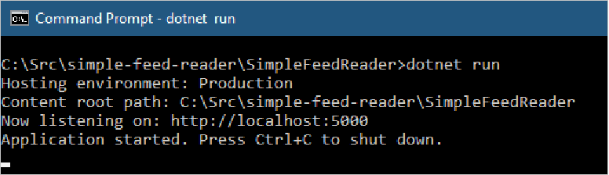

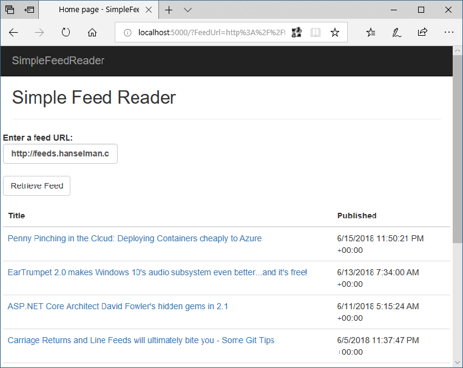

- 6. Once you’re satisfied the app is working correctly, shut it down by pressing Ctrl+C in the command shell.


# Create the Azure App Service Web App

To deploy the app, you’ll need to create an App Service Web App. After creation of the Web App, you’ll deploy to it from your local machine using Git.

- 1. Sign in to the Azure Cloud Shell. Note: When you sign in for the first time, Cloud Shell prompts to create a storage account for configuration files. Accept the defaults or provide a unique name.

- 2. Use the Cloud Shell for the following steps.


a. Declare a variable to store your web app’s name. The name must be unique to be used in the default URL. Using the $RANDOM Bash function to construct the name guarantees uniqueness and results in the format webappname99999.

:::{custom-style=CodeBox} console webappname=mywebapp$RANDOM ::: b. Create a resource group. Resource groups provide a means to aggregate Azure resources to be managed as a group.

:::{custom-style=CodeBox} azurecli az group create --location centralus --name AzureTutorial :::

The az command invokes the Azure CLI. The CLI can be run locally, but using it in the Cloud Shell saves time and configuration.

c. Create an App Service plan in the S1 tier. An App Service plan is a grouping of web apps that share the same pricing tier. The S1 tier isn’t free, but it’s required for the staging slots feature.

:::{custom-style=CodeBox} azurecli az appservice plan create --name $webappname -resource-group AzureTutorial --sku S1 :::

- d. Create the web app resource using the App Service plan in the same resource group.

:::{custom-style=CodeBox} azurecli az webapp create --name $webappname --resourcegroup AzureTutorial --plan $webappname :::

- e. Set the deployment branch to main in the appsettings configuration.

:::{custom-style=CodeBox} azurecli az webapp config appsettings set --name $webappname -

-resource-group AzureTutorial --settings DEPLOYMENT_BRANCH=main :::

- f. Set the deployment credentials. These deployment credentials apply to all the web apps in your subscription. Don’t use special characters in the user name.


:::{custom-style=CodeBox} azurecli az webapp deployment user set --user-name REPLACE_WITH_USER_NAME --password REPLACE_WITH_PASSWORD :::

g. Configure the web app to accept deployments from local Git and display the Git deployment URL. Note this URL for reference later.

:::{custom-style=CodeBox} azurecli echo Git deployment URL: $(az webapp deployment source config-local-git --name $webappname --resource-group AzureTutorial --query url -output tsv) :::

h. Display the web app URL. Browse to this URL to see the blank web app. Note this

#### URL for reference later.

:::{custom-style=CodeBox} console echo Web app URL: http://$webappname.azurewebsites.net :::

- 3. Using a command shell on your local machine, navigate to the web app’s project folder (for example, *.-feed-reader). Execute the following commands to set up Git to push to the deployment URL:

- a. Add the remote URL to the local repository.

:::{custom-style=CodeBox} console git remote add azure-prod GIT_DEPLOYMENT_URL :::

- b. Push the local default branch (main) to the azure-prod remote’s deployment branch (main).


:::{custom-style=CodeBox} console git push azure-prod main ::: You’ll be prompted for the deployment credentials you created earlier. Observe the output in the command shell. Azure builds the ASP.NET Core app remotely.

- 4. In a browser, navigate to the Web app URL and note the app has been built and deployed. Additional changes can be committed to the local Git repository with git commit. These changes are pushed to Azure with the preceding git push command.


# Deployment with Visual Studio

<table>
  <tr>
    <th>Note<br><br>This section applies to Windows only. Linux and macOS users should make the change described in step 2 below. Save the file, and commit the change to the local repository with git commit. Finally, push the change with git push, as in the first section.*<br><br></th>
  </tr>
</table>


The app has already been deployed from the command shell. Let’s use Visual Studio’s integrated tools to deploy an update to the app. Behind the scenes, Visual Studio accomplishes the same thing as the command line tooling, but within Visual Studio’s familiar UI.

- 1. Open SimpleFeedReader.sln in Visual Studio.
- 2. In Solution Explorer, open Pages.cshtml. Change <h2>Simple Feed Reader</h2> to <h2>Simple Feed Reader - V2</h2>.
- 3. Press Ctrl+Shift+B to build the app.
- 4. In Solution Explorer, right-click on the project and click Publish.


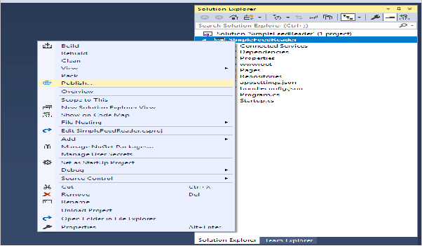

- 5. Visual Studio can create a new App Service resource, but this update will be published over the existing deployment. In the Pick a publish target dialog, select App Service from the list on the left, and then select Select Existing. Click Publish.
- 6. In the App Service dialog, confirm that the Microsoft or Organizational account used to create your Azure subscription is displayed in the upper right. If it’s not, click the drop-down and add it.
- 7. Confirm that the correct Azure Subscription is selected. For View, select Resource Group. Expand the AzureTutorial resource group and then select the existing web app. Click OK.


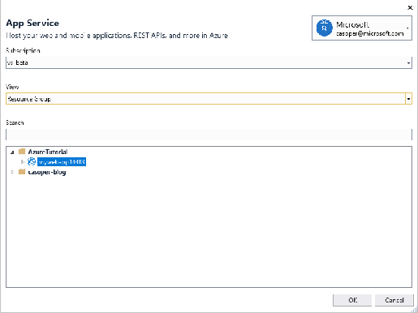

Visual Studio builds and deploys the app to Azure. Browse to the web app URL. Validate that the <h2> element modification is live.

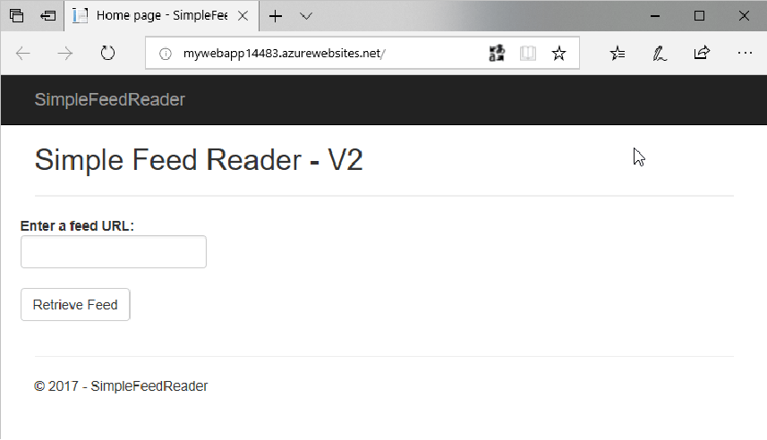

# Deployment slots

Deployment slots support the staging of changes without impacting the app running in production. Once the staged version of the app is validated by a quality assurance team, the production and staging slots can be swapped. The app in staging is promoted to production in this manner. The following steps create a staging slot, deploy some changes to it, and swap the staging slot with production after verification.

- 1. Sign in to the Azure Cloud Shell, if not already signed in.

- 2. Create the staging slot.


- a. Create a deployment slot with the name staging.

:::{custom-style=CodeBox} azurecli az webapp deployment slot create --name $webappname

--resource-group AzureTutorial --slot staging :::

- b. Set the deployment branch to main in the appsettings configuration.

:::{custom-style=CodeBox} azurecli az webapp config appsettings set --name $webappname -

-resource-group AzureTutorial --slot staging --settings DEPLOYMENT_BRANCH=main :::

- c. Configure the staging slot to use deployment from local Git and get the staging deployment URL. Note this URL for reference later.


:::{custom-style=CodeBox} azurecli echo Git deployment URL for staging: $(az webapp deployment source config-local-git --name $webappname --resource-group AzureTutorial -slot staging --query url --output tsv) :::

d. Display the staging slot’s URL. Browse to the URL to see the empty staging slot. Note

#### this URL for reference later.

:::{custom-style=CodeBox} console echo Staging web app URL: http://$webappnamestaging.azurewebsites.net :::

- 3. In a text editor or Visual Studio, modify Pages/Index.cshtml again so that the <h2> element reads <h2>Simple Feed Reader - V3</h2> and save the file.
- 4. Commit the file to the local Git repository, using either the Changes page in Visual Studio’s Team Explorer tab, or by entering the following using the local machine’s command shell: :::{custom-style=CodeBox} console git commit -a -m "upgraded to V3" :::
- 5. Using the local machine’s command shell, add the staging deployment URL as a Git remote and push the committed changes:

- a. Add the remote URL for staging to the local Git repository.

:::{custom-style=CodeBox} console git remote add azure-staging <Git_staging_deployment_URL> :::

- b. Push the local default branch (main) to the azure-staging remote’s deployment branch (main).


:::{custom-style=CodeBox} console git push azure-staging main ::: Wait while Azure builds and deploys the app.

- 6. To verify that V3 has been deployed to the staging slot, open two browser windows. In one window, navigate to the original web app URL. In the other window, navigate to the staging web app URL. The production URL serves V2 of the app. The staging URL serves V3 of the app.
- 7. In the Cloud Shell, swap the verified/warmed-up staging slot into production.


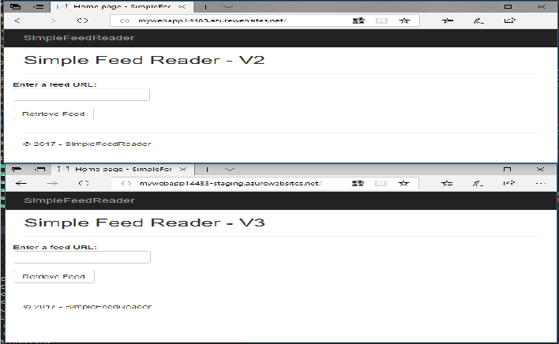

:::{custom-style=CodeBox} azurecli az webapp deployment slot swap --name $webappname -

-resource-group AzureTutorial --slot staging :::

- 8. Verify that the swap occurred by refreshing the two browser windows.


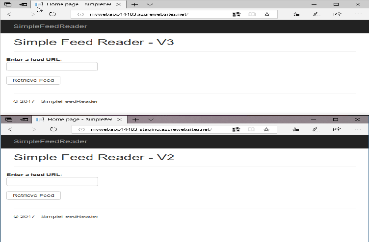

# Summary

In this section, the following tasks were completed:

- • Downloaded and built the sample app.
- • Created an Azure App Service Web App using the Azure Cloud Shell.
- • Deployed the sample app to Azure using Git.
- • Deployed a change to the app using Visual Studio.
- • Added a staging slot to the web app.
- • Deployed an update to the staging slot.
- • Swapped the staging and production slots.


In the next section, you’ll learn how to build a DevOps pipeline with Azure Pipelines.

# Additional reading

- • Web Apps overview

- • Build a .NET Core and SQL Database web app in Azure App Service

- • Configure deployment credentials for Azure App Service

- • Set up staging environments in Azure App Service


<table>
  <tr>
    <th>CHAPTER</th>
  </tr>
</table>


3

Continuous integration and deployment with Azure DevOps

<table>
  <tr>
    <th>Note<br><br>This section details continuous integration and deployment with Azure DevOps. You can achieve that with GitHub Actions as well. GitHub Actions is a workflow engine built into GitHub that can also be used for continuous integration and deployment. To follow the guide for building and deploying to Azure using GitHub, complete the Publish the app’s code to GitHub and Disconnect local Git deployment sections below and then proceed to the GitHub Actions section.<br><br></th>
  </tr>
</table>


In the previous chapter, you created a local Git repository for the Simple Feed Reader app. In this chapter, you’ll publish that code to a GitHub repository and construct an Azure DevOps Services pipeline using Azure Pipelines. The pipeline enables continuous builds and deployments of the app. Any commit to the GitHub repository triggers a build and a deployment to the Azure Web App’s staging slot.

In this section, you’ll complete the following tasks: [!div class=“checklist”]

- • Publish the app’s code to GitHub
- • Disconnect local Git deployment
- • Create an Azure DevOps organization
- • Create a team project in Azure DevOps organization
- • Configure a self-hosted agent if necessary
- • Create a build definition
- • Create a release pipeline
- • Commit changes to GitHub and automatically deploy to Azure
- • Examine the Azure Pipelines pipeline


# Publish the app’s code to GitHub

- 1. Open a browser window, and navigate to https://github.com.
- 2. Click the + drop-down in the header, and select New repository:


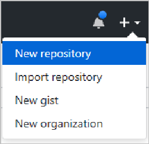

- 1. Select your account in the Owner drop-down, and enter simple-feed-reader in the Repository name textbox.
- 2. Click the Create repository button.
- 3. Open your local machine’s command shell. Navigate to the directory in which the simple-feedreader Git repository is stored.
- 4. Rename the existing origin remote to upstream. Execute the following command: :::{custom-style=CodeBox} console git remote rename origin upstream :::
- 5. Add a new origin remote pointing to your copy of the repository on GitHub. Execute the following command:

:::{custom-style=CodeBox} console git remote add origin https://github.com/<GitHub_username>/simple-feed-reader/ :::

- 6. Publish your local Git repository to the newly created GitHub repository. Execute the following command: :::{custom-style=CodeBox} console git push -u origin main :::
- 7. Open a browser window, and navigate to https://github.com/<GitHub_username>/simplefeed-reader/. Validate that your code appears in the GitHub repository.


# Disconnect local Git deployment

Remove the local Git deployment with the following steps. Azure Pipelines (an Azure DevOps service) both replaces and augments that functionality.

1. Open the Azure portal, and navigate to the staging (mywebapp<unique_number>/staging) Web App. The Web App can be quickly located by entering staging in the portal’s search box:


Click Deployment Center. A new panel appears. Click Disconnect to remove the local Git source control configuration that was added in the previous chapter. Confirm the removal operation by clicking the Yes button.

- 1. Navigate to the mywebapp App Service. As a reminder, the portal’s search box can be used to quickly locate the App Service.
- 2. Click Deployment Center. A new panel appears. Click Disconnect to remove the local Git source control configuration that was added in the previous chapter. Confirm the removal operation by clicking the Yes button.


# Create an Azure DevOps organization

- 1. Open a browser, and navigate to the Azure DevOps organization creation page.

- 2. Select New organization
- 3. Confirm the information, and then select Continue.
- 4. Sign in to your organization at any time, https://dev.azure.com/{yourorganization}


# Create a team project in Azure DevOps organization

- 1. Choose the organization, and then select New project.
- 2. Enter the project name as MyFirstProject and select the Visibility as Private
- 3. Select Create project.


For more information, see Create a project

# Configure a self-hosted agent if necessary

To build your code or deploy your software using Azure Pipelines, you need at least one agent. In Azure Pipelines, you can run parallel jobs on either Microsoft-hosted or self-hosted agent. But with the recent change in Azure Pipelines free grant of parallel jobs is temporarily disable for the public projects.For more details, refer Configure and pay for parallel jobs.

Go to Organization Settings and then Pipelines > Parallel jobs. If you see value 0 under Microsofthosted that means you need a Self-hosted agent to run your pipeline.

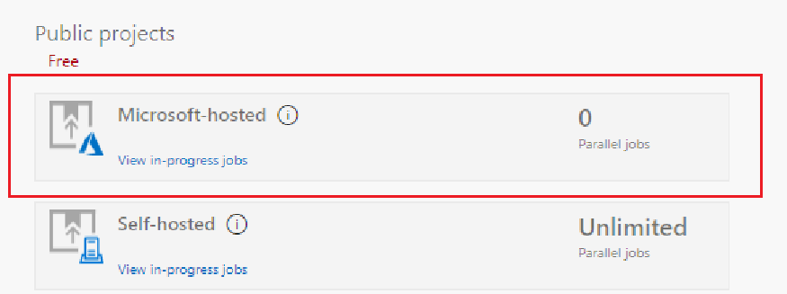

You can create that by following details mentioned in Self-hosted agents. After successful configuration, you’ll be able to see available agent under Organization Settings > Agent pools > {youragentname}

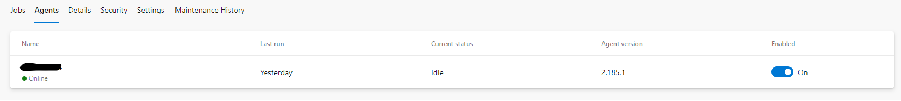

# Configure the Azure Pipelines pipeline

There are three distinct steps to complete. Completing the steps in the following three sections results in an operational DevOps pipeline.

## Grant Azure DevOps access to the GitHub repository

1. In your project, navigate to the Pipelines page. Then choose the action to create a new pipeline:

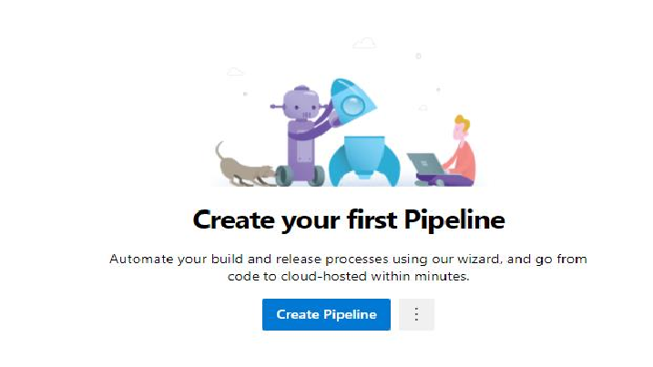

1. Use Use the classic editor to create the pipeline.

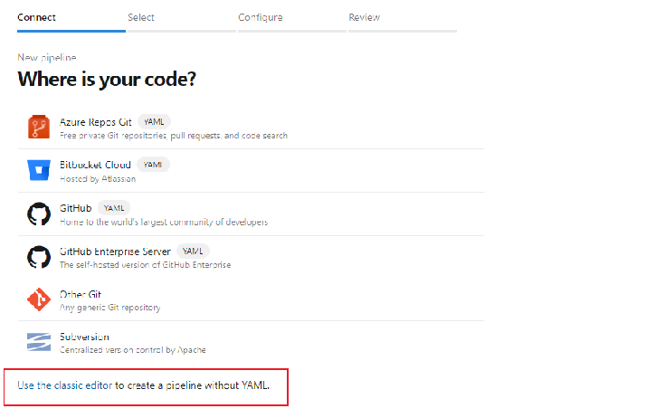

1. Select the GitHub option from the Select a source section::

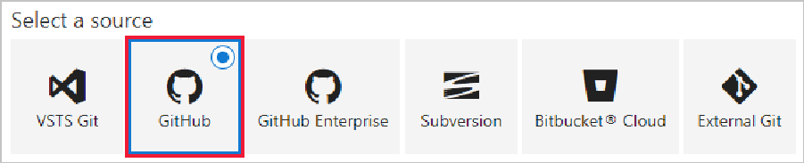

1. Authorization is required before Azure DevOps can access your GitHub repository. Enter GitHub connection in the Connection name textbox. For example:


- 1. If two-factor authentication is enabled on your GitHub account, a personal access token is required. In that case, click the Authorize with a GitHub personal access token link. See the official GitHub personal access token creation instructions for help. Only the repo scope of permissions is needed. Otherwise, click the Authorize using OAuth button.


- 2. When prompted, sign in to your GitHub account. Then select Authorize to grant access to your Azure DevOps organization. If successful, a new service endpoint is created.
- 3. Click the ellipsis button next to the Repository button. Select the /simple-feed-reader repository from the list. Click the Select button.
- 4. Select the default branch (main) from the Default branch for manual and scheduled builds drop-down. Click the Continue button. The template selection page appears.


## Create the build definition

1. From the template selection page, enter ASP.NET Core in the search box:

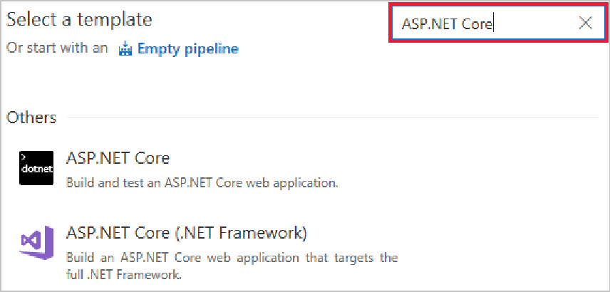

- 1. The template search results appear. Hover over the ASP.NET Core template, and click the Apply button.
- 2. The Tasks tab of the build definition appears. Select the self-hosted Agent pool if you have created that in the earlier step.


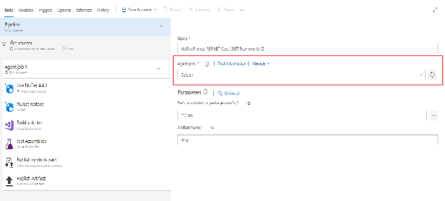

> [!NOTE] > If you are using MS-hosted agent then select the *Hosted > Azure Pipelines* from drop down.

- 1. Click the Triggers tab.
- 2. Check the Enable continuous integration box. Under the Branch filters section, confirm that the Type drop-down is set to Include. Set the Branch specification drop-down to main.


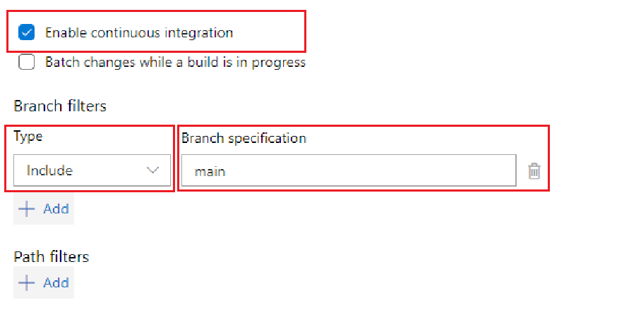

These settings cause a build to trigger when any change is pushed to the default branch (*main*) of the GitHub repository. Continuous integration is tested in the [Commit changes to GitHub and automatically deploy to Azure](#commit-changes-togithub-and-automatical) section.

1. Click the Save & queue button, and select the Save option:


1. The following modal dialog appears:


Use the default folder of *\\*, and click the **Save** button.

## Create the release pipeline

1. Click the Releases tab of your team project. Click the New pipeline button.

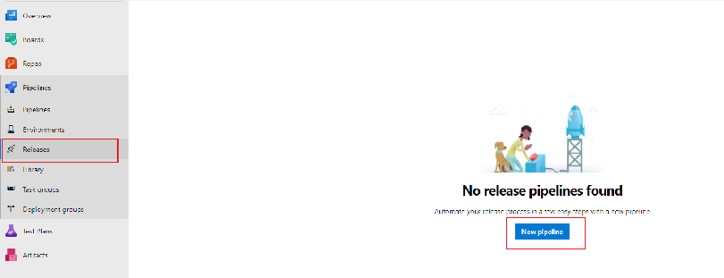

The template selection pane appears.

1. From the template selection page, enter App Service Deployment in the search box:

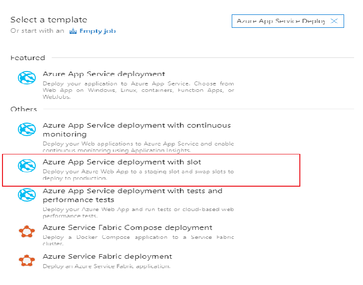

1. The template search results appear. Hover over the Azure App Service Deployment with

Slot template, and click the Apply button. The Pipeline tab of the release pipeline appears.

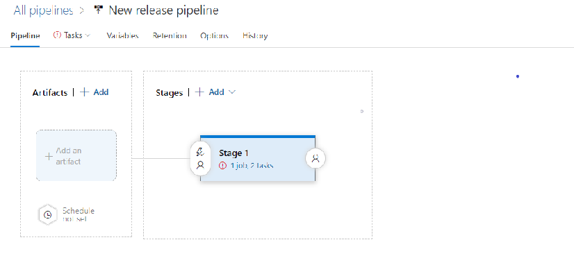

1. Click the Add button in the Artifacts box. The Add artifact panel appears:

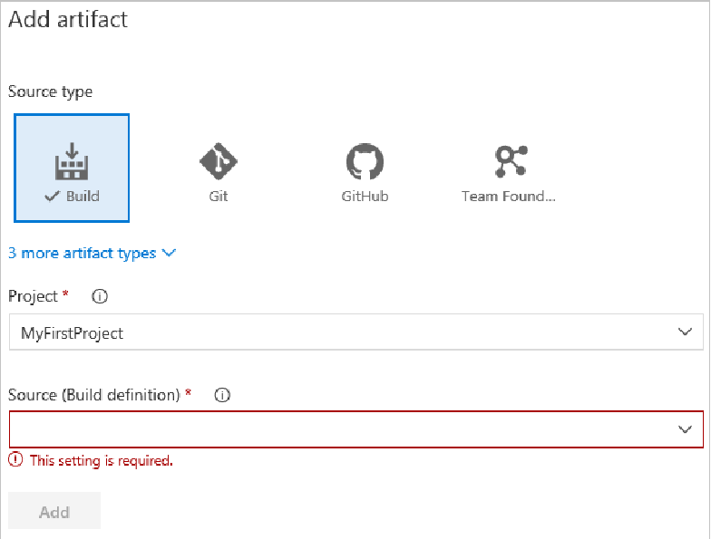

- 1. Select the Build tile from the Source type section. This type allows for the linking of the release pipeline to the build definition.
- 2. Select MyFirstProject from the Project drop-down.
- 3. Select the build definition name, MyFirstProject-ASP.NET Core-CI, from the Source (Build definition) drop-down.
- 4. Select Latest from the Default version drop-down. This option builds the artifacts produced by the latest run of the build definition.


- 5. Replace the text in the Source alias textbox with Drop.
- 6. Click the Add button. The Artifacts section updates to display the changes.
- 7. Click the lightning bolt icon to enable continuous deployments:


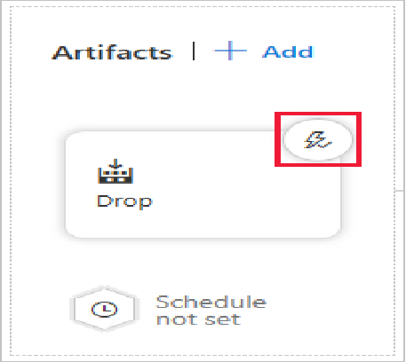

With this option enabled, a deployment occurs each time a new build is available.

- 1. A Continuous deployment trigger panel appears to the right. Click the toggle button to enable the feature. It isn’t necessary to enable the Pull request trigger.
- 2. Click the Add drop-down in the Build branch filters section. Choose the Build Definition’s default branch option. This filter causes the release to trigger only for a build from the GitHub repository’s default branch (main).
- 3. Click the Save button. Click the OK button in the resulting Save modal dialog.
- 4. Click the Stage 1 box. An Stage panel appears to the right. Change the Stage 1 text in the Stage name textbox to Production.


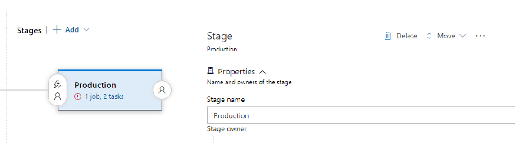

#### 1. Click the 1 phase, 2 tasks link in the Production box:

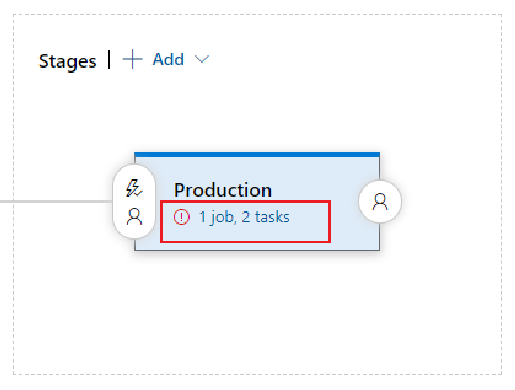

The **Tasks** tab of the environment appears.

- 1. Click the Deploy Azure App Service to Slot task. Its settings appear in a panel to the right.
- 2. Select the Azure subscription associated with the App Service from the Azure subscription drop-down. Once selected, click the Authorize button.
- 3. Select Web App from the App type drop-down.
- 4. Select mywebapp/ from the App service name drop-down.
- 5. Select AzureTutorial from the Resource group drop-down.
- 6. Select staging from the Slot drop-down.
- 7. Select Run on agent* under Tasks. On the right pane, you’ll see Agent Job.
- 8. Select the self-hosted Agent pool if you have created that in the earlier step.


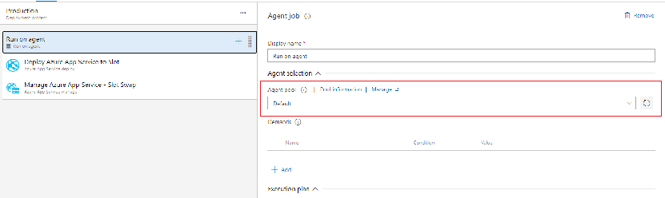

> [!NOTE] > If you are using MS-hosted agent then select the *Hosted > Azure Pipelines* from drop down.

- 1. Click the Save button.
- 2. Hover over the default release pipeline name. Click the pencil icon to edit it. Use MyFirstProject-ASP.NET Core-CD as the name.


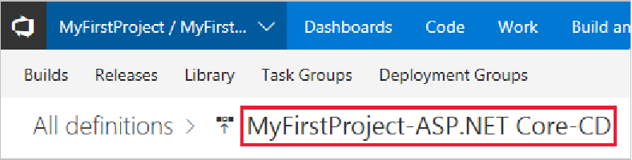

1. Click the Save button.

# Commit changes to GitHub and automatically deploy to Azure

- 1. Open SimpleFeedReader.sln in Visual Studio.
- 2. In Solution Explorer, open Pages.cshtml. Change <h2>Simple Feed Reader - V3</h2> to <h2>Simple Feed Reader - V4</h2>.
- 3. Press Ctrl+Shift+B to build the app.
- 4. Commit the file to the GitHub repository. Use either the Changes page in Visual Studio’s Team Explorer tab, or execute the following using the local machine’s command shell: :::{custom-style=CodeBox} console git commit -a -m "upgraded to V4" :::
- 5. Push the change in the default branch (main) to the origin remote of your GitHub repository. In the following command, replace the placeholder {BRANCH} with the default branch (use main): :::{custom-style=CodeBox} console git push origin {BRANCH} :::


The commit appears in the GitHub repository’s default branch (main). You’ll be able to see the commit history in https://github.com/<GitHub_username>/simple-feedreader/commits/main.

The build is triggered, since continuous integration is enabled in the build definition’s Triggers tab:

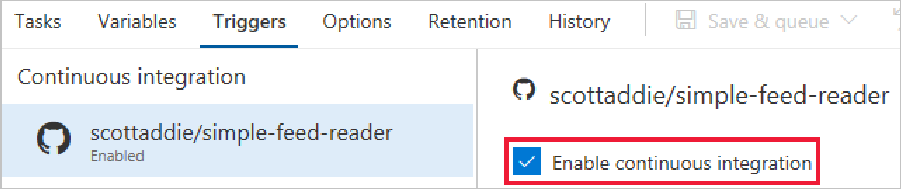

1. Navigate to the Pipelines. You’ll see the CI pipeline details and monitor each steps if you drill down Jobs details.

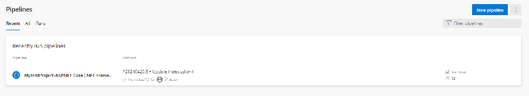

1. Similarly, go to the Releases tab to see the details of CD pipeline. You can always drill down further to see more details of each step.

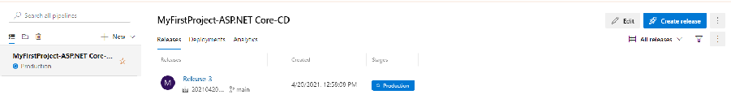

1. Once the build succeeds, a deployment to Azure occurs. Navigate to the app in the browser. Notice that the “V4” text appears in the heading:

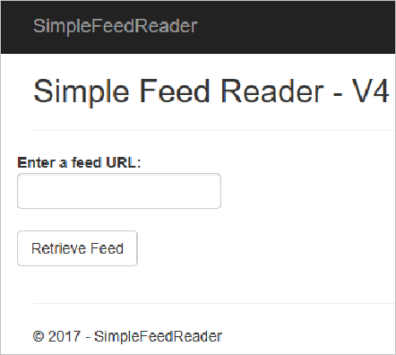

# Examine the Azure Pipelines pipeline

## Build definition

A build definition was created with the name MyFirstProject-ASP.NET Core-CI. Upon completion, the build produces a .zip file including the assets to be published. The release pipeline deploys those assets to Azure.

The build definition’s Tasks tab lists the individual steps being used. There are five build tasks.

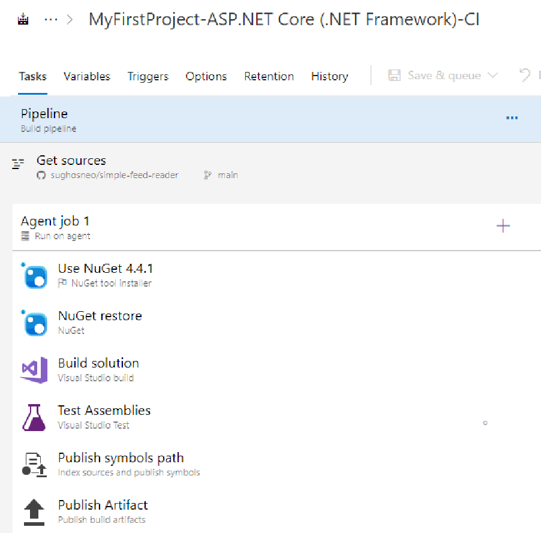

- 1. Restore — Executes the dotnet restore command to restore the app’s NuGet packages. The default package feed used is nuget.org.
- 2. Build — Executes the dotnet build --configuration release command to compile the app’s code. This --configuration option is used to produce an optimized version of the code, which is suitable for deployment to a production environment. Modify the BuildConfiguration variable on the build definition’s Variables tab if, for example, a debug configuration is needed.
- 3. Test — Executes the dotnet test --configuration release --logger trx --results-directory <local_path_on_build_agent> command to run the app’s unit tests. Unit tests are executed within any C# project matching the **/Tests/.csproj glob pattern. Test results are saved in a .trx file at the location specified by the --results-directory option. If any tests fail, the build fails and isn’t deployed.


- [!NOTE] To verify the unit tests work, modify SimpleFeedReader.Tests.cs to purposefully break one of the tests. For example, change Assert.True(result.Count > 0); to Assert.False(result.Count > 0); in the Returns_News_Stories_Given_Valid_Uri method. Commit and push the change to GitHub. The build is triggered and fails. The build pipeline status changes to failed. Revert the change, commit, and push again. The build succeeds.
- 4. Publish — Executes the dotnet publish --configuration release --output <local_path_on_build_agent> command to produce a .zip file with the artifacts to be deployed. The --output option specifies the publish location of the .zip file. That location is specified by passing a predefined variable named $(build.artifactstagingdirectory). That variable expands to a local path, such as *c:_work\1, on the build agent.

- 5. Publish Artifact — Publishes the .zip file produced by the Publish task. The task accepts the


.zip file location as a parameter, which is the predefined variable $(build.artifactstagingdirectory). The .zip file is published as a folder named drop.

Click the build definition’s Summary link to view a history of builds with the definition:


On the resulting page, click the individual build for more details.

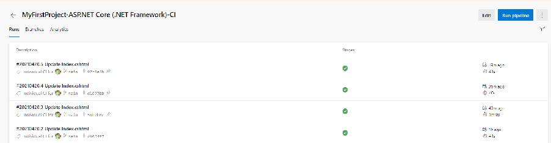

A summary of this specific build is displayed. Click the published link, and notice the drop folder produced by the build is listed:

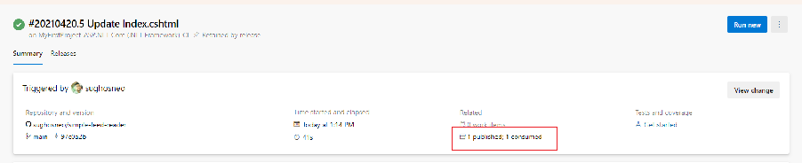

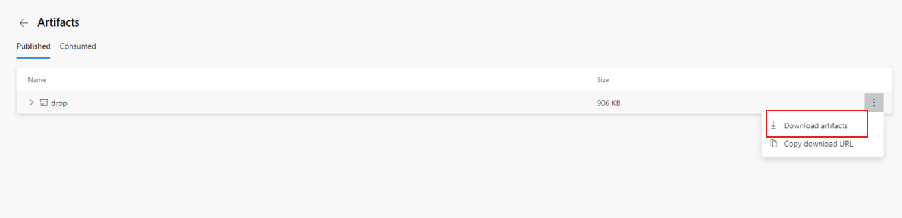

Use the ellipsis and click on Downloads artifacts links to inspect the published artifacts.

## Release pipeline

A release pipeline was created with the name MyFirstProject-ASP.NET Core-CD:

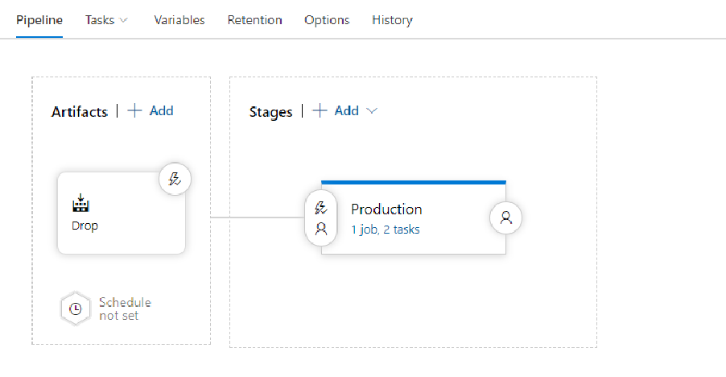

The two major components of the release pipeline are the Artifacts and the Stages. Clicking the box in the Artifacts section reveals the following panel:


The Source (Build definition) value represents the build definition to which this release pipeline is linked. The .zip file produced by a successful run of the build definition is provided to the Production environment for deployment to Azure. Click the 1 phase, 2 tasks link in the Production environment box to view the release pipeline tasks:


The release pipeline consists of two tasks: Deploy Azure App Service to Slot and Manage Azure App Service - Slot Swap. Clicking the first task reveals the following task configuration:


The Azure subscription, service type, web app name, resource group, and deployment slot are defined in the deployment task. The Package or folder textbox holds the .zip file path to be extracted and deployed to the staging slot of the mywebapp<unique_number> web app.

Clicking the slot swap task reveals the following task configuration:

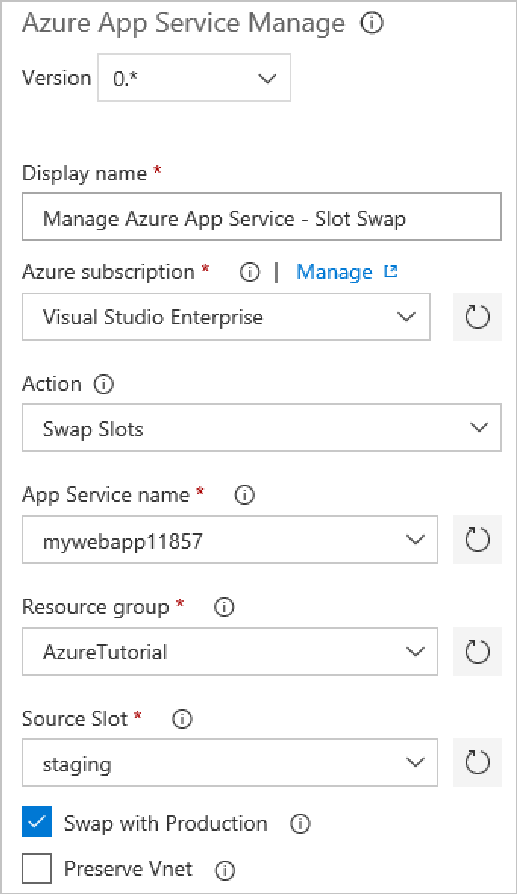

The subscription, resource group, service type, web app name, and deployment slot details are provided. The Swap with Production check box is checked. Consequently, the bits deployed to the staging slot are swapped into the production environment.

# Additional reading

- • Create your first pipeline with Azure Pipelines

- • Build and .NET Core project

- • Deploy a web app with Azure Pipelines


# Continuous integration and deployment with Azure DevOps

<table>
  <tr>
    <th>Note<br><br>This section details continuous integration and deployment with Azure DevOps. You can achieve that with GitHub Actions as well. GitHub Actions is a workflow engine built into GitHub that can also be used for continuous integration and deployment. To follow the guide for building and deploying to Azure using GitHub, complete the Publish the app’s code to GitHub and Disconnect local Git deployment sections below and then proceed to the GitHub Actions section.<br><br></th>
  </tr>
</table>


In the previous chapter, you created a local Git repository for the Simple Feed Reader app. In this chapter, you’ll publish that code to a GitHub repository and construct an Azure DevOps Services pipeline using Azure Pipelines. The pipeline enables continuous builds and deployments of the app. Any commit to the GitHub repository triggers a build and a deployment to the Azure Web App’s staging slot.

In this section, you’ll complete the following tasks: [!div class=“checklist”]

- • Publish the app’s code to GitHub
- • Disconnect local Git deployment
- • Create an Azure DevOps organization
- • Create a team project in Azure DevOps organization
- • Configure a self-hosted agent if necessary
- • Create a build definition
- • Create a release pipeline
- • Commit changes to GitHub and automatically deploy to Azure
- • Examine the Azure Pipelines pipeline


## Publish the app’s code to GitHub

- 1. Open a browser window, and navigate to https://github.com.
- 2. Click the + drop-down in the header, and select New repository:


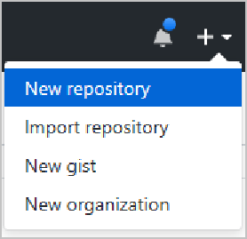

- 1. Select your account in the Owner drop-down, and enter simple-feed-reader in the Repository name textbox.
- 2. Click the Create repository button.
- 3. Open your local machine’s command shell. Navigate to the directory in which the simple-feedreader Git repository is stored.
- 4. Rename the existing origin remote to upstream. Execute the following command: :::{custom-style=CodeBox} console git remote rename origin upstream :::
- 5. Add a new origin remote pointing to your copy of the repository on GitHub. Execute the following command:

:::{custom-style=CodeBox} console git remote add origin https://github.com/<GitHub_username>/simple-feed-reader/ :::

- 6. Publish your local Git repository to the newly created GitHub repository. Execute the following command: :::{custom-style=CodeBox} console git push -u origin main :::
- 7. Open a browser window, and navigate to https://github.com/<GitHub_username>/simplefeed-reader/. Validate that your code appears in the GitHub repository.


## Disconnect local Git deployment

Remove the local Git deployment with the following steps. Azure Pipelines (an Azure DevOps service) both replaces and augments that functionality.

1. Open the Azure portal, and navigate to the staging (mywebapp<unique_number>/staging) Web App. The Web App can be quickly located by entering staging in the portal’s search box:


- 1. Click Deployment Center. A new panel appears. Click Disconnect to remove the local Git source control configuration that was added in the previous chapter. Confirm the removal operation by clicking the Yes button.
- 2. Navigate to the mywebapp App Service. As a reminder, the portal’s search box can be used to quickly locate the App Service.
- 3. Click Deployment Center. A new panel appears. Click Disconnect to remove the local Git source control configuration that was added in the previous chapter. Confirm the removal operation by clicking the Yes button.


## Create an Azure DevOps organization

- 1. Open a browser, and navigate to the Azure DevOps organization creation page.

- 2. Select New organization
- 3. Confirm the information, and then select Continue.


- 4. Sign in to your organization at any time, https://dev.azure.com/{yourorganization}


## Create a team project in Azure DevOps organization

- 1. Choose the organization, and then select New project.
- 2. Enter the project name as MyFirstProject and select the Visibility as Private
- 3. Select Create project.


For more information, see Create a project

## Configure a self-hosted agent if necessary

To build your code or deploy your software using Azure Pipelines, you need at least one agent. In Azure Pipelines, you can run parallel jobs on either Microsoft-hosted or self-hosted agent. But with the recent change in Azure Pipelines free grant of parallel jobs is temporarily disable for the public projects.For more details, refer Configure and pay for parallel jobs.

Go to Organization Settings and then Pipelines > Parallel jobs. If you see value 0 under Microsofthosted that means you need a Self-hosted agent to run your pipeline.

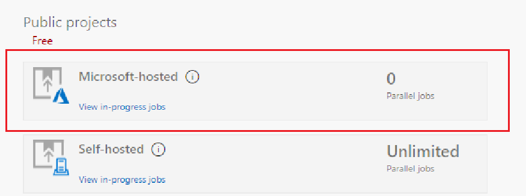

You can create that by following details mentioned in Self-hosted agents. After successful configuration, you’ll be able to see available agent under Organization Settings > Agent pools > {youragentname}

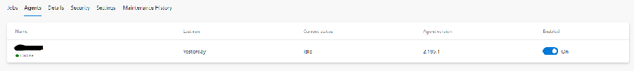

## Configure the Azure Pipelines pipeline

There are three distinct steps to complete. Completing the steps in the following three sections results in an operational DevOps pipeline.

### Grant Azure DevOps access to the GitHub repository

1. In your project, navigate to the Pipelines page. Then choose the action to create a new pipeline:

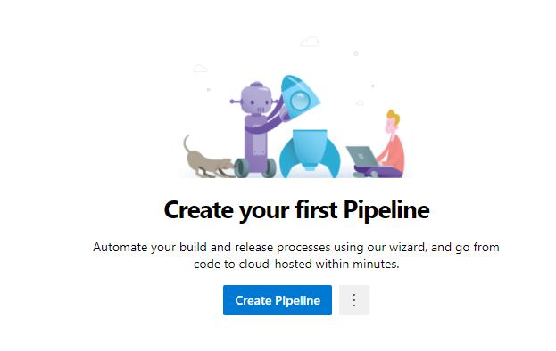

1. Use Use the classic editor to create the pipeline.

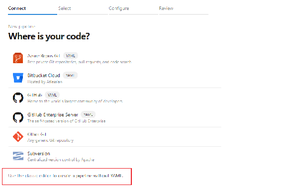

1. Select the GitHub option from the Select a source section::

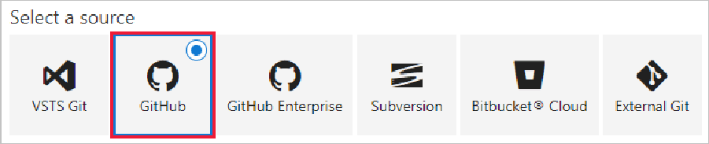

1. Authorization is required before Azure DevOps can access your GitHub repository. Enter GitHub connection in the Connection name textbox. For example:

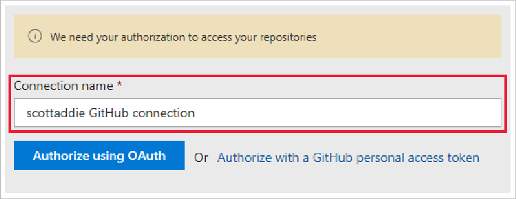

- 1. If two-factor authentication is enabled on your GitHub account, a personal access token is required. In that case, click the Authorize with a GitHub personal access token link. See the official GitHub personal access token creation instructions for help. Only the repo scope of permissions is needed. Otherwise, click the Authorize using OAuth button.

- 2. When prompted, sign in to your GitHub account. Then select Authorize to grant access to your Azure DevOps organization. If successful, a new service endpoint is created.
- 3. Click the ellipsis button next to the Repository button. Select the /simple-feed-reader repository from the list. Click the Select button.
- 4. Select the default branch (main) from the Default branch for manual and scheduled builds drop-down. Click the Continue button. The template selection page appears.


### Create the build definition

1. From the template selection page, enter ASP.NET Core in the search box:

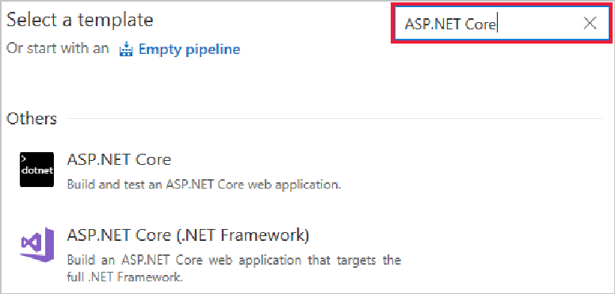

The template search results appear. Hover over the ASP.NET Core template, and click the Apply button.

1. The Tasks tab of the build definition appears. Select the self-hosted Agent pool if you have created that in the earlier step.

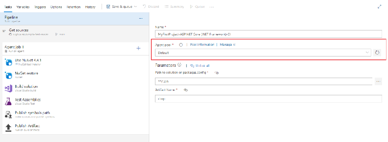

> [!NOTE] > If you are using MS-hosted agent then select the *Hosted > Azure Pipelines* from drop down.

- 1. Click the Triggers tab.
- 2. Check the Enable continuous integration box. Under the Branch filters section, confirm that the Type drop-down is set to Include. Set the Branch specification drop-down to main.


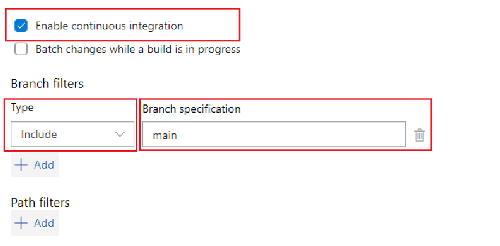

These settings cause a build to trigger when any change is pushed to the default branch (*main*) of the GitHub repository. Continuous integration is tested in the [Commit changes to GitHub and automatically deploy to Azure](#commit-changes-togithub-and-automatical) section.

1. Click the Save & queue button, and select the Save option:

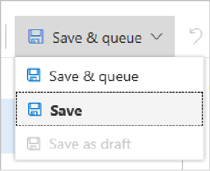

1. The following modal dialog appears:

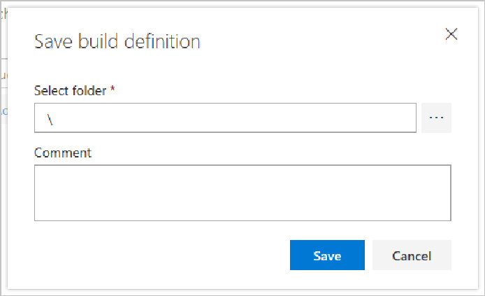

Use the default folder of *\\*, and click the **Save** button. Create the release pipeline

1. Click the Releases tab of your team project. Click the New pipeline button.

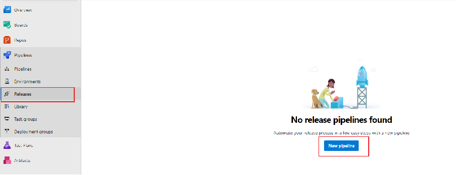

The template selection pane appears.

1. From the template selection page, enter App Service Deployment in the search box:

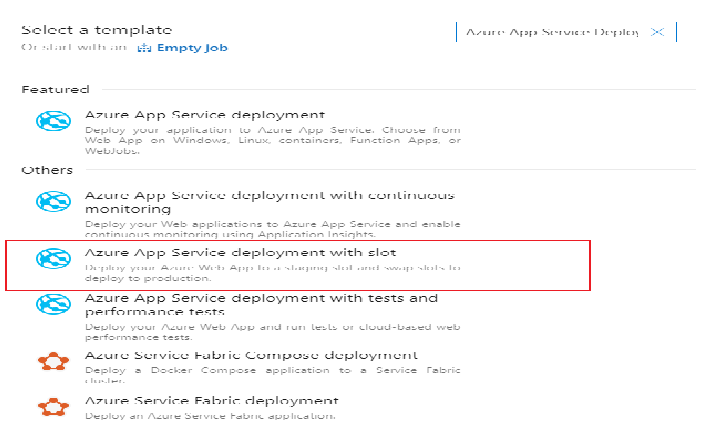

1. The template search results appear. Hover over the Azure App Service Deployment with

Slot template, and click the Apply button. The Pipeline tab of the release pipeline appears.

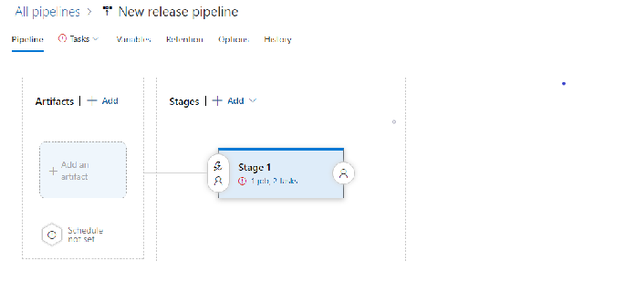

1. Click the Add button in the Artifacts box. The Add artifact panel appears:

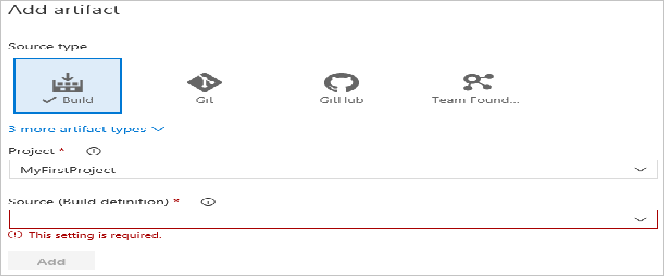

- 1. Select the Build tile from the Source type section. This type allows for the linking of the release pipeline to the build definition.
- 2. Select MyFirstProject from the Project drop-down.
- 3. Select the build definition name, MyFirstProject-ASP.NET Core-CI, from the Source (Build definition) drop-down.
- 4. Select Latest from the Default version drop-down. This option builds the artifacts produced by the latest run of the build definition.
- 5. Replace the text in the Source alias textbox with Drop.
- 6. Click the Add button. The Artifacts section updates to display the changes.
- 7. Click the lightning bolt icon to enable continuous deployments:


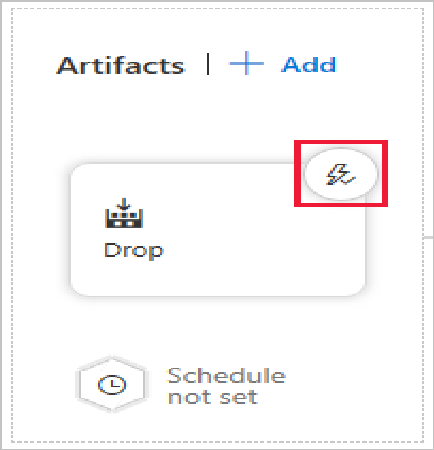

With this option enabled, a deployment occurs each time a new build is available.

- 1. A Continuous deployment trigger panel appears to the right. Click the toggle button to enable the feature. It isn’t necessary to enable the Pull request trigger.
- 2. Click the Add drop-down in the Build branch filters section. Choose the Build Definition’s default branch option. This filter causes the release to trigger only for a build from the GitHub repository’s default branch (main).
- 3. Click the Save button. Click the OK button in the resulting Save modal dialog.
- 4. Click the Stage 1 box. An Stage panel appears to the right. Change the Stage 1 text in the Stage name textbox to Production.


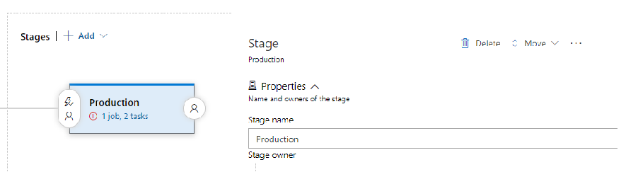

#### 1. Click the 1 phase, 2 tasks link in the Production box:

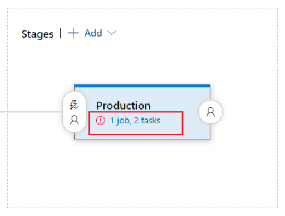

The **Tasks** tab of the environment appears.

- 1. Click the Deploy Azure App Service to Slot task. Its settings appear in a panel to the right.
- 2. Select the Azure subscription associated with the App Service from the Azure subscription drop-down. Once selected, click the Authorize button.
- 3. Select Web App from the App type drop-down.
- 4. Select mywebapp/ from the App service name drop-down.
- 5. Select AzureTutorial from the Resource group drop-down.
- 6. Select staging from the Slot drop-down.
- 7. Select Run on agent* under Tasks. On the right pane, you’ll see Agent Job.
- 8. Select the self-hosted Agent pool if you have created that in the earlier step.


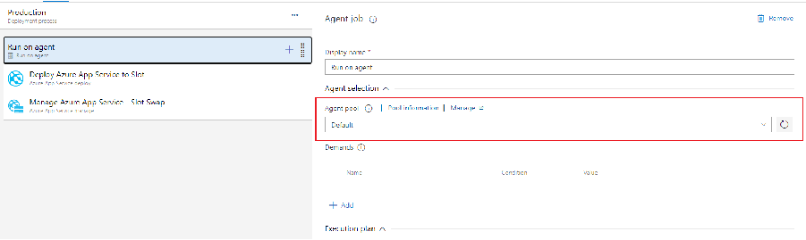

> [!NOTE] > If you are using MS-hosted agent then select the *Hosted > Azure Pipelines* from drop down.

- 1. Click the Save button.
- 2. Hover over the default release pipeline name. Click the pencil icon to edit it. Use MyFirstProject-ASP.NET Core-CD as the name.


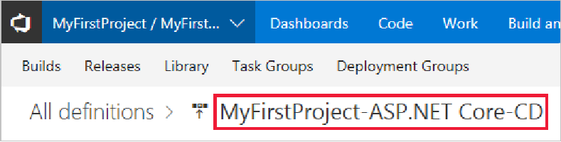

1. Click the Save button.

## Commit changes to GitHub and automatically deploy to Azure

- 1. Open SimpleFeedReader.sln in Visual Studio.
- 2. In Solution Explorer, open Pages.cshtml. Change <h2>Simple Feed Reader - V3</h2> to <h2>Simple Feed Reader - V4</h2>.
- 3. Press Ctrl+Shift+B to build the app.
- 4. Commit the file to the GitHub repository. Use either the Changes page in Visual Studio’s Team Explorer tab, or execute the following using the local machine’s command shell: :::{custom-style=CodeBox} console git commit -a -m "upgraded to V4" :::
- 5. Push the change in the default branch (main) to the origin remote of your GitHub repository. In the following command, replace the placeholder {BRANCH} with the default branch (use main): :::{custom-style=CodeBox} console git push origin {BRANCH} :::


The commit appears in the GitHub repository’s default branch (main). You’ll be able to see the commit history in https://github.com/<GitHub_username>/simple-feedreader/commits/main.

The build is triggered, since continuous integration is enabled in the build definition’s Triggers tab:

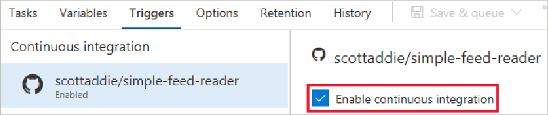

1. Navigate to the Pipelines. You’ll see the CI pipeline details and monitor each steps if you drill down Jobs details.


1. Similarly, go to the Releases tab to see the details of CD pipeline. You can always drill down further to see more details of each step.


1. Once the build succeeds, a deployment to Azure occurs. Navigate to the app in the browser. Notice that the “V4” text appears in the heading:

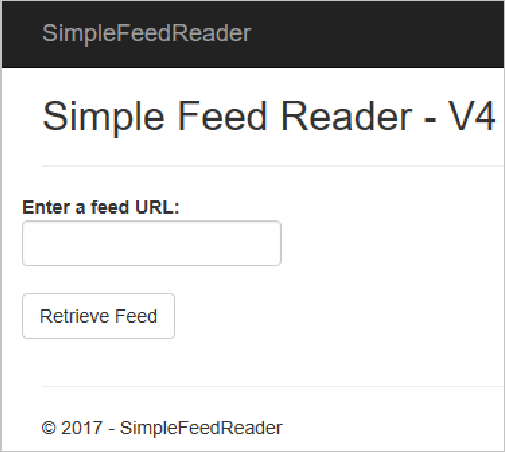

## Examine the Azure Pipelines pipeline Build definition

A build definition was created with the name MyFirstProject-ASP.NET Core-CI. Upon completion, the build produces a .zip file including the assets to be published. The release pipeline deploys those assets to Azure.

The build definition’s Tasks tab lists the individual steps being used. There are five build tasks.


- 1. Restore — Executes the dotnet restore command to restore the app’s NuGet packages. The default package feed used is nuget.org.
- 2. Build — Executes the dotnet build --configuration release command to compile the app’s code. This --configuration option is used to produce an optimized version of the code, which is suitable for deployment to a production environment. Modify the BuildConfiguration variable on the build definition’s Variables tab if, for example, a debug configuration is needed.
- 3. Test — Executes the dotnet test --configuration release --logger trx --results-directory <local_path_on_build_agent> command to run the app’s unit tests. Unit tests are executed within any C# project matching the **/Tests/.csproj glob pattern. Test results are saved in a .trx file at the location specified by the --results-directory option. If any tests fail, the build fails and isn’t deployed.


- [!NOTE] To verify the unit tests work, modify SimpleFeedReader.Tests.cs to purposefully break one of the tests. For example, change Assert.True(result.Count > 0); to Assert.False(result.Count > 0); in the Returns_News_Stories_Given_Valid_Uri method. Commit and push the change to GitHub. The build is triggered and fails. The build pipeline status changes to failed. Revert the change, commit, and push again. The build succeeds.
- 4. Publish — Executes the dotnet publish --configuration release --output <local_path_on_build_agent> command to produce a .zip file with the artifacts to be deployed. The --output option specifies the publish location of the .zip file. That location is specified by passing a predefined variable named $(build.artifactstagingdirectory). That variable expands to a local path, such as *c:_work\1, on the build agent.

- 5. Publish Artifact — Publishes the .zip file produced by the Publish task. The task accepts the


.zip file location as a parameter, which is the predefined variable $(build.artifactstagingdirectory). The .zip file is published as a folder named drop.

Click the build definition’s Summary link to view a history of builds with the definition:


On the resulting page, click the individual build for more details.


A summary of this specific build is displayed. Click the published link, and notice the drop folder produced by the build is listed:


Use the ellipsis and click on Downloads artifacts links to inspect the published artifacts. Release pipeline A release pipeline was created with the name MyFirstProject-ASP.NET Core-CD:

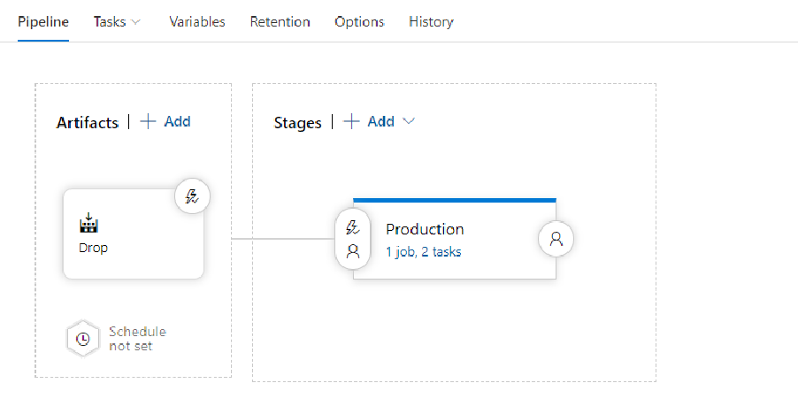

The two major components of the release pipeline are the Artifacts and the Stages. Clicking the box in the Artifacts section reveals the following panel:

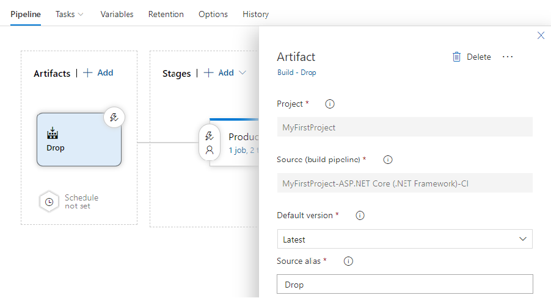

The Source (Build definition) value represents the build definition to which this release pipeline is linked. The .zip file produced by a successful run of the build definition is provided to the Production environment for deployment to Azure. Click the 1 phase, 2 tasks link in the Production environment box to view the release pipeline tasks:

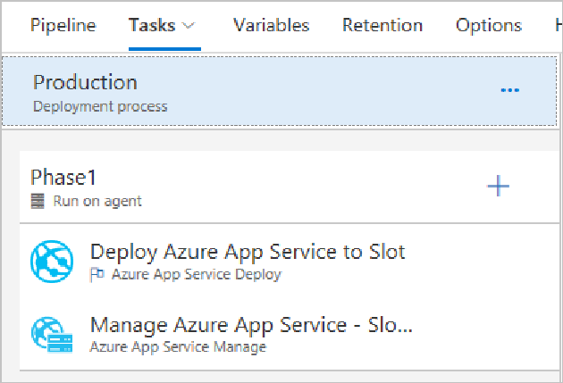

The release pipeline consists of two tasks: Deploy Azure App Service to Slot and Manage Azure App Service - Slot Swap. Clicking the first task reveals the following task configuration:


The Azure subscription, service type, web app name, resource group, and deployment slot are defined in the deployment task. The Package or folder textbox holds the .zip file path to be extracted and deployed to the staging slot of the mywebapp<unique_number> web app.

Clicking the slot swap task reveals the following task configuration:


The subscription, resource group, service type, web app name, and deployment slot details are provided. The Swap with Production check box is checked. Consequently, the bits deployed to the staging slot are swapped into the production environment.

## Additional reading

- • Create your first pipeline with Azure Pipelines

- • Build and .NET Core project

- • Deploy a web app with Azure Pipelines


# Continuous integration and deployment with GitHub Actions

GitHub has long been the home for millions of open-source developers around the globe. Most developers associate source control with GitHub. However, GitHub is an evolving platform that can be used for more than just synchronizing Git repositories.

## GitHub Actions

GitHub Actions is a workflow engine that can automate workflows for nearly all events that occur on GitHub. Actions is a great solution for Continuous Integration/Continuous Deployment (CI/CD) pipelines.

In this section of articles, you’ll learn how to create an Actions workflow. The workflow will build, test, and deploy a .NET web app to Azure Web Apps.

<table>
  <tr>
    <th>Note Before you begin, complete the Publish the app’s code to GitHub and Disconnect local Git deployment sections of the Continuous integration and deployment with Azure DevOps section to publish your code to GitHub. Then proceed to the Build article.<br><br></th>
  </tr>
</table>


In the Build article, you’ll create the initial workflow to build and test the .NET app. You’ll: [!div class=“checklist”]

- • Learn the basic structure of a GitHub Action workflow YAML file.
- • Use a template to create a basic build workflow that builds a .NET app and executes unit tests.
- • Publish the compiled app so that it’s ready for deployment. In the Deploy article, you’ll: [!div class=“checklist”]
- • Learn about environments in GitHub Actions.
- • Create two environments and specify environment protection rules.
- • Create environment secrets for managing environment-specific configuration.
- • Extend the workflow YAML file to add deployment steps.
- • Add a manual dispatch trigger.


## Secure code with CodeQL

In addition to building and deploying code, GitHub Advanced Security offers tools for “shifting left” with security. That is, integrating security early on in the software delivery lifecycle. CodeQL is a code scanning language that runs queries to find potential vulnerabilities or quality issues in your code. CodeQL is run using an Actions workflow.

In the CodeQL article, you’ll:

[!div class=“checklist”]

- • Create a Code Scanning Action.
- • Edit the workflow file to include custom scan settings.
- • See scanning results.


## Compare and contrast GitHub Actions and Azure Pipelines

GitHub Actions and Azure Pipelines have a common lineage and are similar in many respects. However, you should understand the differences before selecting a platform for building, testing, and deploying apps. In the Comparison article, you’ll deep dive into these platforms and compare and contrast them. You’ll also learn how to select the correct platform for your CI/CD needs.

# Continuous integration and deployment with GitHub Actions

GitHub has long been the home for millions of open-source developers around the globe. Most developers associate source control with GitHub. However, GitHub is an evolving platform that can be used for more than just synchronizing Git repositories.

## GitHub Actions

GitHub Actions is a workflow engine that can automate workflows for nearly all events that occur on GitHub. Actions is a great solution for Continuous Integration/Continuous Deployment (CI/CD) pipelines.

In this section of articles, you’ll learn how to create an Actions workflow. The workflow will build, test, and deploy a .NET web app to Azure Web Apps.

<table>
  <tr>
    <th>Note Before you begin, complete the Publish the app’s code to GitHub and Disconnect local Git deployment sections of the Continuous integration and deployment with Azure DevOps section to publish your code to GitHub. Then proceed to the Build article.<br><br></th>
  </tr>
</table>


In the Build article, you’ll create the initial workflow to build and test the .NET app. You’ll: [!div class=“checklist”]

- • Learn the basic structure of a GitHub Action workflow YAML file.
- • Use a template to create a basic build workflow that builds a .NET app and executes unit tests.
- • Publish the compiled app so that it’s ready for deployment.


In the Deploy article, you’ll: [!div class=“checklist”]

- • Learn about environments in GitHub Actions.


- • Create two environments and specify environment protection rules.
- • Create environment secrets for managing environment-specific configuration.
- • Extend the workflow YAML file to add deployment steps.
- • Add a manual dispatch trigger.


## Secure code with CodeQL

In addition to building and deploying code, GitHub Advanced Security offers tools for “shifting left” with security. That is, integrating security early on in the software delivery lifecycle. CodeQL is a code scanning language that runs queries to find potential vulnerabilities or quality issues in your code. CodeQL is run using an Actions workflow.

In the CodeQL article, you’ll: [!div class=“checklist”]

- • Create a Code Scanning Action.
- • Edit the workflow file to include custom scan settings.
- • See scanning results.


## Compare and contrast GitHub Actions and Azure Pipelines

GitHub Actions and Azure Pipelines have a common lineage and are similar in many respects. However, you should understand the differences before selecting a platform for building, testing, and deploying apps. In the Comparison article, you’ll deep dive into these platforms and compare and contrast them. You’ll also learn how to select the correct platform for your CI/CD needs.

Compare and contrast GitHub Actions and Azure Pipelines GitHub Actions and Azure Pipelines have a common history. In fact, the Actions agent is a fork of the Pipelines agent. There are many similarities between GitHub Actions and Azure Pipelines and it’s worth comparing and contrasting them. Pipelines as code Before you compare GitHub Actions and Azure Pipelines, you should consider the benefits of pipelines as code. Pipelines as code: [!div class=“checklist”]

- • Benefit from standard source control practices (such as code reviews via pull request and versioning).
- • Can be audited for changes just like any other files in the repository.
- • Don’t require accessing a separate system or UI to edit.
- • Can fully codify the build, test, and deploy process for code.


- • Can usually be templatized to empower teams to create standard processes across multiple repositories.


<table>
  <tr>
    <th>Note The term “pipelines” can also be referred to by several different interchangeable words: pipeline, workflow, and build are common terms. In this article, references to Azure Pipelines are referring to YAML Pipelines, and not the older UI-based Classic Pipelines.<br><br></th>
  </tr>
</table>


## Agents and runners

Before you examine pipelines themselves, you should consider how these pipelines execute. Both GitHub Actions and Azure Pipelines are really orchestration engines. When a pipeline is triggered, the system finds an “agent” and tells the agent to execute the jobs defined in the pipeline file.

Azure Pipelines run on agents. The agent is written in .NET, so it will run wherever .NET can run: Windows, macOS, and Linux. Agents can even run in containers. Agents are registered to a pool in Azure Pipelines or to a repository or organization in GitHub. Agents can be hosted or private.

GitHub Workflows execute on runners. The runner code is essentially a fork of the Azure Pipelines code, so it’s very similar. It’s also cross-platform and you can also use hosted or self-hosted runners.

### Hosted agents and runners

Hosted agents (Azure Pipelines) and hosted runners (GitHub) are agents that are spun up and managed by Azure DevOps or GitHub respectively. You don’t need to maintain any build infrastructure. When a pipeline triggers that targets a hosted agent, an instance of the specified agent image is created. The job is run by the agent on the instance, and once the job completes, the instance is destroyed. The same applies for hosted runners running GitHub workflows.

<table>
  <tr>
    <th>Note<br><br>The list of software installed on Azure Pipelines images is listed in this repository. You can select the platform folder and examine the README.md files. You can find information on GitHub hosted runners.<br><br></th>
  </tr>
</table>


Private agents and self-hosted runners There are times when you can’t use hosted images. For example, when you:

- • Require SDKs or other software that isn’t installed on the images.
- • Need to access resources that aren’t public (such as an internal SonarQube server or an internal Artifactory instance).
- • Need to deploy to private networks.
- • Need to install licenses for third-party software required for building your code.
- • Need more storage or memory than is provided to the hosted agent images.
- • Need more time than the maximum build time limit for hosted agents.


<table>
  <tr>
    <th>Important<br><br>It’s possible to install tools and SDKs when running pipelines on hosted agents. If the install steps don’t take long, this is viable. However, if the tools/software take a long time to install, then you may be better off with a private agent or self-hosted runner, since the install steps will need to execute for every run of the workflow.<br><br></th>
  </tr>
</table>


### Azure DevOps agents

Every Azure DevOps account has a hosted pool with a single agent that can run one job at a time. Also included is a set number of free build minutes. You may purchase additional “hosted pipelines” in Azure DevOps. When you purchase an additional hosted pipeline, you’re really removing the build minutes limit and adding concurrency. One pipeline can run one job at a time. Two pipelines can run two jobs simultaneously, and so on.

Comparison of agents

<table>
  <tr>
    <th>Feature</th>
    <th>GitHub</th>
    <th>Azure Pipelines</th>
    <th>Links</th>
  </tr>
  <tr>
    <td>Hosted agents for public repos/projects</td>
    <td>Free</td>
    <td>Up to 10 free Microsoft-hosted parallel jobs that can run for up to 360 minutes (6 hours) each time with no overall time limit per month. You aren’t given this free grant by default, you have to submit a request<br><br></td>
    <td>Azure Pipelines GitHub<br><br></td>
  </tr>
  <tr>
    <td>Hosted agents for private repos/projects</td>
    <td>2,000 minutes free per month,<br>3,000 minutes for Pro and Team licenses, 50,000 minutes for Enterprise license. Additional minutes may be purchased.<br></td>
    <td>One free parallel job that can run for up to 60 minutes each time, until you’ve used 1,800 minutes (30 hours) per month. You can pay for additional capacity per parallel job. Paid parallel jobs remove the monthly time limit and allow you to run each job for up to 360 minutes (6 hours).</td>
    <td> </td>
  </tr>
  <tr>
    <td>Cross-platform</td>
    <td>Yes</td>
    <td>Yes</td>
    <td> </td>
  </tr>
  <tr>
    <td>Scale set agents</td>
    <td>No</td>
    <td>Yes</td>
    <td>Azure virtual machine scale set agents<br><br></td>
  </tr>
</table>


## Comparison of GitHub Actions and Azure Pipelines

Azure Pipelines (YAML pipelines) provide a mature set of features. Some of the features include:

- • Approvals
- • Artifact storage


- • Deployment jobs
- • Environments
- • Gates
- • Stages
- • Templates
- • Triggers
- • Variable groups


For a full list of Azure Pipelines features, refer to the Feature availability table. GitHub Actions are evolving rapidly and provide features such as triggers for almost all GitHub events, artifact storage, environments and environment rules, starter templates, and matrices. Read more about the entire feature set refer GitHub Actions. Feature comparison The following table is current as of January 2023 and is not an exhaustive list of features.

<table>
  <tr>
    <th>Feature</th>
    <th>Description</th>
    <th>GitHub Actions</th>
    <th>Azure Pipelines</th>
  </tr>
  <tr>
    <td>Approvals</td>
    <td>Define approval conditions before moving further in the pipeline</td>
    <td>Yes</td>
    <td>Yes</td>
  </tr>
  <tr>
    <td>Artifacts</td>
    <td>Upload, store, and download artifacts from jobs</td>
    <td>Yes</td>
    <td>Yes</td>
  </tr>
  <tr>
    <td>Caching</td>
    <td>Cache folders or files for subsequent runs</td>
    <td>Yes</td>
    <td>Yes</td>
  </tr>
  <tr>
    <td>Conditions</td>
    <td>Specify conditions for steps or jobs</td>
    <td>Yes</td>
    <td>Yes</td>
  </tr>
  <tr>
    <td>Container Jobs</td>
    <td>Run jobs inside a container</td>
    <td>Yes</td>
    <td>Yes</td>
  </tr>
  <tr>
    <td>Demands</td>
    <td>Specify demands that must be met to match jobs to agents</td>
    <td>Yes</td>
    <td>Yes</td>
  </tr>
  <tr>
    <td>Dependenci es</td>
    <td>Specify dependencies between jobs or stages</td>
    <td>Yes</td>
    <td>Yes</td>
  </tr>
  <tr>
    <td>Deployment Groups</td>
    <td>A logical set of target machines for deployments</td>
    <td>No</td>
    <td>Yes</td>
  </tr>
  <tr>
    <td>Deployment Jobs</td>
    <td>Job that targets a deployment group</td>
    <td>No</td>
    <td>Yes</td>
  </tr>
</table>


<table>
  <tr>
    <th>Feature</th>
    <th>Description</th>
    <th>GitHub Actions</th>
    <th>Azure Pipelines</th>
  </tr>
  <tr>
    <td>Environment s</td>
    <td>A collection of resources to target or a logical environment</td>
    <td>Yes</td>
    <td>Yes</td>
  </tr>
  <tr>
    <td>Gates/Check s</td>
    <td>Automatic collection and evaluation of signals to control continuation</td>
    <td>Yes</td>
    <td>Yes</td>
  </tr>
  <tr>
    <td>Jobs</td>
    <td>Sequence of steps that are executed on an agent</td>
    <td>Yes</td>
    <td>Yes</td>
  </tr>
  <tr>
    <td>Service Containers</td>
    <td>Manage the lifecycle of a containerized service instance available during a job</td>
    <td>Yes</td>
    <td>Yes</td>
  </tr>
  <tr>
    <td>Service Connections</td>
    <td>Abstract credentials to external systems</td>
    <td>No</td>
    <td>Yes</td>
  </tr>
  <tr>
    <td>Passwordles s connections to cloud providers</td>
    <td>Provide technologies and support use cases that reduce and potentially eliminate the use of passwords</td>
    <td>Yes</td>
    <td>No</td>
  </tr>
  <tr>
    <td>Stages</td>
    <td>Group jobs in a pipeline</td>
    <td>No</td>
    <td>Yes</td>
  </tr>
  <tr>
    <td>Templates</td>
    <td>Define reusable, parameterized building blocks for steps, jobs, or variables</td>
    <td>Yes</td>
    <td>Yes</td>
  </tr>
  <tr>
    <td>Starter Templates</td>
    <td>Defines a starter workflow based on the type of code detected in a repository</td>
    <td>Yes</td>
    <td>No</td>
  </tr>
  <tr>
    <td>Triggers</td>
    <td>Set of events that cause the pipeline to trigger</td>
    <td>Yes</td>
    <td>Yes</td>
  </tr>
</table>


<table>
  <tr>
    <th>Feature</th>
    <th>Description</th>
    <th>GitHub Actions</th>
    <th>Azure Pipelines</th>
  </tr>
  <tr>
    <td>Variables</td>
    <td>Variables that can be passed in, statically or dynamically defined</td>
    <td>Yes</td>
    <td>Yes</td>
  </tr>
  <tr>
    <td>Variable Groups</td>
    <td>Store values for use across multiple pipelines</td>
    <td>No</td>
    <td>Yes</td>
  </tr>
</table>


<table>
  <tr>
    <th>Important<br><br>GitHub Actions is rapidly evolving. Be sure to check documentation carefully before deciding which platform is right for you.<br><br></th>
  </tr>
</table>


# Build a .NET web app using GitHub Actions

GitHub Actions allow you to automate workflows in response to events that are triggered in GitHub. A common workflow is Continuous Integration (CI), but Actions can automate other processes. For example, sending welcome emails when people join a repository.

To explore moving code to the cloud, you’ll build a GitHub Actions workflow file. The workflow file will be used for the Simple Feed Reader app you’ve already deployed to Azure App Service.

In this article, you will: > [!div class=“checklist”] > > * Learn the basic structure of a GitHub Action workflow YAML file. > * Use a template to create a basic build workflow that builds the .NET app and executes unit tests. > * Publish the compiled app so that it’s ready for deployment.

## Workflow structure

Workflows are defined in YAML files, and contain several common nodes:

- • a name
- • a trigger, defined by an on section
- • one or more job sections composed of one or more steps
- • optional attributes such as environment variables


Jobs are run on runners. You can use hosted runners, which are spun up by GitHub during the workflow and then thrown away. Hosted runners are great because you don’t have to maintain your own build infrastructure. For workflows that require a specific build environment, or for running workflows on a private network, you can also use private runners. To create a private runner, install the runner on any machine that supports .NET.

Each job will specify what runner GitHub should use to execute the steps. You can also specify dependencies between jobs using the needs attribute. Deployment jobs can also specify an environment to target.

The steps node can be as easy as inline commands, or they can be actions. Most CI workflows will have a combination of run steps (for executing scripts) and actions. Individual actions are pulled into the workflow by referencing the GitHub Action repository (and optionally a tag or commit hash for specific versions) and specifying any parameters using the with keyword.

<table>
  <tr>
    <th>Tip For more information, see GitHub Actions YAML syntax.<br><br></th>
  </tr>
</table>


From a workflow file, you’re able to run any of the available .NET CLI commands. For example, if you’re required to build, test, and deploy an ASP.NET Core Blazor WebAssembly app with Ahead-of-Time (AoT) compilation, you’d use the following commands:

- • dotnet workload install

- • dotnet restore

- • dotnet build

- • dotnet test

- • dotnet publish


The .NET SDK is a workflow necessity All .NET workflows require the .NET SDK, and this can be set up by the actions/setup-dotnet GitHub Action. This action sets up a .NET CLI environment for use in actions. Some GitHub hosted runners have the .NET SDK preinstalled, but that’s subject to change. As a best practice, use the actions/setupdotnet action to ensure the proper version is available.

## Create a basic build workflow

A primary principle of effective DevOps is to “build once, and deploy many times”. You’ll start by creating a workflow to build a basic .NET app. In the next step, you’ll publish the output to prepare for deployment.

- 1. Navigate to your GitHub repository and select the Actions tab.
- 2. GitHub detects that there’s .NET code in the repository and suggests a .NET workflow template. Select Set up this workflow to create a new YAML workflow file:


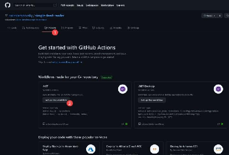

- **Figure 1**: Creating a new workflow.


- 1. Commit the file onto the main branch. Since you’ve defined a trigger condition for commits to main, this commit should trigger the workflow to run.
- **Figure 2**: Commit the YAML file.

1. Select the Actions tab again. You should see a running workflow. Once the workflow has completed, you should see a successful run.

- **Figure 3**: Successful build view.

1. Opening the logs, you can see that the .NET build succeeded and the tests ran and passed.

- **Figure 4**: Checking the logs.


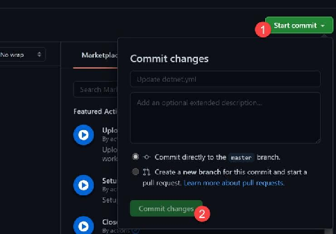

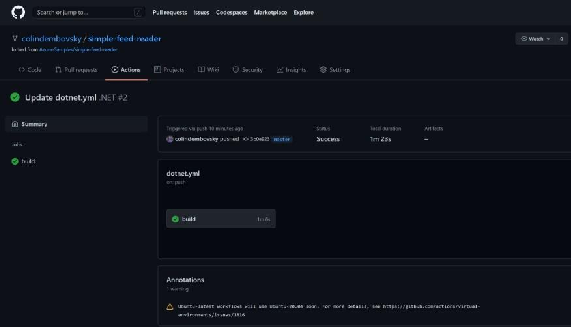

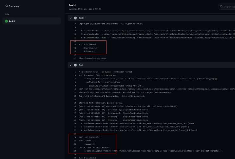

<table>
  <tr>
    <th>Note If any of the tests fail, the workflow will fail.<br><br></th>
  </tr>
</table>


## Dissect the workflow file

Let’s examine the workflow YAML file you have so far:

<table>
  <tr>
    <th>name: .NET on:<br><br>push:<br><br>branches: [ main ] pull_request:<br><br>branches: [ main ] jobs:<br><br>build: runs-on: ubuntu-latest steps:<br><br>- uses: actions/checkout@v3<br><br>- name: Setup .NET uses: actions/setup-dotnet@v3 with:<br><br>dotnet-version: 6.0.x<br><br>- name: Restore dependencies run: dotnet restore<br><br>- name: Build run: dotnet build --no-restore<br><br>- name: Test run: dotnet test --no-build --verbosity normal<br><br><br></th>
  </tr>
</table>


Notice the following things:

- 1. There’s a name that names the workflow.
- 2. The on object specifies when this workflow should run. This workflow has two events that trigger it: push to main and pull_request to main. Each time someone commits to main or creates a pull request (PR) to main, this workflow will execute.
- 3. There’s a single job called build. This build should run on a hosted agent. ubuntu_latest specifies the most recent Ubuntu hosted agent.
- 4. There are five steps:


- 1. actions/checkout@v3 is an action that checks out the code in the repository onto the runner.
- 2. actions/setup-dotnet@v3 is an action that sets up the .NET CLI. This step also specifies a name attribute for the logs and the dotnet-version parameter within the with object.
- 3. Three run steps that execute dotnet restore, dotnet build, and dotnet test. name attributes are also specified for these run steps to make the logs look pretty.


## Publish the output

Now that you’ve successfully built and tested the code, add steps that publish the output so you can deploy the web app.

1. Navigate to the .github/workflows/dotnet.yml file and select the pencil icon to edit

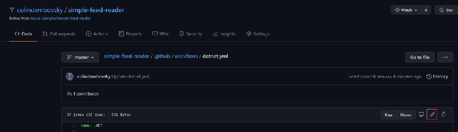

- **Figure 5**: Edit the YAML file.

- 1. Add the following Publish step below the Test step. The step runs the dotnet publish command to publish the web app: :::{custom-style=CodeBox} ```yml

- – name: Test run: dotnet test –no-build –verbosity normal # <– this is the current bottom line
- – name: Publish run: dotnet publish SimpleFeedReader/SimpleFeedReader.csproj -c Release -o website ``` :::


- 2. This publishes the web app to a folder on the hosted agent. Now you’ll want to upload the site as a build artifact that can be deployed to Azure. To complete this activity, you’ll use an existing action.
- 3. On the list of actions in the Actions Helper pane on the right, search for artifact. Select on the Upload a Build Artifact (By actions) action.


- **Figure 6**: Accessing the snippet helper.


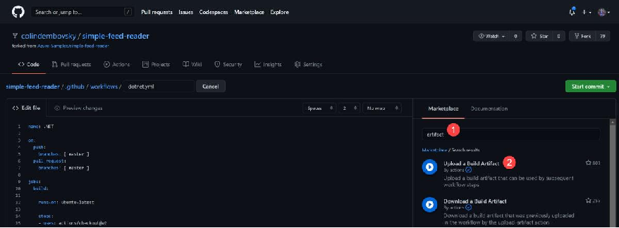

- 1. Edit the version to v2.2.2 to display a sample snippet. Select the clipboard icon to copy the snippet and paste it into the workflow below the publish step.
- **Figure 7**: Copying a snippet.

- 1. Edit the YAML for this step to look as follows: :::{custom-style=CodeBox} ```yml

– name: Upload a Build Artifact uses: actions/upload-artifact@v3 with: name: website path: SimpleFeedReader/website/** if-no-files-found: error ``` :::

- 2. Commit the file.
- 3. Once the workflow completes, you’ll see the artifact from the Home tab:


- **Figure 8**: Viewing artifacts in the summary page.


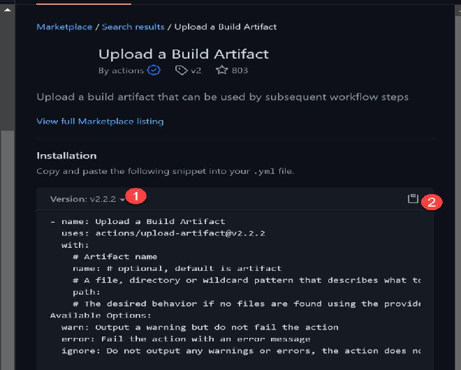

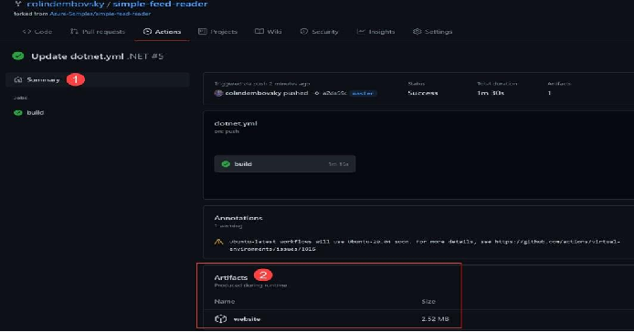

Final workflow file The final workflow file should look something like this:

<table>
  <tr>
    <th>name: .NET on:<br><br>push:<br><br>branches: [ main ] pull_request:<br><br>branches: [ main ] jobs:<br><br>build: runs-on: ubuntu-latest steps:<br><br>- uses: actions/checkout@v3<br><br>- name: Setup .NET uses: actions/setup-dotnet@v3 with:<br><br>dotnet-version: 6.0.x<br><br>- name: Restore dependencies run: dotnet restore<br><br>- name: Build run: dotnet build --no-restore<br><br>- name: Test run: dotnet test --no-build --verbosity normal<br><br>- name: Publish run: dotnet publish SimpleFeedReader/SimpleFeedReader.csproj -c Release -o website<br><br>- name: Upload a Build Artifact uses: actions/upload-artifact@v3 with:<br><br><br>name: website path: SimpleFeedReader/website/** if-no-files-found: error<br><br></th>
  </tr>
</table>


# Deploy a .NET web app using GitHub Actions

<table>
  <tr>
    <th>Warning Please complete the Build tutorial before starting this lab.<br><br></th>
  </tr>
</table>


In this article, you’ll: > [!div class=“checklist”] > > * Learn about Environments in GitHub Actions. > * Create two environments and specify environment protection rules. > * Create environment secrets for managing environment-specific configuration. > * Extend the workflow YAML file to add deployment steps. > * Add a manual dispatch trigger.

## Environments

Now that you’ve published an artifact that’s potentially deployable, you’ll add deployment jobs to the workflow. There’s nothing special about a deployment job, other than the fact that it references an

environment. Environments are logical constructs that allow you to specify environment protection rules, such as approvals, on any group of resources that you’re targeting. In this walkthrough, you’ll be deploying to two environments: PRE-PROD and PROD. In a typical development lifecycle, you’ll want to deploy the latest code to a soft environment (typically DEV) that is expected to be a bit unstable. You’ll use PRE-PROD as this soft environment. The “higher” environments (like UAT and PROD) are harder environments that are expected to be more stable. To enforce this, you can build protection rules into higher environments. You’ll configure an approval protection rule on the PROD environment: whenever a deployment job targets an environment with an approval rule, it will pause until approval is granted before executing. GitHub environments are logical. They represent the physical (or virtual) resources that you’re deploying to. In this case, the PRE-PROD is just a deployment slot on the Azure Web App. PROD is the production slot. The PRE-PROD deployment job will deploy the published .NET app to the staging slot. The PROD deployment job will swap the slots. Once you have these steps in place, you’ll update the workflow to handle environment-specific configuration using environment secrets.

<table>
  <tr>
    <th>Note For more information, see GitHub Actions - Environments.<br><br></th>
  </tr>
</table>


## Azure authentication

To perform actions such as deploying code to an Azure resource, you need the correct permissions. For deployment to Azure Web Apps, you can use a publishing profile. If you want to deploy to a staging slot, then you’ll need the publishing profile for the slot too. Instead, you can use a service principal (SPN) and assign permission to this service principal. You can then authenticate using credentials for the SPN before using any commands that the SPN has permissions to perform.

Once you have an SPN, you’ll create a repository secret to securely store the credentials. You can then refer to the secret whenever you need to authenticate. The secret is encrypted and once it has been saved, can never be viewed or edited (only deleted or re-created).

### Create an SPN

- 1. In your terminal or Cloud Shell, run the following command to create a service principal with contributor permissions to the web app you created earlier:

:::{custom-style=CodeBox} azurecli az ad sp create-for-rbac --name "{sp-name}" --sdk-auth -role contributor \ --scopes /subscriptions/{subscription-id}/resourceGroups/{resourcegroup}/providers/Microsoft.Web/sites/{webappname} :::

- 2. The command should output JSON that has credentials embedded:


:::{custom-style=CodeBox} json { "clientId": "<GUID>", "clientSecret": "<GUID>", "subscriptionId": "<GUID>", "tenantId": "<GUID>", ... } :::

- 3. Make sure to record the clientId, clientSecret, subscription, and tenantId. You can also leave the terminal open for copy/paste later.


### Create a repository secret

- 1. Now you’re going to create an encrypted secret to store the credentials. You’ll create this secret at the repository level.
- 2. Navigate to GitHub and select your repository Settings tab. Then select Secrets. Select New


#### repository secret:

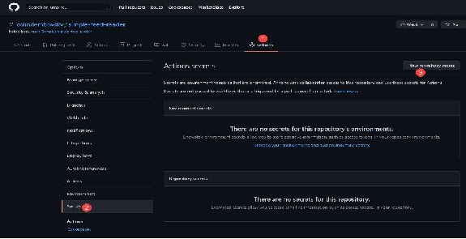

- **Figure 1**: Create a secret.

1. Copy and paste the JSON from the az ad sp create-for-rbac command into the body of the secret. You can create this JSON by hand too if you have the relevant fields for your SPN. The secret should be named AZURE_CREDENTIALS. Select Add secret to save the new secret:

- **Figure 2**: Add Azure credentials.


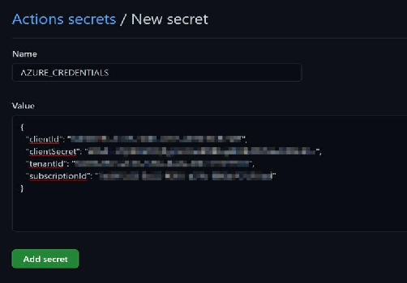

1. You’ll consume this secret in a workflow in later steps. To access it, use the variable notation ${{}}. In this case, ${{ AZURE_CREDENTIAL }} will be populated with the JSON you saved.

## Add environments

Environments are used as a logical boundary. You can add approvals to environments to ensure quality. You can also track deployments to environments and specify environment-specific values (secrets) for configuration.

For this example, you’re going to split the actual Azure environment into two logical environments called PRE-PROD and PROD. When you deploy the web app, you’ll deploy to the staging slot of the Azure web app, represented by the PRE-PROD environment. When you’re ready to deploy to PROD, you’ll just perform a slot swap.

In this case, the only difference between the environments is the slot that you’re deploying to. In real life, there would typically be different web apps (and separate web app plans), separate resource groups, and even separate subscriptions. Typically, there’s an SPN per environment. You may want to override the AZURE_CREDENTIAL value that you saved as a repository secret by creating it as an environment secret.

<table>
  <tr>
    <th>Note<br><br>Precedence works from Environment to repository. If a targeted environment has a secret called MY_SECRET, then that value is used. If not, the repository value of MY_SECRET (if any) is used.<br><br></th>
  </tr>
</table>


#### 1. Select Settings and then Environments in your repository. Select New Environment:

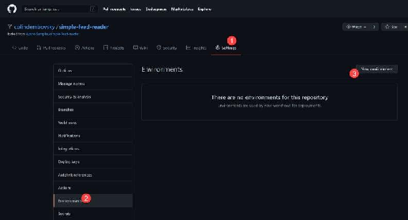

- **Figure 3**: Create an environment.

1. Enter PRE-PROD and select Configure environment:

- **Figure 4**: Name the environment.


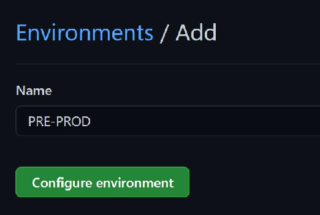

- 1. Since deploying to a staging slot doesn’t affect the web app, you can safely deploy to the slot without requiring an approval first. A reviewer could be added if desired. For this example, leave the Environment protection rules empty.

[!NOTE] If you target an environment in a workflow and it does not exist, an “empty” environment is created automatically. The environment would look exactly the same as the PRE-PROD environment - it would exist, but would not have any protection rules enabled.

- 2. Select Environments again and again select New Environment. Now enter PROD as the name and select Configure environment.
- 3. Check the Required reviewers rule and add yourself as a reviewer. Don’t forget to select Save protection rules:


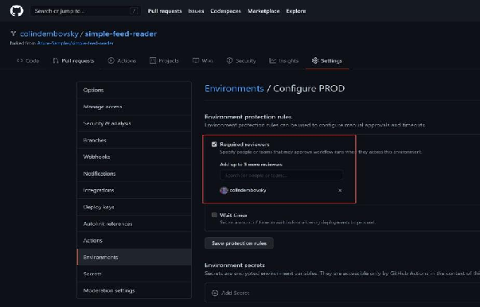

- **Figure 5**: Add protection rules.


## Deploy to staging

You can now add additional jobs to the workflow to deploy to the environments! You’ll start by adding a deployment to the PRE-PROD environment, which in this case is the web app staging slot.

- 1. Navigate to the .github/workflows/dotnet.yml file and select the pencil icon to edit the file.
- 2. You’re going to use the web app name a few times in this workflow, and will need the name of the resource group too. You’ll define the app and resource group names as variables. With the variables, you can maintain the values in one place in the workflow file.
- 3. Add this snippet below the on block and above the jobs block: :::{custom-style=CodeBox} ```yml env: app-name: “” rg-name: “” jobs: # <– this is the existing jobs line ``` :::

[!WARNING] You’ll need to replace <name of your web app> with the actual name of your web app, and <name of your resource group> with the actual name of your resource group.

- 4. Add a new job below the build job as follows:


:::{custom-style=CodeBox} ```yml if-no-files-found: error # <– last line of build job: insert below this line

deploy_staging: needs: build runs-on: ubuntu-latest

<table>
  <tr>
    <th>environment: name: PRE-PROD url: ${{ steps.deploywebapp.outputs.webapp-url }}<br><br>steps:<br><br>- name: Download a Build Artifact uses: actions/download-artifact@v3 with:<br><br>name: website path: website<br><br>- name: Login via Azure CLI uses: azure/login@v1 with:<br><br>creds: ${{ secrets.AZURE_CREDENTIALS }}<br><br>- name: Deploy web app id: deploywebapp uses: azure/webapps-deploy@v2 with:<br><br>app-name: ${{ env.app-name }} slot-name: staging package: website<br><br>- name: az cli logout run: az logout<br><br><br></th>
  </tr>
</table>


``` ::: The preceding workflow defines several steps:

- 1. You’re creating a new job called deploy_staging.
- 2. You specify a dependency using needs. This job needs the build job to complete successfully before it starts.
- 3. This job also runs on the latest Ubuntu hosted agent, as specified with the runs-on attribute.
- 4. You specify that this job is targeting the PRE-PROD environment using the environment object. You also specify the url property. This URL will be displayed in the workflow diagram, giving users an easy way to navigate to the environment. The value of this property is set as the output of the step with id deploywebapp, which is defined below.
- 5. You’re executing a download-artifact step to download the artifact (compiled web app) from the build job.
- 6. You then login to Azure using the AZURE_CREDENTIALS secret you saved earlier. Note the ${{ }} notation for dereferencing variables.
- 7. You then perform a webapp-deploy, specifying the app-name, slot-name, and path to the downloaded artifact (package). This action also defines an output parameter that you use to set the url of the environment above.


- 8. Finally, you execute a logout to log out of the Azure context.


- 5. Commit the file.
- 6. When the run completes, you should see two successful jobs. The URL for the PRE-PROD stage has been set and selecting it will navigate you to your web app staging slot:


- **Figure 6**: Deployment to PRE-PROD is successful.

1. Notice how the staging slot’s direct URL contains -staging:

- **Figure 7**: The staging slot running.


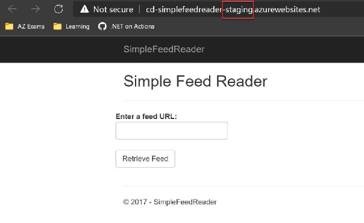

1. You can also now see deployments. Navigate to https://{your repository url}/deployments to view your deployments:

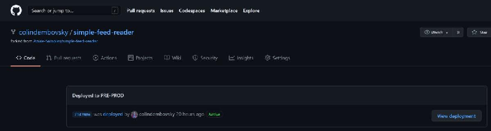

- **Figure 8**: View deployments.


## Deploy to production

Now that you’ve deployed successfully to PRE-PROD, you’ll want to deploy to PROD. Deployment to PROD will be slightly different since you don’t need to copy the website again - you just need to swap the staging slot with the production slot. You’ll do this using an Azure CLI (az) command.

- 1. Navigate to the .github/workflows/dotnet.yml file and select the pencil icon to edit the file.
- 2. Add a new job below the deploy_staging job as follows:


:::{custom-style=CodeBox} ```yml run: az logout # <– last line of previous job: insert below this line

deploy_prod: needs: deploy_staging runs-on: ubuntu-latest

<table>
  <tr>
    <th>environment: name: PROD url: ${{ steps.slot_swap.outputs.url }}<br><br>steps:<br><br>- name: Login via Azure CLI uses: azure/login@v1 with:<br><br>creds: ${{ secrets.AZURE_CREDENTIALS }}<br><br>- name: Swap staging slot into production id: slot_swap run: |<br><br><br>az webapp deployment slot swap -g ${{ env.rg-name }} -n ${{ env.app-name }} -s staging url=$(az webapp show -g ${{ env.rg-name }} -n ${{ env.app-name }} --query<br><br>"defaultHostName" -o tsv) echo "::set-output name=url::http://$url"<br><br>- name: az cli logout<br><br>run: az logout ``` :::<br><br></th>
  </tr>
</table>


The deployment to the PROD environment workflow specifies several steps:

- 1. Once again, you specify a new job deploy_prod that needs deploy_staging to complete before starting.
- 2. You’re targeting the PROD environment this time. Also, the url value is different from before.


- 3. For the steps, you don’t need to download the artifact since you’re just going to perform a slot swap. You start by executing a login to the Azure context.
- 4. The Swap staging slot into production step is a multi-line run command (note the use of the pipe symbol |). You also specify an id for this step so that you can refer to it (you refer to it in the url property of the environment). The first line executes the slot swap using the variables you defined above in the workflow. The second line uses an az webapp show command to extract the URL of the target web app. This final line uses ::set-output in an echo to create an output variable for this task, setting the value to the web app URL.


[!NOTE] The URL must start with http:// or https:// or it won’t render.

- 3. Commit the file.
- 4. Let the workflow run for a couple minutes until it has deployed to PRE-PROD. At this point, the workflow will pause and wait for the required approval since you’re targeting the PROD environment, which requires an approval as defined earlier:


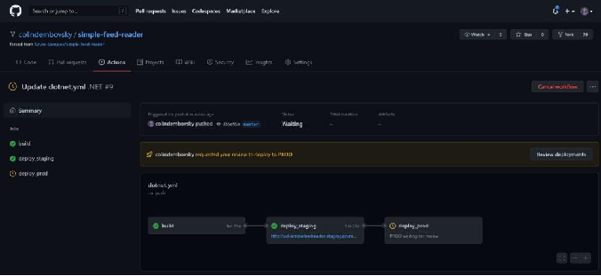

- **Figure 9**: Waiting for an approval.

1. Select Review deployments, select the PROD checkbox, optionally add a comment, and then select Approve and deploy to start the PROD job.

- **Figure 10**: Approve the PROD deployment.


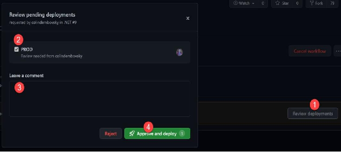

1. The deployment should only take a few seconds. Once it has completed, the URL for the PROD environment will update.

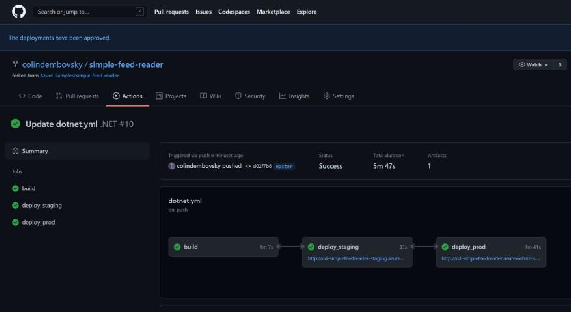

- **Figure 11**: PROD deployment completed.

1. Selecting the PROD URL will navigate you to the PROD site.

- **Figure 12**: The PROD site.


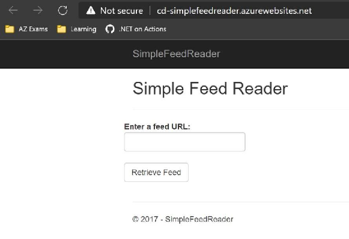

## Add a manual queue option

You now have an end-to-end build and deploy workflow, including approvals. One more change you can make is to add a manual trigger to the workflow so that the workflow can be triggered from within the Actions tab of the repository.

- 1. Navigate to the .github/workflows/dotnet.yml file and select the pencil icon to edit the file.
- 2. Add a new trigger between on and push on lines 3 and 4: :::{custom-style=CodeBox} yml on: workflow_dispatch: # <-- this is the new line push: :::
- 3. The workflow_dispatch trigger displays a Run workflow button in the Actions tab of the repository—but only if the trigger is defined in the default branch. However, once this trigger is defined in the workflow, you can select the branch for the run.
- 4. Commit the file.


- 5. To see the Run workflow button, select the Actions tab. Select the .NET workflow in the list of workflows. At the top of the list of runs, you’ll see the Run workflow button. If you select it, you can choose the branch to run the workflow against and queue it:


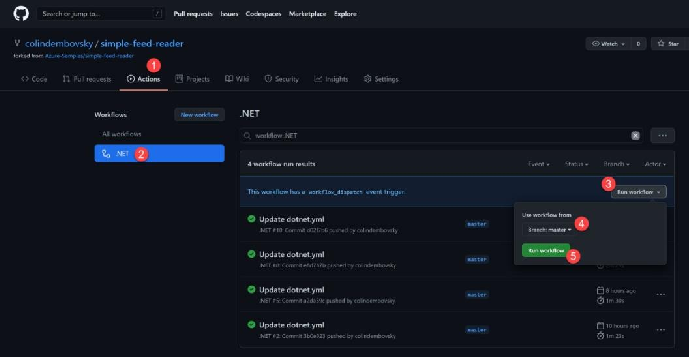

- **Figure 13**: Manual dispatch.


## Handle environment configuration

Your workflow is deploying the same binary to each environment. This concept is important to ensure that the binaries you test in one environment are the same that you deploy to the next. However, environments typically have different settings like database connection strings. You want to ensure that the DEV app is using DEV settings and the PROD app is using PROD settings.

For this simple app, there’s no database connection string. However, there’s an example configuration setting that you can modify for each environment. If you open the simple-feedreader/SimpleFeedReader/appsettings.json file, you’ll see that the configuration includes a setting for the Header text on the Index page:

<table>
  <tr>
    <th>"UI": {<br><br>"Index": {<br><br>"Header": "Simple News Reader" }<br><br>},<br><br></th>
  </tr>
</table>


To show how environment configuration can be handled, you’re going to add a secret to each environment and then substitute that value into the settings as you deploy.

Add environment secrets

- 1. On your repository, select Settings > Environments > PRE-PROD.
- 2. Select Add secret and add a secret called index_header with the value PRE PROD News Reader. Select Add secret.


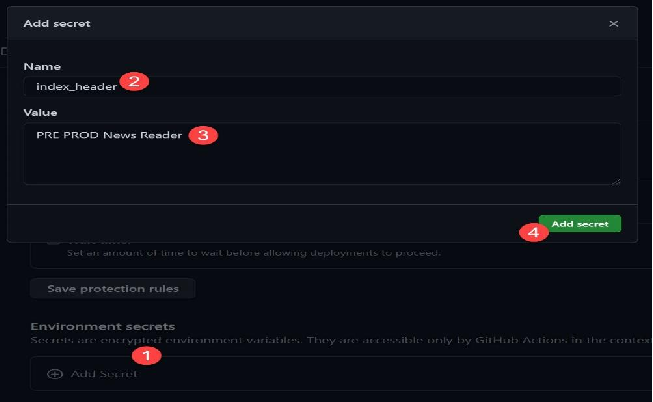

- **Figure 14**: Add an environment secret.

- 1. Repeat these steps to add a secret called index_header with the value PROD News Reader for the PROD environment.
- 2. If you select Settings > Secrets in the repository, you’ll see the changes. They should look something like this:


- **Figure 15**: View secrets. Update the workflow to handle configuration


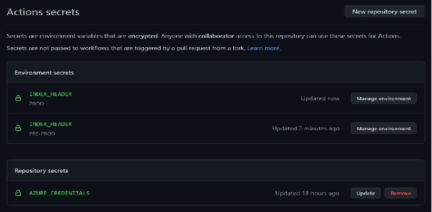

- 1. Navigate to the .github/workflows/dotnet.yml file and select the pencil icon to edit the file.
- 2. Add the following step before the az cli logout step in the deploy_staging job:


:::{custom-style=CodeBox} ```yml - name: Update config uses: Azure/appservice-settings@v1 with: app-name: ${{ env.app-name }} slot-name: staging app-settings-json: | [ { "name": "UI:Index:Header", "value": "${{ secrets.INDEX_HEADER }}“,”slotSetting”: true } ]

- name: az cli logout # <-- this exists already ``` :::

- 3. Add almost the same code to the deploy_prod job above its az cli logout step. The only difference is that you don’t specify a slot-name, since you’re targeting the production slot:

:::{custom-style=CodeBox} ```yml - name: Update config uses: Azure/appservice-settings@v1 with: app-name: ${{ env.app-name }} app-settings-json: | [ { "name": "UI:Index:Header", "value": "${{ secrets.INDEX_HEADER }}“,”slotSetting”: true } ]

- name: az cli logout # <-- this exists already ``` :::

- 4. Commit the file.
- 5. Let the workflow run and approve the deployment to PROD once the approval is reached.
- 6. You should see the following headers on the index page for both sites:


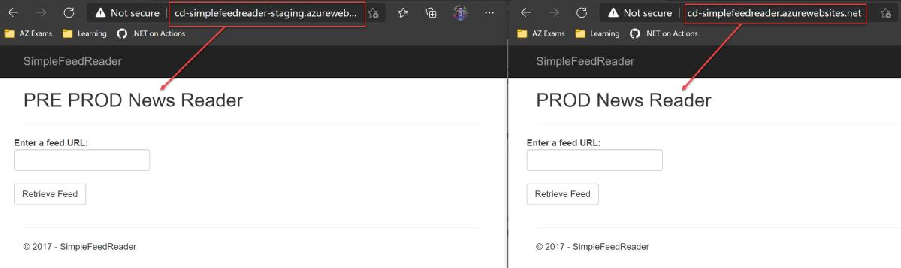

- **Figure 16**: Settings changed in the environments.


Final workflow file The final workflow file should look like this: name: .NET on:

workflow_dispatch: inputs:

reason: description: 'The reason for running the workflow' required: true default: 'Manual build from GitHub UI'

push:

branches: [ main ] pull_request:

branches: [ main ]

env: app-name: "cd-simplefeedreader" rg-name: "cd-dotnetactions"

jobs: build:

runs-on: ubuntu-latest steps:

- - uses: actions/checkout@v3

- - name: 'Print manual run reason' if: ${{ github.event_name == 'workflow_dispatch' }} run: |

echo 'Reason: ${{ github.event.inputs.reason }}'

- - name: Setup .NET uses: actions/setup-dotnet@v3 with:

dotnet-version: 6.0.x

- - name: Restore dependencies run: dotnet restore

- - name: Build run: dotnet build --no-restore

- - name: Test run: dotnet test --no-build --verbosity normal

- - name: Publish run: dotnet publish SimpleFeedReader/SimpleFeedReader.csproj -c Release -o website

- - name: Upload a Build Artifact uses: actions/upload-artifact@v3 with:


name: website path: SimpleFeedReader/website/** if-no-files-found: error

deploy_staging: needs: build runs-on: ubuntu-latest

environment: name: STAGING url: ${{ steps.deploywebapp.outputs.webapp-url }}

steps:

- - name: Download a Build Artifact uses: actions/download-artifact@v3 with:

name: website path: website

- - name: Login via Azure CLI uses: azure/login@v1 with:

creds: ${{ secrets.AZURE_CREDENTIALS }}

- - name: Deploy web app id: deploywebapp uses: azure/webapps-deploy@v2 with:

app-name: ${{ env.app-name }} slot-name: staging package: website

- - name: Update config uses: Azure/appservice-settings@v1 with:


app-name: ${{ env.app-name }} slot-name: staging app-settings-json: |

[

{

"name": "UI:Index:Header", "value": "${{ secrets.INDEX_HEADER }}", "slotSetting": true

} ]

- - name: az cli logout run: az logout


deploy_prod: needs: deploy_staging runs-on: ubuntu-latest

environment: name: PROD url: ${{ steps.slot_swap.outputs.url }}

steps:

- - name: Login via Azure CLI uses: azure/login@v1 with:

creds: ${{ secrets.AZURE_CREDENTIALS }}

- - name: Swap staging slot into production id: slot_swap run: |


az webapp deployment slot swap -g ${{ env.rg-name }} -n ${{ env.app-name }} -s staging

url=$(az webapp show -g ${{ env.rg-name }} -n ${{ env.app-name }} --query "defaultHostName" -o tsv)

echo "::set-output name=url::http://$url"

- - name: Update config uses: Azure/appservice-settings@v1 with:

app-name: ${{ env.app-name }} app-settings-json: |

[

{

"name": "UI:Index:Header", "value": "${{ secrets.INDEX_HEADER }}", "slotSetting": true

} ]

- - name: az cli logout run: az logout


# Secure .NET Code with CodeQL and GitHub Actions

CodeQL is a static code analysis engine that can automate security and quality checks. With CodeQL, you can perform variant analysis, which uses known vulnerabilities as seeds to find similar issues. CodeQL is part of GitHub Advanced Security that includes:

[!div class=“checklist”]

- • Code scanning—find potential security vulnerabilities in your code.
- • Secret scanning—detect secrets and tokens that are committed.
- • Dependency scanning—detect vulnerabilities in packages that you consume.


CodeQL supports some of the most popular programming languages and compilers:

- • C/C++
- • Java
- • C#
- • Python
- • Go
- • JavaScript
- • TypeScript


CodeQL is a powerful language and security professionals can create custom queries using CodeQL. However, teams can benefit immensely from the large open-source collection of queries that the security community has created without having to write any custom CodeQL.

In this article, you’ll set up a GitHub workflow that will scan code in your repository using CodeQL. You will:

[!div class=“checklist”]

- • Create a code scanning action.
- • Edit the workflow file to include custom scan settings.
- • See scanning results.


<table>
  <tr>
    <th>Note To see security alerts for your repository, you must be a repository owner.<br><br></th>
  </tr>
</table>


## Create the code scanning workflow

You can use a starter workflow for code scanning by navigating to the Security tab of your repository. 1. Navigate to your GitHub repository and select the Security > Code Scanning Alerts. The top

recommended workflow should be CodeQL Analysis. Select Set up this workflow.

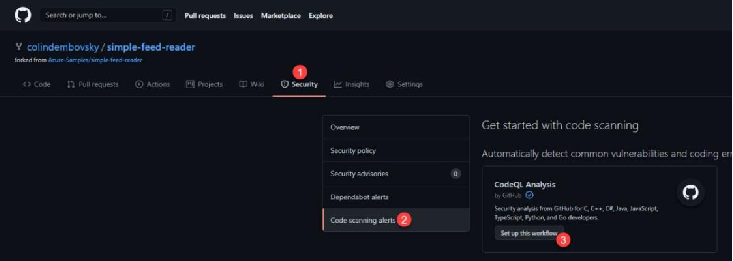

- **Figure 1:** Create a new code scanning workflow.


- 1. A new workflow file is created in your .github/workflows folder.
- 2. Select Start Commit on the upper right to save the default workflow. You can commit to the main branch.


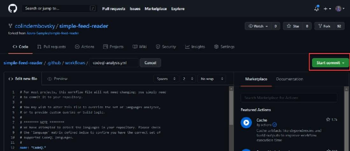

- **Figure 2:** Commit the file.

1. Select the Actions tab. In the left-hand tree, you’ll see a CodeQL node. Select this node to filter for CodeQL workflow runs.

- **Figure 3:** View the CodeQL workflow runs.


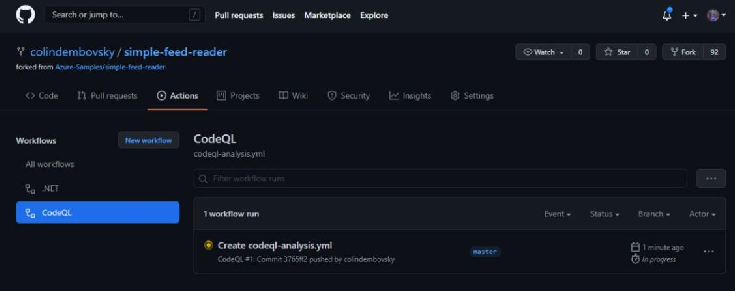

Take a look at the workflow file while it runs. If you remove the comments from the file, you’ll see the following YAML:

name: "CodeQL" on:

push:

branches: [ main ] pull_request:

branches: [ main ] schedule:

- cron: '40 14 * * 6' jobs:

analyze: name: Analyze runs-on: ubuntu-latest

strategy: fail-fast: false

matrix:

language: [ 'csharp' ] steps:

- - name: Checkout repository uses: actions/checkout@v3

- - name: Initialize CodeQL uses: github/codeql-action/init@v1 with:

languages: ${{ matrix.language }}

- - name: Autobuild uses: github/codeql-action/autobuild@v1

- - name: Perform CodeQL Analysis uses: github/codeql-action/analyze@v1


Notice the following things:

- 1. The workflow name is CodeQL.
- 2. This workflow triggers on push and pull_request events to the main branch. There’s also a cron trigger. The cron trigger lets you define a schedule for triggering this workflow and is randomly generated for you. In this case, this workflow will run at 14:40 UTC every Saturday.

[!TIP] If you edit the workflow file and hover over the cron expression, a tooltip will show you the English text for the cron expression.

- 3. There’s a single job called analyze that runs on the ubuntu-latest hosted agent.
- 4. This workflow defines a strategy with a matrix on the array of language. In this case, there’s only csharp. If the repository contained other languages, you could add them to this array. This causes the job to “fan out” and create an instance per value of the matrix.
- 5. There are four steps, starting with checkout.
- 6. The second step initializes the CodeQL scanner for the language this job is going to scan. CodeQL intercepts calls to the compiler to build a database of the code while the code is being built.
- 7. The Autobuild step will attempt to automatically build the source code using common conventions. If this step fails, you can replace it with your own custom build steps.
- 8. After building, the CodeQL analysis is performed, where suites of queries are run against the code database.
- 9. The run should complete successfully. However, there appear to be no issues.


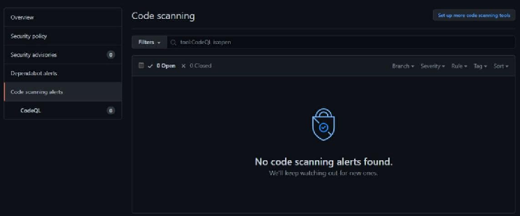

- **Figure 4:** No results to the initial scan.

Customize CodeQL settings

The CodeQL scan isn’t reporting any security issues. That’s expected with this basic sample. CodeQL can also scan for quality issues. The current workflow is using the default security-extended suite. You can add quality scanning in by adding a configuration file to customize the scanning suites. In this step, you’ll configure CodeQL to use the security-and-quality suites.

[!INFORMATION] For other CodeQL configuration options, see Configuring CodeQL code scanning in your CI system.

1. Navigate to the .github folder in the Code tab and select Add File:

- **Figure 5:** Create a new file.


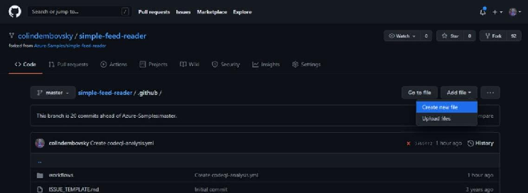

1. Enter codeql/codeql-config.yml as the name. This creates the file in a folder. Paste in the following code: :::{custom-style=CodeBox} ```yml name: “Security and Quality” queries:

– uses: security-and-quality ``` :::

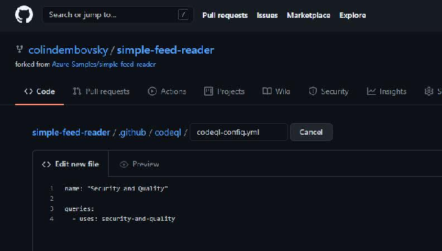

- **Figure 6:** Create the CodeQL configuration file.


- 1. Select Commit to main at bottom of the editor to commit the file.
- 2. Edit the CodeQL workflow to use the new configuration file. Navigate to


.github/workflows/codeql-analysis.yml and select the pencil icon. Add a new property to the with section as shown below:

:::{custom-style=CodeBox} yml - name: Initialize CodeQL uses: github/codeql-action/init@v1 with: languages: ${{ matrix.language }} config-file: ./.github/codeql/codeql-config.yml # <-add this line :::

1. Select Start Commit and commit to the main branch.

## Review the security alerts

<table>
  <tr>
    <th>Important You must be a repository owner to view security alerts. This sample repository is small. As such, it doesn’t contain any major security or quality issues. However, “real world” repositories will likely have some issues.<br><br></th>
  </tr>
</table>


When the last CodeQL workflow run completes, you should see two issues in the Security tab:

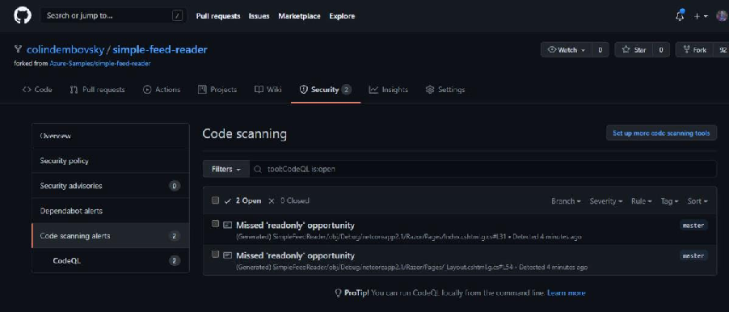

Figure 7: View security alerts.

- 1. Select the first alert to open it.
- 2. In this case, the alert is for a generated file that isn’t committed to the repository. For that reason, the preview is unavailable.
- 3. Notice the tags that are applied. These tags can be used for filtering issues.
- 4. Select Show more under the rule information to show help and recommendations.


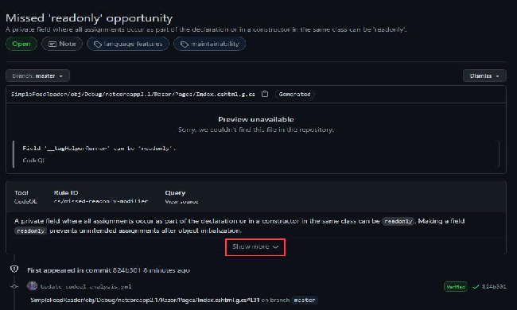

- **Figure 8:** Open an alert.


1. Selecting Dismiss will open options for dismissing this issue:

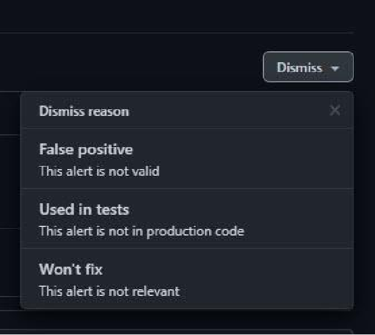

###### **Figure 9:** Dismiss an alert.

<table>
  <tr>
    <th>CHAPTER</th>
  </tr>
</table>


4

Monitor and debug

Having deployed the app and built a DevOps pipeline, it’s important to understand how to monitor and troubleshoot the app.

In this section, you’ll complete the following tasks: [!div class=“checklist”]

- • Find basic monitoring and troubleshooting data in the Azure portal
- • Learn how Azure Monitor provides a deeper look at metrics across all Azure services
- • Connect the web app with Application Insights for app profiling
- • Turn on logging and learn where to download logs
- • Stream logs in real time
- • Learn where to set up alerts
- • Learn about remote debugging Azure App Service web apps.


# Basic monitoring and troubleshooting

App Service web apps are easily monitored in real time. The Azure portal renders metrics in easy-tounderstand charts and graphs.

- 1. Open the Azure portal, and then navigate to the mywebapp<unique_number> App Service.

- 2. The Overview tab displays useful “at-a-glance” information, including graphs displaying recent metrics.


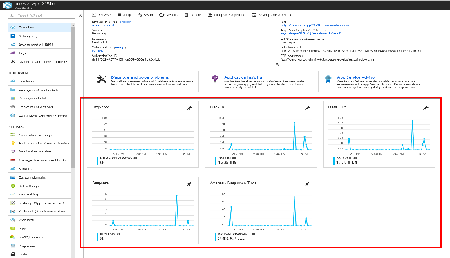

- * **Http 5xx**: Count of server-side errors, usually exceptions in ASP.NET Core code.
- * **Data In**: Data ingress coming into your web app.
- * **Data Out**: Data egress from your web app to clients.
- * **Requests**: Count of HTTP requests.
- * **Average Response Time**: Average time for the web app to respond to HTTP requests.

Several self-service tools for troubleshooting and optimization are also found on this page.

- * **Diagnose and solve problems** is a self-service troubleshooter.
- * **Application Insights** is for profiling performance and app behavior, and is discussed later in this section.
- * **App Service Advisor** makes recommendations to tune your app experience.


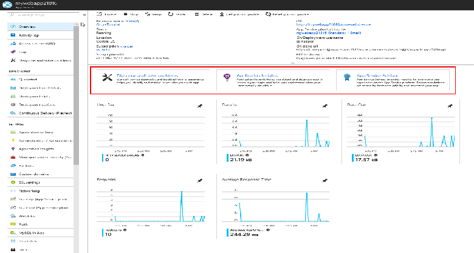

# Advanced monitoring

Azure Monitor is the centralized service for monitoring all metrics and setting alerts across Azure services. Within Azure Monitor, administrators can granularly track performance and identify trends. Each Azure service offers its own set of metrics to Azure Monitor.

# Profile with Application Insights

Application Insights is an Azure service for analyzing the performance and stability of web apps and

how users use them. The data from Application Insights is broader and deeper than that of Azure Monitor. The data can provide developers and administrators with key information for improving apps. Application Insights can be added to an Azure App Service resource without code changes.

- 1. Open the Azure portal, and then navigate to the mywebapp<unique_number> App Service.

- 2. From the Overview tab, click the Application Insights tile.


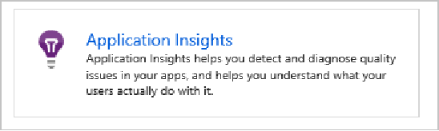

1. Select the Create new resource radio button. Use the default resource name, and select the location for the Application Insights resource. The location doesn’t need to match that of your web app.

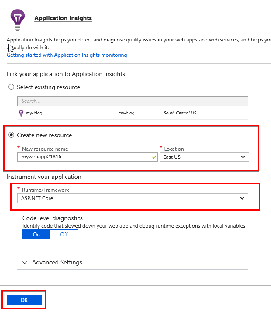

- 1. For Runtime/Framework, select ASP.NET Core. Accept the default settings.
- 2. Select OK. If prompted to confirm, select Continue.
- 3. After the resource has been created, click the name of Application Insights resource to navigate directly to the Application Insights page.


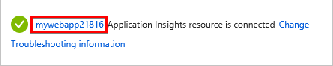

As the app is used, data accumulates. Select Refresh to reload the blade with new data.

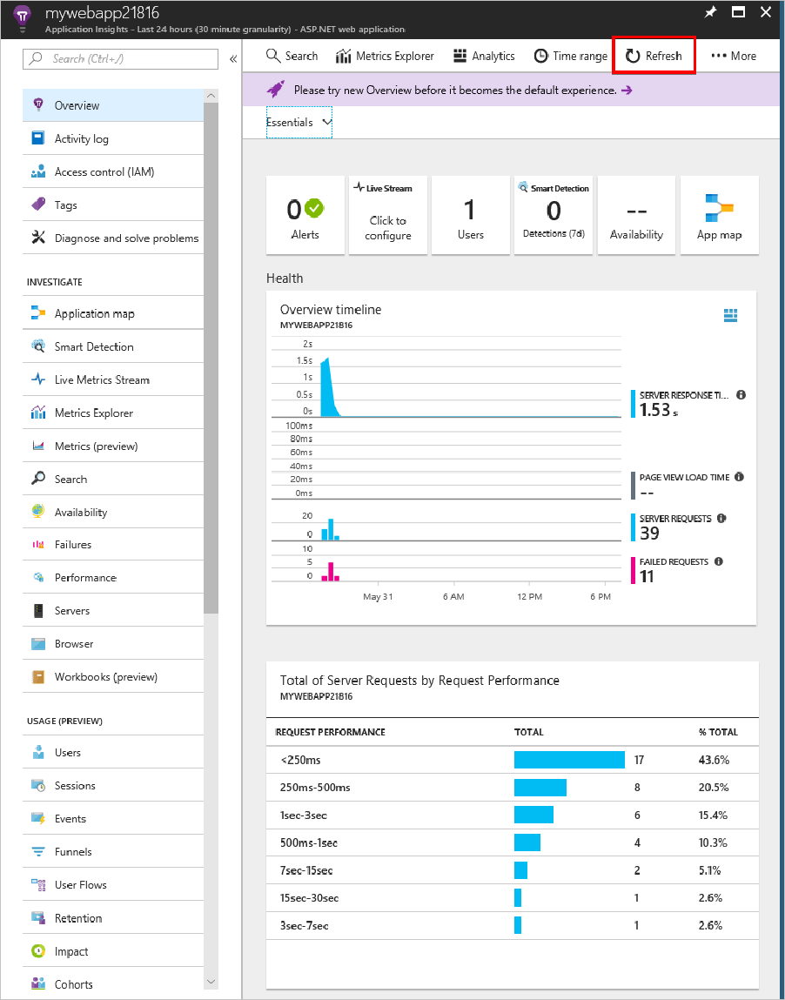

##### Application Insights provides useful server-side information with no additional configuration. To get the most value from Application Insights, instrument your app with the Application Insights SDK. When properly configured, the service provides end-to-end monitoring across the web server and

browser, including client-side performance. For more information, see the Application Insights documentation.

# Logging

Web server and app logs are disabled by default in Azure App Service. Enable the logs with the following steps:

- 1. Open the Azure portal, and navigate to the mywebapp<unique_number> App Service.

- 2. In the menu to the left, scroll down to the Monitoring section. Select Diagnostics logs.


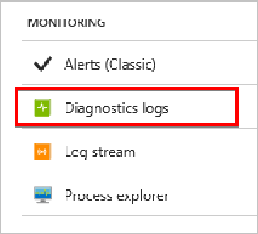

- 1. Turn on Application Logging (Filesystem). If prompted, click the box to install the extensions to enable app logging in the web app.
- 2. Set Web server logging to File System.
- 3. Enter the Retention Period in days. For example, 30.
- 4. Click Save.


ASP.NET Core and web server (App Service) logs are generated for the web app. They can be downloaded using the FTP/FTPS information displayed. The password is the same as the deployment credentials created earlier in this guide. The logs can be streamed directly to your local machine with PowerShell or Azure CLI. Logs can also be viewed in Application Insights.

# Log streaming

App and web server logs can be streamed in real time through the portal.

1. Open the Azure portal, and navigate to the mywebapp<unique_number> App Service. 2. In the menu to the left, scroll down to the Monitoring section and select Log stream.

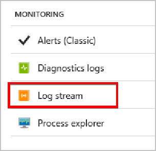

Logs can also be streamed via Azure CLI or Azure PowerShell, including through the Cloud Shell.

# Alerts

Azure Monitor also provides real time alerts based on metrics, administrative events, and other criteria.

<table>
  <tr>
    <th>Note Currently alerting on web app metrics is only available in the Alerts (classic) service.<br><br></th>
  </tr>
</table>


The Alerts (classic) service can be found in Azure Monitor or under the Monitoring section of the App Service settings.

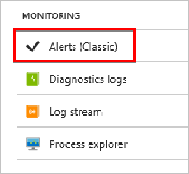

# Live debugging

Azure App Service can be debugged remotely with Visual Studio when logs don’t provide enough information. However, remote debugging requires the app to be compiled with debug symbols. Debugging shouldn’t be done in production, except as a last resort.

Conclusion In this section, you completed the following tasks: [!div class=“checklist”]

- • Find basic monitoring and troubleshooting data in the Azure portal
- • Learn how Azure Monitor provides a deeper look at metrics across all Azure services
- • Connect the web app with Application Insights for app profiling
- • Turn on logging and learn where to download logs
- • Stream logs in real time
- • Learn where to set up alerts
- • Learn about remote debugging Azure App Service web apps.


# Additional reading

- • Troubleshooting ASP.NET Core on Azure App Service and IIS

- • Common errors reference for Azure App Service and IIS with ASP.NET Core

- • Monitor Azure web app performance with Application Insights

- • Enable diagnostics logging for web apps in Azure App Service

- • Troubleshoot a web app in Azure App Service using Visual Studio

- • Create classic metric alerts in Azure Monitor for Azure services - Azure portal


<table>
  <tr>
    <th>CHAPTER</th>
  </tr>
</table>


5

Next steps

In this guide, you created a DevOps pipeline for an ASP.NET Core sample app. Congratulations! We hope you enjoyed learning to publish ASP.NET Core web apps to Azure App Service and automate the continuous integration of changes.

Beyond web hosting and DevOps, Azure has a wide array of Platform-as-a-Service (PaaS) services useful to ASP.NET Core developers. This section gives a brief overview of some of the most commonly used services.

# Storage and databases

Redis Cache is high-throughput, low-latency data caching available as a service. It can be used for caching page output, reducing database requests, and providing ASP.NET Core session state across multiple instances of an app.

Azure Storage is Azure’s massively scalable cloud storage. Developers can take advantage of Queue Storage for reliable message queuing, and Table Storage is a NoSQL key-value store designed for rapid development using massive, semi-structured data sets.

Azure SQL Database provides familiar relational database functionality as a service using the Microsoft SQL Server Engine.

Cosmos DB globally distributed, multi-model NoSQL database service. Multiple APIs are available, including SQL API (formerly called DocumentDB), Cassandra, and MongoDB.

# Identity

Azure Active Directory and Azure Active Directory B2C are both identity services. Azure Active Directory is designed for enterprise scenarios and enables Azure AD B2B (business-to-business) collaboration, while Azure Active Directory B2C is intended business-to-customer scenarios, including social network sign-in.

# Mobile

Notification Hubs is a multi-platform, scalable push-notification engine to quickly send millions of messages to apps running on various types of devices.

# Web infrastructure

Azure Container Service manages your hosted Kubernetes environment, making it quick and easy to deploy and manage containerized apps without container orchestration expertise.

Azure Search is used to create an enterprise search solution over private, heterogenous content. Service Fabric is a distributed systems platform that makes it easy to package, deploy, and manage scalable and reliable microservices and containers.

